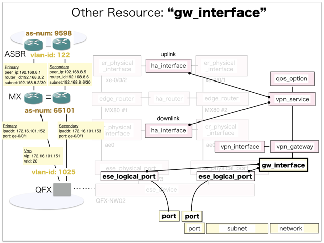
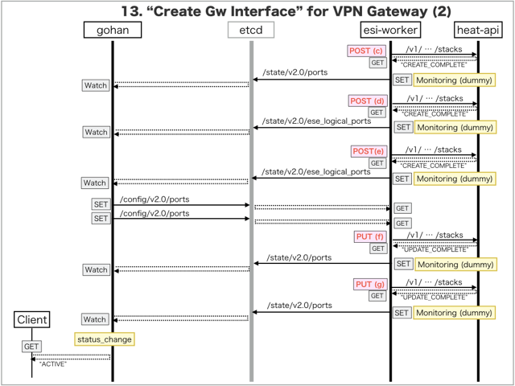

[Return to Previous Page](00_vpn_gateway.md)

# 13. Clarification of interface in Sequence Diagram "Create Gw Interface"
You can see the relations of "Gw Interface" as following.



## 13.1. Sequence Diagram between gohan and etcd
This is a diagram that has been described as interfaces for "Gw Interface" between gohan and etcd.

* Initinalizing gohan ...
* Receiving HTTP Methods for Creating Resource ...




## 13.2. Stored data in etcd after initinalizing gohan
These are stored data for "heat_templates" in etcd.

* [Checking stored data for "gw_interface_vpn"](../heat_template/gw_interface_vpn.md)
* [Checking stored data for "port"](../heat_template/port.md)
* [Checking stored data for "ese_logical_port"](../heat_template/ese_logical_port.md)
* [Checking stored data for "gw_interface_monitoring"](../heat_template/gw_interface_monitoring.md)
* [Checking stored data for "port_monitoring"](../heat_template/port_monitoring.md)
* [Checking stored data for "ese_logical_port_monitoring"](../heat_template/ese_logical_port_monitoring.md)


## 13.3. HTTP Methods for RESTful between Gohan and Client
This is JSON data for "Create Gw Interface" in HTTP Methods from client.

* Checking JSON data at post method
```
POST /v2.0/gw_interfaces
```
```
{
    "gw_interface": {
        "description": "Sample Gw-interface",
        "gw_vipv4": "172.16.101.151",
        "name": "sample-gw-interface",
        "netmask": 24,
        "network_id": "bb69041d-c654-4e9f-a763-afd4333275bc",
        "primary_ipv4": "172.16.101.152",
        "secondary_ipv4": "172.16.101.153",
        "service_type": "vpn",
        "vrid": 20,
        "vpn_gw_id": "4fab887d-8f73-40e6-b2d8-2426255231bf",
        "tenant_id": "0b576f6f4cbf414f829cd12f008bf08f"
    }
}
```


## 13.4. Stored data in etcd after receiving HTTP Methods for RESTful
These are stored data for "Create Gw Interface" in etcd.

* [Checking stored data for creating "gw_interface"](stored_in_etcd/CreateGwInterface_01.md)
* [Checking stored data for creating "port"](stored_in_etcd/CreateGwInterface_02.md)
* [Checking stored data for creating "ese_logical_port"](stored_in_etcd/CreateGwInterface_03.md)
* [Checking stored data for creating "port"](stored_in_etcd/CreateGwInterface_04.md)
* [Checking stored data for creating "ese_logical_port"](stored_in_etcd/CreateGwInterface_05.md)
* [Checking stored data for creating "port"](stored_in_etcd/CreateGwInterface_06.md)
* [Checking stored data for creating "port"](stored_in_etcd/CreateGwInterface_07.md)


## 13.5. Stored heat-stack via heat-api
These are stored heat-stacks for "Create Gw Interface" in heat-engine.

* [Checking heat-stack of "gw_interface" for creating at "(a)" in section "13.1."](heat-stack/CreateGwInterface_01.md)
* [Checking heat-stack of "port" for creating at "(b)" in section "13.1."](heat-stack/CreateGwInterface_02.md)
* [Checking heat-stack of "port" for creating at "(c)" in section "13.1."](heat-stack/CreateGwInterface_03.md)
* [Checking heat-stack of "ese_logical_port" for creating at "(d)" in section "13.1."](heat-stack/CreateGwInterface_04.md)
* [Checking heat-stack of "ese_logical_port" for creating at "(e)" in section "13.1."](heat-stack/CreateGwInterface_05.md)
* [Checking heat-stack of "port" for updating at "(f)" in section "13.1."](heat-stack/CreateGwInterface_06.md)
* [Checking heat-stack of "port" for updating at "(g)" in section "13.1."](heat-stack/CreateGwInterface_07.md)


## 13.6. Stored resource for monitoring in Kafka
This is JSON data for "Create Gw Interface" between monitoring-worker and kafka

* [Checking the topic "monitor_igs_interface" for monitoring "gw_interface"](stored_in_kafka/CreateGwInterface_01.md)
* [Checking the topic "monitor_logical_port" for monitoring "ese_logical_port"](stored_in_kafka/CreateGwInterface_02.md)
* [Checking the topic "monitor_virtual_machine_interface" for monitoring "port"](stored_in_kafka/CreateGwInterface_03.md)


## 13.7. Applying JUNOS Configurations via netconf
Checking configuration in Edge Router

* MX-1
```
[edit interfaces ae0 unit 1025 family inet]
+       address 172.16.101.153/24 {
+           vrrp-group 20 {
+               virtual-address 172.16.101.151;
+               priority 100;
+           }
+       }

[edit routing-instances vrf_gw_sample-ha-router-downlink_1025 protocols bgp]
       group CloudGW1 { ... }
+      group inet-gw-group {
+          apply-groups VPNGW2-RI-IBGP;
+          local-address 172.16.101.153;
+          peer-as 65101;
+          neighbor 172.16.101.152;
+      }

[edit]
```

* MX-2
```
[edit interfaces ae0 unit 1025 family inet]
+       address 172.16.101.152/24 {
+           vrrp-group 20 {
+               virtual-address 172.16.101.151;
+               priority 105;
+           }
+       }

[edit routing-instances vrf_gw_sample-ha-router-downlink_1025 protocols bgp]
       group CloudGW1 { ... }
+      group inet-gw-group {
+          apply-groups VPNGW1-RI-IBGP;
+          local-address 172.16.101.152;
+          peer-as 65101;
+          neighbor 172.16.101.153;
+      }

[edit]
```

## 13.8. Stored resource in gohan
As a result, checking resources regarding of "Gw Interface" in gohan.

* Checking the target of resources via gohan client
```
$ gohan client gw_interface show --output-format json fbd7d07e-9e84-4ad7-ab85-36d46adb9435
{
    "gw_interface": {
        "aws_gw_id": null,
        "description": "Sample Gw-interface",
        "gw_vipv4": "172.16.101.151",
        "gw_vipv6": null,
        "id": "fbd7d07e-9e84-4ad7-ab85-36d46adb9435",
        "interdc_gw_id": null,
        "internet_gw_id": null,
        "name": "sample-gw-interface",
        "netmask": 24,
        "network_id": "bb69041d-c654-4e9f-a763-afd4333275bc",
        "primary_ipv4": "172.16.101.152",
        "primary_ipv6": null,
        "public_ip_id": null,
        "secondary_ipv4": "172.16.101.153",
        "secondary_ipv6": null,
        "service_type": "vpn",
        "status": "ACTIVE",
        "tenant_id": "0b576f6f4cbf414f829cd12f008bf08f",
        "vpn_gw_id": "4fab887d-8f73-40e6-b2d8-2426255231bf",
        "vrid": 20
    }
}
```
* Checking resource_mapping via gohan client
```
$ gohan client resource_mapping list --output-format json
{
    "resource_mappings": [

        ... (snip)

        {
            "created": 1.494478959e+09,
            "deleted": null,
            "id": "050aa995-9d28-4108-b02b-6003c1de5880",
            "mapped_id": "10.79.5.185-ae0.1025",
            "relation": "vpn_primary",
            "resource_id": "fbd7d07e-9e84-4ad7-ab85-36d46adb9435",
            "resource_type": "gw_interface",
            "tenant_id": "0b576f6f4cbf414f829cd12f008bf08f"
        },
        {
            "created": 1.494478965e+09,
            "deleted": null,
            "id": "35f2e482-0cc8-4371-aee5-0a0cf0ee276e",
            "mapped_id": "10.161.0.34-xe-0/0/4.1025",
            "relation": "baremetal",
            "resource_id": "67d9f139-b5be-4082-a090-3a1a9cbf1df8",
            "resource_type": "port",
            "tenant_id": "0b576f6f4cbf414f829cd12f008bf08f"
        },
        {
            "created": 1.494478959e+09,
            "deleted": null,
            "id": "3cc6cb24-ad8d-481d-a3f6-c60c62071697",
            "mapped_id": "10.79.5.184-ae0.1025",
            "relation": "vpn_secondary",
            "resource_id": "fbd7d07e-9e84-4ad7-ab85-36d46adb9435",
            "resource_type": "gw_interface",
            "tenant_id": "0b576f6f4cbf414f829cd12f008bf08f"
        },
        {
            "created": 1.494478965e+09,
            "deleted": null,
            "id": "620b2247-8ba2-4e1b-86fe-4de6260608bc",
            "mapped_id": "10.161.0.34-xe-0/0/3.1025",
            "relation": "baremetal",
            "resource_id": "33907bcb-8689-425d-a700-fe8acfd94aed",
            "resource_type": "port",
            "tenant_id": "0b576f6f4cbf414f829cd12f008bf08f"
        }
    ]
}
```
* Checking another resources via gohan client
```
$ gohan client ese_logical_port show --output-format json ecb4c4ac-3ebc-4045-a27c-52fecc93bac5
{
    "ese_logical_port": {
        "common_function_gateway_id": null,
        "connected_resource": "gw_interface",
        "description": "ESE Logical port for Port 67d9f139-b5be-4082-a090-3a1a9cbf1df8",
        "ese_physical_port_id": "176ec475-e9e8-4605-8b41-802fbc6220c1",
        "gw_interface_id": "fbd7d07e-9e84-4ad7-ab85-36d46adb9435",
        "id": "ecb4c4ac-3ebc-4045-a27c-52fecc93bac5",
        "name": "xe-0/0/4.1025",
        "network_id": "bb69041d-c654-4e9f-a763-afd4333275bc",
        "port_ids": [
            "67d9f139-b5be-4082-a090-3a1a9cbf1df8"
        ],
        "status": "ACTIVE",
        "tags": {},
        "tenant_id": "0b576f6f4cbf414f829cd12f008bf08f",
        "type": "L2",
        "vlan_id": 1025
    }
}
```
```
$ gohan client port show --output-format json 67d9f139-b5be-4082-a090-3a1a9cbf1df8
{
    "port": {
        "admin_state_up": true,
        "allowed_address_pairs": [],
        "attached": true,
        "binding:vif_type": "vrouter",
        "description": "",
        "device_id": "fbd7d07e-9e84-4ad7-ab85-36d46adb9435",
        "device_owner": "network:gw_interface",
        "ese_logical_port_id": "ecb4c4ac-3ebc-4045-a27c-52fecc93bac5",
        "fake_delete": false,
        "fixed_ips": [
            {
                "ip_address": "172.16.101.153",
                "subnet_id": "b4f0c956-2fe0-4634-b7c8-22bfd8095aaf"
            }
        ],
        "id": "67d9f139-b5be-4082-a090-3a1a9cbf1df8",
        "mac_address": "fa:16:3e:62:dd:f5",
        "managed_by_service": true,
        "name": "Port for : 176ec475-e9e8-4605-8b41-802fbc6220c1",
        "network_id": "bb69041d-c654-4e9f-a763-afd4333275bc",
        "segmentation_id": 1025,
        "segmentation_type": "vlan",
        "status": "ACTIVE",
        "tags": {},
        "tenant_id": "0b576f6f4cbf414f829cd12f008bf08f"
    }
}
```
```
$ gohan client ese_logical_port show --output-format json ef450536-01c9-4380-a34d-a1ae56e0447e
{
    "ese_logical_port": {
        "common_function_gateway_id": null,
        "connected_resource": "gw_interface",
        "description": "ESE Logical port for Port 33907bcb-8689-425d-a700-fe8acfd94aed",
        "ese_physical_port_id": "eec156b0-7317-48dd-b76c-019c0758e99d",
        "gw_interface_id": "fbd7d07e-9e84-4ad7-ab85-36d46adb9435",
        "id": "ef450536-01c9-4380-a34d-a1ae56e0447e",
        "name": "xe-0/0/3.1025",
        "network_id": "bb69041d-c654-4e9f-a763-afd4333275bc",
        "port_ids": [
            "33907bcb-8689-425d-a700-fe8acfd94aed"
        ],
        "status": "ACTIVE",
        "tags": {},
        "tenant_id": "0b576f6f4cbf414f829cd12f008bf08f",
        "type": "L2",
        "vlan_id": 1025
    }
}
```
```
$ gohan client port show --output-format json 33907bcb-8689-425d-a700-fe8acfd94aed
{
    "port": {
        "admin_state_up": true,
        "allowed_address_pairs": [],
        "attached": true,
        "binding:vif_type": "vrouter",
        "description": "",
        "device_id": "fbd7d07e-9e84-4ad7-ab85-36d46adb9435",
        "device_owner": "network:gw_interface",
        "ese_logical_port_id": "ef450536-01c9-4380-a34d-a1ae56e0447e",
        "fake_delete": false,
        "fixed_ips": [
            {
                "ip_address": "172.16.101.151",
                "subnet_id": "b4f0c956-2fe0-4634-b7c8-22bfd8095aaf"
            },
            {
                "ip_address": "172.16.101.152",
                "subnet_id": "b4f0c956-2fe0-4634-b7c8-22bfd8095aaf"
            }
        ],
        "id": "33907bcb-8689-425d-a700-fe8acfd94aed",
        "mac_address": "fa:16:3e:ef:15:a2",
        "managed_by_service": true,
        "name": "Port for : eec156b0-7317-48dd-b76c-019c0758e99d",
        "network_id": "bb69041d-c654-4e9f-a763-afd4333275bc",
        "segmentation_id": 1025,
        "segmentation_type": "vlan",
        "status": "ACTIVE",
        "tags": {},
        "tenant_id": "0b576f6f4cbf414f829cd12f008bf08f"
    }
}
```

[Return to Previous Page](00_vpn_gateway.md)
