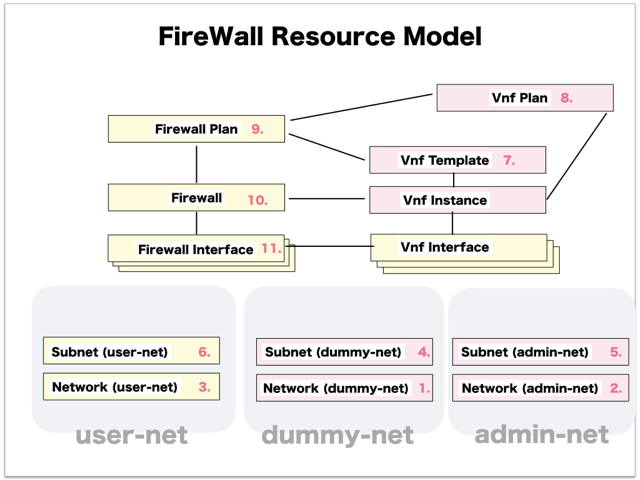

[Return to Top Page](../README.md)

# ESI interface for Firewall
This section is for the purpose of documenting ESI interface.

* Initinalizing gohan ...
* Receiving HTTP Methods for Creating Resource ...

# Resource model for Firewall
First of all, you can see the overview of resources model of "Firewall".

* [01: Network (dummy-net)](01_network_dummy.md)
* [02: Network (admin-net)](02_network_admin.md)
* [03: Network (user-net)](03_network_user.md)
* [04: Subnet (dummy-net)](04_subnet_dummy.md)
* [05: Subnet (admin-net)](05_subnet_admin.md)
* [06: Subnet (user-net)](06_subnet_user.md)
* [07: Vnf Template](07_vnf_Template.md)
* [08: Vnf Plan](08_vnf_plan.md)
* [09: Firewall Plan](09_firewall_plan.md)
* [10: Firewall](10_firewall.md)
* [11: Firewall Interface](11_firewall_interface.md)

