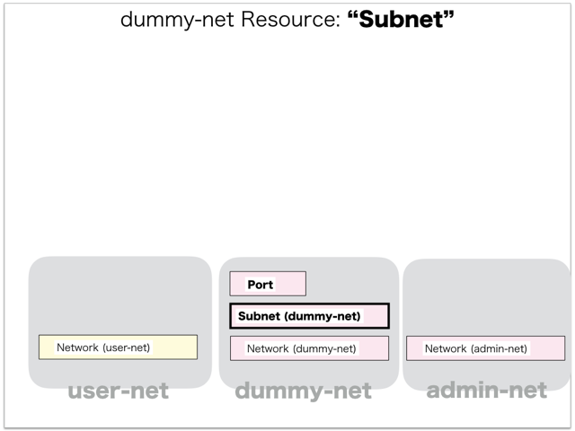

[Return to Previous Page](00_firewall.md)

# 4. Clarification of interface in Sequence Diagram "Create Subnet for admin-net"
You can see the relations of "Subnet" as following.




## 4.1. Gohan


### Outline
First of all, Gohan has received JSON data for "Create Subnet" in HTTP Methods from client.

* Checking JSON data at post method
```
POST /v2.0/subnets
```
```
{
    "subnet": {
        "description": "adminpod subnet",
        "name": "adminpod-subnet",
        "tenant_id": "0f40dffa48614d9baa7eaac7e7532099",
        "tags": {},
        "ip_version": 4,
        "cidr": "100.64.193.0/24",
        "network_id": "75c2c3ec-7fe7-494c-a35c-db3f94d3a554",
        "host_routes": [{
            "destination": "172.26.10.0/24",
            "nexthop": "100.64.193.1"
        }]
    }
}
```
After processing, Gohan has stored data for "Create Subnet" in etcd.

* [Checking stored data for creating "subnet"](stored_in_etcd/01_Gohan/CreateSubnet2_01.md)
* [Checking stored data for creating "port(dhcp)"](stored_in_etcd/01_Gohan/CreateSubnet2_02.md)


## 4.2. ResourceReader
When ResourceReader has started, it gets all of schemas from Gohan.
After that, these schemas are converted as a template_mappings.
And then, ResourceReader keeps storing template_mappings for following processing.

### Reference
* [Checking schemas in ResourceReader](../memo/schemas.txt)
* [Checking template_mappings in ResourceReader](../memo/template_mappings.md)


### Outline
After fetching resource_data for "Create Subnet" in etcd, ResourceReader has fetched heat_templates in etcd.

* [Checking stored data for "subnet"](../heat_template/subnet.md)

And then, ResourceReader has stored data as finishing resource

* [Checking stored data for creating "port(dhcp)"](stored_in_etcd/00_ResourceReader/CreateSubnet2_02.md)


## 4.3. JobManager


### Outline
After converting resource_data to job_data, JobManager has stored it in etcd.

* [Checking stored data for creating "subnet"](stored_in_etcd/02_JobManager/CreateSubnet2_01.md)


## 4.4. HeatWorker


### Outline
After fetching job_data, HeatWorker has handled job_data.
And then, HeatWorker has stored the result of handling job_data.

* [Checking stored data for creating "subnet"](stored_in_etcd/03_HeatWorker/CreateSubnet2_01.md)


## 4.5. Heat


### Outline
Heat has conducted some tasks for "Create Subnet".
As a result, Heat has stored heat-stacks for "Create Subnet".

* [Checking heat-stack of "subnet"](heat-stack/CreateSubnet2_01.md)


## 4.6. Stored resource in gohan
As a result, checking resources regarding of "Subnet" in gohan.

* Checking the target of resources via gohan client
```
$ gohan client subnet show --output-format json c8090497-34be-456b-9186-377e918f3d50
{
    "subnet": {
        "allocation_pools": [
            {
                "end": "100.64.193.254",
                "start": "100.64.193.2"
            }
        ],
        "cidr": "100.64.193.0/24",
        "description": "adminpod subnet",
        "dhcp_server_address": "100.64.193.2",
        "dns_nameservers": [],
        "enable_dhcp": true,
        "gateway_ip": "100.64.193.1",
        "host_routes": [
            {
                "destination": "172.26.10.0/24",
                "nexthop": "100.64.193.1"
            }
        ],
        "id": "c8090497-34be-456b-9186-377e918f3d50",
        "ip_version": 4,
        "ipv6_address_mode": null,
        "ipv6_ra_mode": null,
        "name": "adminpod-subnet",
        "network_id": "75c2c3ec-7fe7-494c-a35c-db3f94d3a554",
        "ntp_servers": [],
        "orchestration_state": "CREATE_COMPLETE",
        "status": "ACTIVE",
        "tags": {},
        "tenant_id": "0f40dffa48614d9baa7eaac7e7532099"
    }
}
```
* Checking another resources via gohan client
```
$ gohan client port show --output-format json 10de1073-2a60-4bbc-810b-642537ad19bf
{
    "port": {
        "admin_state_up": true,
        "allowed_address_pairs": [],
        "attached": false,
        "binding:vif_type": "vrouter",
        "description": "DHCP Server Port",
        "device_id": "c8090497-34be-456b-9186-377e918f3d50",
        "device_owner": "network:dhcp",
        "ese_logical_port_id": null,
        "fake_delete": false,
        "fixed_ips": [
            {
                "ip_address": "100.64.193.2",
                "subnet_id": "c8090497-34be-456b-9186-377e918f3d50"
            }
        ],
        "id": "10de1073-2a60-4bbc-810b-642537ad19bf",
        "mac_address": "00:00:5e:00:01:00",
        "managed_by_service": false,
        "name": "dhcp-server-port",
        "network_id": "75c2c3ec-7fe7-494c-a35c-db3f94d3a554",
        "operational_state": "",
        "orchestration_state": "SYNC_COMPLETE",
        "security_groups": [],
        "segmentation_id": null,
        "segmentation_type": null,
        "status": "ACTIVE",
        "tags": {},
        "tenant_id": "0f40dffa48614d9baa7eaac7e7532099"
    }
}
```

[Return to Previous Page](00_firewall.md)
