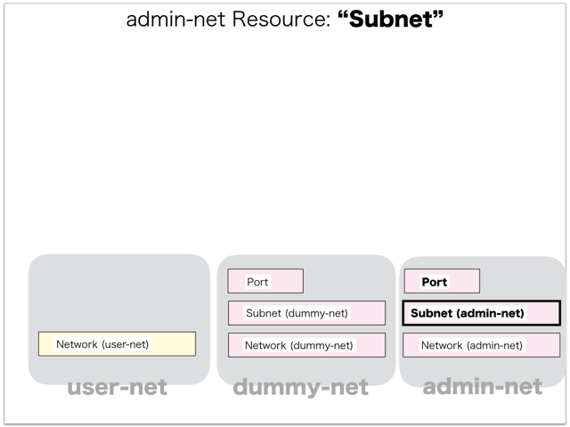

[Return to Previous Page](00_fire_wall.md)

# 5. Clarification of interface in Sequence Diagram "Create Vnf Template"
You can see the relations of "Vnf Template" as following.




## 5.1. HTTP Methods for RESTful between Gohan and Client


This is JSON data for "Create Vnf Template" in HTTP Methods from client.

* Checking JSON data at post method
```
POST /v2.0/vnf_templates
```
```
{
    "vnf_template": {
        "credentials": {
            "password": "***",
            "username": "vfwadmin"
        },
        "description": "lab3-vyatta-3.5R6_20151204",
        "dummy_networks": [
            "73b2c401-a1f3-49fb-8612-8c755b37a28d"
        ],
        "function": "firewall",
        "image": "vyatta-0108-2016",
        "init_config": {},
        "management_networks": [
            "75c2c3ec-7fe7-494c-a35c-db3f94d3a554"
        ],
        "name": "vyatta-template-3.5R6",
        "security_group": "permit-any",
        "vendor": "vyatta",
        "version": "3.5R6",
        "tenant_id": "0f40dffa48614d9baa7eaac7e7532099"
    }
}
```


## 5.2. Stored data in etcd after receiving HTTP Methods for RESTful


These are stored data for "Create Vnf Template" in etcd.

* [Checking stored data for creating "vnf_template"](stored_in_etcd/CreateVnfTemplate_01.md)


## 5.3. Stored resource in gohan
As a result, checking resources regarding of "Vnf Template" in gohan.

* Checking the target of resources via gohan client
```
$ gohan client vnf_template show --output-format json 5a84974a-9d8b-4887-898b-8e3c095e744d
{   
    "vnf_template": {
        "credentials": {
            "password": "password",
            "username": "vfwadmin"
        },
        "description": "lab3-vyatta-3.5R6_20151204",
        "dummy_networks": [
            "73b2c401-a1f3-49fb-8612-8c755b37a28d"
        ],
        "function": "firewall",
        "id": "5a84974a-9d8b-4887-898b-8e3c095e744d",
        "image": "vyatta-0108-2016",
        "init_config": {},
        "management_networks": [
            "75c2c3ec-7fe7-494c-a35c-db3f94d3a554"
        ],
        "name": "vyatta-template-3.5R6",
        "security_group": "permit-any",
        "service_network_id": null,
        "tenant_id": "0f40dffa48614d9baa7eaac7e7532099",
        "user_data_template": "",
        "vendor": "vyatta",
        "version": "3.5R6"
    }
}
```

[Return to Previous Page](00_fire_wall.md)
