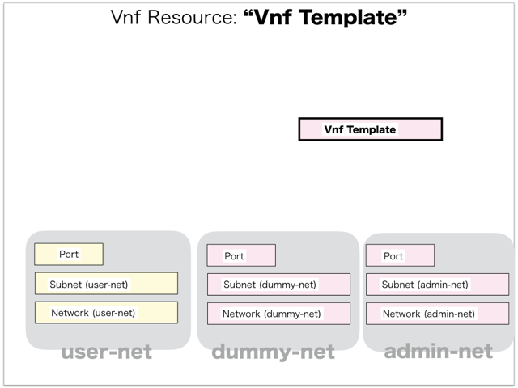

[Return to Previous Page](00_firewall.md)

# 7. Clarification of interface in Sequence Diagram "Create Vnf Template"
You can see the relations of "Vnf Template" as following.




## 7.1. Gohan


### Outline
First of all, Gohan has received JSON data for "Create Vnf Template" in HTTP Methods from client.

* Checking JSON data at post method
```
POST /v2.0/vnf_templates
```
```
{
    "vnf_template": {
        "credentials": {
            "password": "***",
            "username": "vfwadmin"
        },
        "description": "lab3-vyatta-3.5R6_20151204",
        "dummy_networks": ["3ad67159-9f73-404a-94da-582bda1641fb"],
        "function": "firewall",
        "image": "vyatta-0108-2016",
        "init_config": {},
        "management_networks": ["690a259f-d2bb-4674-ba29-07b3619cc537"],
        "name": "vyatta-template-3.5R6",
        "security_group": "permit-any",
        "vendor": "vyatta",
        "version": "3.5R6",
        "tenant_id": "d2a4608bbd28402196acdba7a1632daf"
    }
}
```
After processing, Gohan has stored data for "Create Vnf Template" in etcd

* [Checking stored data for creating "vnf_template"](stored_in_etcd/01_Gohan/CreateVnfTemplate_01.md)


## 7.2. ResourceReader
When ResourceReader has started, it gets all of schemas from Gohan.
After that, these schemas are converted as a template_mappings.
And then, ResourceReader keeps storing template_mappings for following processing.

### Reference
* [Checking schemas in ResourceReader](../memo/schemas.txt)
* [Checking template_mappings in ResourceReader](../memo/template_mappings.md)
* [Checking _relations in ResourceReader](../memo/_relations.md)


### Outline
After fetching resource_data for "Create Vnf Template" in etcd, ResourceReader has not fetched heat_templates in etcd because of non_workable_resource.
And then, ResourceReader has stored data as finishing resource

* [Checking stored data for creating "vnf_template"](stored_in_etcd/00_ResourceReader/CreateVnfTemplate_01.md)


## 7.3. Stored resource in gohan
As a result, checking resources regarding of "Vnf Template" in gohan.

* Checking the target of resources via gohan client
```
$ gohan client vnf_template show --output-format json 856d0c84-482e-483d-9fec-55a8ce177e11
{
    "vnf_template": {
        "credentials": {
            "password": "password",
            "username": "vfwadmin"
        },
        "description": "lab3-vyatta-3.5R6_20151204",
        "dummy_networks": [
            "3ad67159-9f73-404a-94da-582bda1641fb"
        ],
        "function": "firewall",
        "id": "856d0c84-482e-483d-9fec-55a8ce177e11",
        "image": "vyatta-0108-2016",
        "init_config": {},
        "management_networks": [
            "690a259f-d2bb-4674-ba29-07b3619cc537"
        ],
        "name": "vyatta-template-3.5R6",
        "security_group": "permit-any",
        "service_network_id": null,
        "tenant_id": "d2a4608bbd28402196acdba7a1632daf",
        "user_data_template": "",
        "vendor": "vyatta",
        "version": "3.5R6"
    }
}
```

[Return to Previous Page](00_firewall.md)
