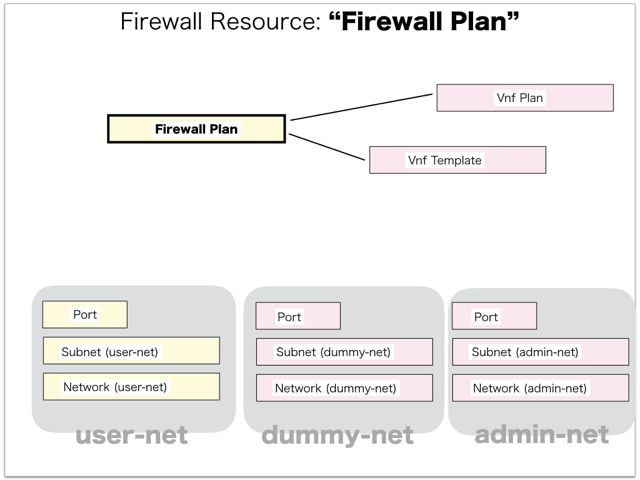

[Return to Previous Page](00_firewall.md)

# 9. Clarification of interface in Sequence Diagram "Create Firewall Plan"
You can see the relations of "Firewall Plan" as following.




## 9.1. Gohan


### Outline
First of all, Gohan has received JSON data for "Create Firewall Plan" in HTTP Methods from client.

* Checking JSON data at post method
```
POST /v2.0/firewall_plans
```
```
{
    "firewall_plan": {
        "is_public": true,
        "name": "Brocade_5600_vRouter_3.5R6S3_2CPU-8GB-2IF",
        "vendor": "vyatta",
        "version": "3.5R6S3-test",
        "vnf_plan_id": "e881b86c-4e61-4268-93a9-6b272a48cb6a",
        "vnf_template_id": "856d0c84-482e-483d-9fec-55a8ce177e11",
        "tenant_id": "d2a4608bbd28402196acdba7a1632daf"
    }
}
```
After processing, Gohan has stored data for "Create Firewall Plan" in etcd

* [Checking stored data for creating "firewall_plan"](stored_in_etcd/01_Gohan/CreateFirewallPlan_01.md)


## 9.2. ResourceReader
When ResourceReader has started, it gets all of schemas from Gohan.
After that, these schemas are converted as a template_mappings.
And then, ResourceReader keeps storing template_mappings for following processing.

### Reference
* [Checking schemas in ResourceReader](../memo/schemas.txt)
* [Checking template_mappings in ResourceReader](../memo/template_mappings.md)


### Outline
After fetching resource_data for "Create Firewall Plan" in etcd, ResourceReader has not fetched heat_templates in etcd because of non_workable_resource.
And then, ResourceReader has stored data as finishing resource

* [Checking stored data for creating "firewall_plan"](stored_in_etcd/00_ResourceReader/CreateFirewallPlan_01.md)


## 9.3. Stored resource in gohan
As a result, checking resources regarding of "Firewall Plan" in gohan.

* Checking the target of resources via gohan client
```
$ gohan client firewall_plan show --output-format json 3cf84f69-ae2e-47a1-a8f7-31286603d2f6
{
    "firewall_plan": {
        "description": "",
        "enabled": true,
        "id": "3cf84f69-ae2e-47a1-a8f7-31286603d2f6",
        "is_public": true,
        "name": "Brocade_5600_vRouter_3.5R6S3_2CPU-8GB-2IF",
        "tenant_id": "d2a4608bbd28402196acdba7a1632daf",
        "vendor": "vyatta",
        "version": "3.5R6S3-test",
        "vnf_plan_id": "e881b86c-4e61-4268-93a9-6b272a48cb6a",
        "vnf_template_id": "856d0c84-482e-483d-9fec-55a8ce177e11"
    }
}
```

[Return to Previous Page](00_firewall.md)
