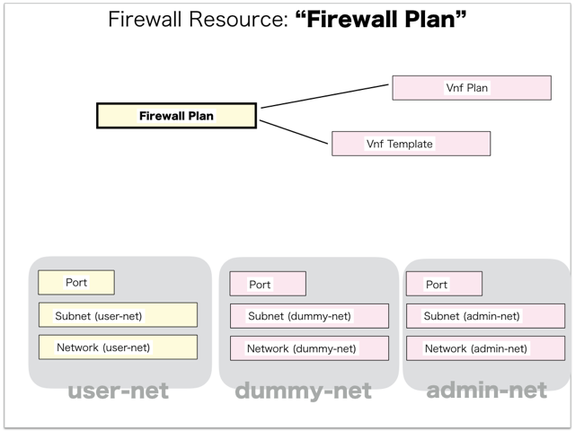

[Return to Previous Page](00_fire_wall.md)

# 9. Clarification of interface in Sequence Diagram "Create Network for user-net"
You can see the relations of "Network" as following.




## 9.1. Stored data in etcd after initinalizing gohan


These are stored data for "heat_templates" in etcd.

* [Checking stored data for "network"](../heat_template/network.md)


## 9.2. HTTP Methods for RESTful between Gohan and Client


This is JSON data for "Create Network" in HTTP Methods from client.

* Checking JSON data at post method
```
POST /v2.0/networks
```
```
{
    "network": {
        "admin_state_up": true,
        "description": "firewall network",
        "name": "sample-fw-net",
        "plane": "data",
        "tags": {},
        "tenant_id": "0f40dffa48614d9baa7eaac7e7532099"
    }
}
```


## 9.3. Stored data in etcd after receiving HTTP Methods for RESTful


These are stored data for "Create Network" in etcd.

* [Checking stored data for creating "network"](stored_in_etcd/CreateNetwork3_01.md)


## 9.4. Stored heat-stack via heat-api


These are stored heat-stacks for "Create Network" in heat-engine.

* [Checking heat-stack of "network"](heat-stack/CreateNetwork3_01.md)


## 9.5. Stored resource in gohan
As a result, checking resources regarding of "Network" in gohan.

* Checking the target of resources via neutron client
```
$ neutron net-show 82712b89-c35c-4276-83cb-818860d41f9e
+---------------------+--------------------------------------+
| Field               | Value                                |
+---------------------+--------------------------------------+
| admin_state_up      | True                                 |
| description         | firewall network                     |
| id                  | 82712b89-c35c-4276-83cb-818860d41f9e |
| name                | sample-fw-net                        |
| orchestration_state | CREATE_COMPLETE                      |
| plane               | data                                 |
| shared              | False                                |
| status              | ACTIVE                               |
| subnets             |                                      |
| tags                | {}                                   |
| tenant_id           | 0f40dffa48614d9baa7eaac7e7532099     |
+---------------------+--------------------------------------+
```
* Checking the target of resources via gohan client
```
$ gohan client network show --output-format json 82712b89-c35c-4276-83cb-818860d41f9e
{
    "network": {
        "admin_state_up": true,
        "description": "firewall network",
        "id": "82712b89-c35c-4276-83cb-818860d41f9e",
        "name": "sample-fw-net",
        "orchestration_state": "CREATE_COMPLETE",
        "plane": "data",
        "shared": false,
        "status": "ACTIVE",
        "subnets": [],
        "tags": {},
        "tenant_id": "0f40dffa48614d9baa7eaac7e7532099"
    }
}
```
* Checking billing_resource via gohan client
```
$ gohan client billing_resource list --output-format json
{
    "billing_resources": [

        ... (snip)

        {
            "config_version": 1,
            "ended": null,
            "id": "b67ba7c3-6946-42c1-bbbb-8779a54b40d6",
            "info": {},
            "parent_billing_id": null,
            "resource_id": "82712b89-c35c-4276-83cb-818860d41f9e",
            "resource_type": "network",
            "started": 1.518421605e+09,
            "tenant_id": "0f40dffa48614d9baa7eaac7e7532099",
            "unique_resource_id": "82712b89-c35c-4276-83cb-818860d41f9e"
        }
    ]
}
```

[Return to Previous Page](00_fire_wall.md)
