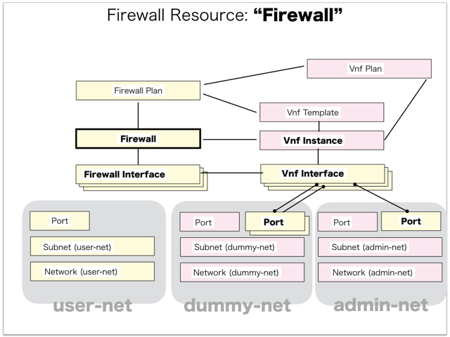
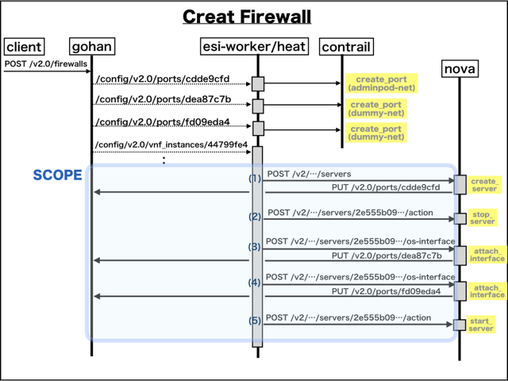

[Return to Previous Page](00_firewall.md)

# 10. Clarification of interface in Sequence Diagram "Create Firewall"
You can see the relations of "Firewall" as following.




## 10.1. Gohan


### Outline
First of all, Gohan has received JSON data for "Create Firewall" in HTTP Methods from client.

* Checking JSON data at post method
```
POST /v2.0/firewalls
```
```
{
    "firewall": {
        "availability_zone": "nova",
        "default_gateway": "192.168.1.1",
        "firewall_plan_id": "3cf84f69-ae2e-47a1-a8f7-31286603d2f6",
        "tenant_id": "d2a4608bbd28402196acdba7a1632daf"
    }
}
```
After processing, Gohan has stored data for "Create Firewall" in etcd.

* [Checking stored data for creating "port (100.64.193.3 / device_owner:"")"](stored_in_etcd/01_Gohan/CreateFirewall_01.md)
* [Checking stored data for creating "port (10.121.232.3 / device_owner:"")"](stored_in_etcd/01_Gohan/CreateFirewall_02.md)
* [Checking stored data for creating "port (10.121.232.4 / device_owner:"")"](stored_in_etcd/01_Gohan/CreateFirewall_03.md)
* [Checking stored data for creating "vnf_instance"](stored_in_etcd/01_Gohan/CreateFirewall_04.md)
* [Checking stored data for creating "vnf_interface (slot_number:0)"](stored_in_etcd/01_Gohan/CreateFirewall_05.md)
* [Checking stored data for creating "vnf_interface (slot_number:1)"](stored_in_etcd/01_Gohan/CreateFirewall_06.md)
* [Checking stored data for creating "vnf_interface (slot_number:2)"](stored_in_etcd/01_Gohan/CreateFirewall_07.md)
* [Checking stored data for creating "firewall"](stored_in_etcd/01_Gohan/CreateFirewall_08.md)
* [Checking stored data for creating "firewall_interface (dp0s5 / slot_number:2)"](stored_in_etcd/01_Gohan/CreateFirewall_09.md)
* [Checking stored data for creating "firewall_interface (dp0s4 / slot_number:1)"](stored_in_etcd/01_Gohan/CreateFirewall_10.md)
* [Checking stored data for creating "firewall_interface (dp0s3 / slot_number:0)"](stored_in_etcd/01_Gohan/CreateFirewall_11.md)
* [Checking stored data for updating "port (100.64.193.3 / device_owner:"compute:nova" / attached:false)"](stored_in_etcd/01_Gohan/CreateFirewall_12.md)
* [Checking stored data for updating "port (100.64.193.3 / device_owner:"compute:nova" / attached:true)"](stored_in_etcd/01_Gohan/CreateFirewall_13.md)
* [Checking stored data for updating "port (10.121.232.3 / device_owner:"compute:nova" / attached:false)"](stored_in_etcd/01_Gohan/CreateFirewall_14.md)
* [Checking stored data for updating "port (10.121.232.3 / device_owner:"compute:nova" / attached:true)"](stored_in_etcd/01_Gohan/CreateFirewall_15.md)
* [Checking stored data for updating "port (10.121.232.4 / device_owner:"compute:nova" / attached:false)"](stored_in_etcd/01_Gohan/CreateFirewall_16.md)
* [Checking stored data for updating "port (10.121.232.4 / device_owner:"compute:nova" / attached:true)"](stored_in_etcd/01_Gohan/CreateFirewall_17.md)


## 10.2. ResourceReader
When ResourceReader has started, it gets all of schemas from Gohan.
After that, these schemas are converted as a template_mappings.
And then, ResourceReader keeps storing template_mappings for following processing.

### Reference
* [Checking schemas in ResourceReader](../memo/schemas.txt)
* [Checking template_mappings in ResourceReader](../memo/template_mappings.md)
* [Checking _relations in ResourceReader](../memo/_relations.md)


### Outline
After fetching resource_data for "Create Firewall" in etcd, ResourceReader has fetched heat_templates in etcd.

* [Checking stored data for "port"](../heat_template/port.md)
* [Checking stored data for "vnf_instance"](../heat_template/vnf_instance.md)
* [Checking stored data for "firewall_config"](../heat_template/firewall_config.md)
* [Checking stored data for "firewall_interface"](../heat_template/firewall_interface.md)


## 10.3. JobManager


### Outline
After converting resource_data to job_data, JobManager has stored it in etcd.

* [Checking stored data for creating "port (100.64.193.3 / device_owner:"")"](stored_in_etcd/02_JobManager/CreateFirewall_01.md)
* [Checking stored data for creating "port (10.121.232.3 / device_owner:"")"](stored_in_etcd/02_JobManager/CreateFirewall_02.md)
* [Checking stored data for creating "port (10.121.232.4 / device_owner:"")"](stored_in_etcd/02_JobManager/CreateFirewall_03.md)
* [Checking stored data for creating "vnf_instance"](stored_in_etcd/02_JobManager/CreateFirewall_04.md)
* [Checking stored data for creating "firewall"](stored_in_etcd/02_JobManager/CreateFirewall_08.md)
* [Checking stored data for creating "firewall_interface (dp0s5 / slot_number:2)"](stored_in_etcd/02_JobManager/CreateFirewall_09.md)
* [Checking stored data for creating "firewall_interface (dp0s4 / slot_number:1)"](stored_in_etcd/02_JobManager/CreateFirewall_10.md)
* [Checking stored data for creating "firewall_interface (dp0s3 / slot_number:0)"](stored_in_etcd/02_JobManager/CreateFirewall_11.md)
* [Checking stored data for updating "port (100.64.193.3 / device_owner:"compute:nova" / attached:false)"](stored_in_etcd/02_JobManager/CreateFirewall_12.md)
* [Checking stored data for updating "port (100.64.193.3 / device_owner:"compute:nova" / attached:true)"](stored_in_etcd/02_JobManager/CreateFirewall_13.md)
* [Checking stored data for updating "port (10.121.232.3 / device_owner:"compute:nova" / attached:false)"](stored_in_etcd/02_JobManager/CreateFirewall_14.md)
* [Checking stored data for updating "port (10.121.232.3 / device_owner:"compute:nova" / attached:true)"](stored_in_etcd/02_JobManager/CreateFirewall_15.md)
* [Checking stored data for updating "port (10.121.232.4 / device_owner:"compute:nova" / attached:false)"](stored_in_etcd/02_JobManager/CreateFirewall_16.md)
* [Checking stored data for updating "port (10.121.232.4 / device_owner:"compute:nova" / attached:true)"](stored_in_etcd/02_JobManager/CreateFirewall_17.md)


## 10.4. HeatWorker


### Outline
After fetching job_data, HeatWorker has handled job_data.
And then, HeatWorker has stored the result of handling job_data.

* [Checking stored data for creating "port (100.64.193.3 / device_owner:"")"](stored_in_etcd/03_HeatWorker/CreateFirewall_01.md)
* [Checking stored data for creating "port (10.121.232.3 / device_owner:"")"](stored_in_etcd/03_HeatWorker/CreateFirewall_02.md)
* [Checking stored data for creating "port (10.121.232.4 / device_owner:"")"](stored_in_etcd/03_HeatWorker/CreateFirewall_03.md)
* [Checking stored data for creating "vnf_instance"](stored_in_etcd/03_HeatWorker/CreateFirewall_04.md)
* [Checking stored data for creating "firewall"](stored_in_etcd/03_HeatWorker/CreateFirewall_08.md)
* [Checking stored data for creating "firewall_interface (dp0s5 / slot_number:2)"](stored_in_etcd/03_HeatWorker/CreateFirewall_09.md)
* [Checking stored data for creating "firewall_interface (dp0s4 / slot_number:1)"](stored_in_etcd/03_HeatWorker/CreateFirewall_10.md)
* [Checking stored data for creating "firewall_interface (dp0s3 / slot_number:0)"](stored_in_etcd/03_HeatWorker/CreateFirewall_11.md)
* [Checking stored data for updating "port (100.64.193.3 / device_owner:"compute:nova" / attached:false)"](stored_in_etcd/03_HeatWorker/CreateFirewall_12.md)
* [Checking stored data for updating "port (100.64.193.3 / device_owner:"compute:nova" / attached:true)"](stored_in_etcd/03_HeatWorker/CreateFirewall_13.md)
* [Checking stored data for updating "port (10.121.232.3 / device_owner:"compute:nova" / attached:false)"](stored_in_etcd/03_HeatWorker/CreateFirewall_14.md)
* [Checking stored data for updating "port (10.121.232.3 / device_owner:"compute:nova" / attached:true)"](stored_in_etcd/03_HeatWorker/CreateFirewall_15.md)
* [Checking stored data for updating "port (10.121.232.4 / device_owner:"compute:nova" / attached:false)"](stored_in_etcd/03_HeatWorker/CreateFirewall_16.md)
* [Checking stored data for updating "port (10.121.232.4 / device_owner:"compute:nova" / attached:true)"](stored_in_etcd/03_HeatWorker/CreateFirewall_17.md)


## 10.5. Heat


### Outline
Heat has conducted some tasks for "Create Firewall".
As a result, Heat has stored heat-stacks for "Create Firewall".

* [Checking heat-stack of "vnf_instance"](heat-stack/CreateFirewall_01.md)
* [Checking heat-stack of "firewall"](heat-stack/CreateFirewall_02.md)
* [Checking heat-stack of "firewall_interface (dp0s3)"](heat-stack/CreateFirewall_03.md)
* [Checking heat-stack of "firewall_interface (dp0s4)"](heat-stack/CreateFirewall_04.md)
* [Checking heat-stack of "firewall_interface (dp0s5)"](heat-stack/CreateFirewall_05.md)
* [Checking heat-stack of "port (100.64.193.3)"](heat-stack/CreateFirewall_06.md)
* [Checking heat-stack of "port (10.121.232.3)"](heat-stack/CreateFirewall_07.md)
* [Checking heat-stack of "port (10.121.232.4)"](heat-stack/CreateFirewall_08.md)


## 10.6. ESI-Interface between Gohan/heat-engine and Nova-compute




### (1) Creating vnf-instance in nova-comoute
* from heat to nova
```
POST /v2/d2a4608bbd28402196acdba7a1632daf/servers
```
```
{
    "server": {
        "name": "firewall-dbd98e9a-30ba-4b9b-a2a4-ef4ddb3d36cc",
        "imageRef": "9fc4bb4b-a95d-4d86-8510-8679969d969b",
        "availability_zone": "nova",
        "flavorRef": "4",
        "max_count": 1,
        "min_count": 1,
        "networks": [
            {
                "port": "47c9831b-b346-4317-bc44-f942ecaee54c"
            }
        ]
    }
}
```
* from nova to gohan
```
PUT /v2.0/ports/47c9831b-b346-4317-bc44-f942ecaee54c.json
```
```
{
    "port": {
        "device_owner": "compute:nova",
        "device_id": "dab11f56-f0f2-4cac-bee6-6cec5038458c"
    }
}
```
* from gohan to nova
```
POST /v2/d2a4608bbd28402196acdba7a1632daf/os-server-external-events
```
```
{
    "events": [
        {
            "name": "network-vif-plugged",
            "server_uuid": "dab11f56-f0f2-4cac-bee6-6cec5038458c",
            "status": "completed",
            "tag": "47c9831b-b346-4317-bc44-f942ecaee54c"
        }
    ]
}
```
### (2) Stopping vnf-instace in nova-comoute
* from heat to nova
```
POST /v2/d2a4608bbd28402196acdba7a1632daf/servers/dab11f56-f0f2-4cac-bee6-6cec5038458c/action
```
```
{
    "os-stop": null
}
```
### (3) Attaching interface in nova-comoute
* from heat to nova
```
POST /v2/d2a4608bbd28402196acdba7a1632daf/servers/dab11f56-f0f2-4cac-bee6-6cec5038458c/os-interface
```
```
{
    "interfaceAttachment": {
        "port_id": "160234ca-2b72-4029-b3ff-8c83d82b9c5a"
    }
}
```
* from nova to gohan
```
PUT /v2.0/ports/160234ca-2b72-4029-b3ff-8c83d82b9c5a.json
```
```
{
    "port": {
        "device_owner": "compute:nova",
        "device_id": "dab11f56-f0f2-4cac-bee6-6cec5038458c"
    }
}
```
* from gohan to nova
```
POST /v2/d2a4608bbd28402196acdba7a1632daf/os-server-external-events
```
```
{   
    "events": [
        {   
            "name": "network-vif-plugged",
            "server_uuid": "dab11f56-f0f2-4cac-bee6-6cec5038458c",
            "status": "completed",
            "tag": "160234ca-2b72-4029-b3ff-8c83d82b9c5a"
        }
    ]
}
```
### (4) Attaching interface in nova-comoute
* from heat to nova
```
POST /v2/d2a4608bbd28402196acdba7a1632daf/servers/dab11f56-f0f2-4cac-bee6-6cec5038458c/os-interface
```
```
{
    "interfaceAttachment": {
        "port_id": "47c97a61-e3e8-403a-b662-a117935c7a02"
    }
}
```
* from nova to gohan
```
PUT /v2.0/ports/47c97a61-e3e8-403a-b662-a117935c7a02.json
```
```
{
    "port": {
        "device_owner": "compute:nova",
        "device_id": "dab11f56-f0f2-4cac-bee6-6cec5038458c"
    }
}
```
* from gohan to nova
```
POST /v2/d2a4608bbd28402196acdba7a1632daf/os-server-external-events
```
```
{
    "events": [
        {
            "name": "network-vif-plugged",
            "server_uuid": "dab11f56-f0f2-4cac-bee6-6cec5038458c",
            "status": "completed",
            "tag": "47c97a61-e3e8-403a-b662-a117935c7a02"
        }
    ]
}
```
### (5) Starting vnf-instace in nova-comoute
* from heat to nova
```
POST /v2/d2a4608bbd28402196acdba7a1632daf/servers/dab11f56-f0f2-4cac-bee6-6cec5038458c/action
```
```
{
    "os-start": null
}
```


## 10.7. CollectorAgent


### Outline
CollectorAgent has conducted some tasks for "Create Firewall" based heat-stacks via Heat.
As a result, CollectorAgent has responded the result of status information as handling tasks.

* [Checking monitoring of "vnf_instance"](collector_agents/CreateFirewall_01.md)
* [Checking monitoring of "firewall_config"](collector_agents/CreateFirewall_02.md)
* [Checking monitoring of "firewall_interface (dp0s5)"](collector_agents/CreateFirewall_03.md)
* [Checking monitoring of "firewall_interface (dp0s3)"](collector_agents/CreateFirewall_04.md)
* [Checking monitoring of "firewall_interface (dp0s4)"](collector_agents/CreateFirewall_05.md)
* [Checking monitoring of "port"](collector_agents/CreateFirewall_06.md)
* [Checking monitoring of "port"](collector_agents/CreateFirewall_07.md)
* [Checking monitoring of "port"](collector_agents/CreateFirewall_08.md)

And then, CollectorAgent has stored the result of status information.

* [Checking stored data for creating "vnf_instance"](stored_in_etcd/04_CollectorAgent/CreateFirewall_04.md)
* [Checking stored data for creating "firewall"](stored_in_etcd/04_CollectorAgent/CreateFirewall_08.md)
* [Checking stored data for creating "firewall_interface (dp0s5 / slot_number:2)"](stored_in_etcd/04_CollectorAgent/CreateFirewall_09.md)
* [Checking stored data for creating "firewall_interface (dp0s4 / slot_number:1)"](stored_in_etcd/04_CollectorAgent/CreateFirewall_10.md)
* [Checking stored data for creating "firewall_interface (dp0s3 / slot_number:0)"](stored_in_etcd/04_CollectorAgent/CreateFirewall_11.md)
* [Checking stored data for updating "port (100.64.193.3 / device_owner:"compute:nova" / attached:true)"](stored_in_etcd/04_CollectorAgent/CreateFirewall_13.md)
* [Checking stored data for updating "port (10.121.232.3 / device_owner:"compute:nova" / attached:true)"](stored_in_etcd/04_CollectorAgent/CreateFirewall_15.md)
* [Checking stored data for updating "port (10.121.232.4 / device_owner:"compute:nova" / attached:true)"](stored_in_etcd/04_CollectorAgent/CreateFirewall_17.md)


## 10.8. Stored resource in gohan
As a result, checking resources regarding of "Firewall" in gohan.

* Checking the target of resources via gohan client
```
$ gohan client firewall show --output-format json dbd98e9a-30ba-4b9b-a2a4-ef4ddb3d36cc
{
    "firewall": {
        "admin_username": "user-admin",
        "availability_zone": "nova",
        "default_gateway": "192.168.1.1",
        "description": "",
        "firewall_plan_id": "3cf84f69-ae2e-47a1-a8f7-31286603d2f6",
        "id": "dbd98e9a-30ba-4b9b-a2a4-ef4ddb3d36cc",
        "interfaces": [
            {
                "id": "e262b311-b17e-442b-adb1-41e93117067d",
                "ip_address": "100.64.194.3",
                "name": "dp0s3",
                "network_id": "690a259f-d2bb-4674-ba29-07b3619cc537",
                "operational_state": "NO_STATE",
                "orchestration_state": "CREATE_COMPLETE",
                "slot_number": 0,
                "status": "PENDING_CREATE",
                "type": "management",
                "virtual_ip_address": null,
                "virtual_ip_properties": null,
                "vnf_interface_id": "a641f61c-cbc9-447c-b180-a7eaa4a683ad"
            },
            {
                "id": "1fbbd8eb-0e12-4178-96e8-7454faed5f82",
                "ip_address": null,
                "name": "dp0s4",
                "network_id": null,
                "operational_state": "NO_STATE",
                "orchestration_state": "CREATE_COMPLETE",
                "slot_number": 1,
                "status": "PENDING_CREATE",
                "type": "user",
                "virtual_ip_address": null,
                "virtual_ip_properties": null,
                "vnf_interface_id": "20e0aabb-d2db-4b0f-89f6-61f685f1af0d"
            },
            {
                "id": "69718be2-0ae7-4601-bead-face902fe88e",
                "ip_address": null,
                "name": "dp0s5",
                "network_id": null,
                "operational_state": "NO_STATE",
                "orchestration_state": "CREATE_COMPLETE",
                "slot_number": 2,
                "status": "PENDING_CREATE",
                "type": "user",
                "virtual_ip_address": null,
                "virtual_ip_properties": null,
                "vnf_interface_id": "3c6c8dcb-16f5-4523-90d0-f06295670928"
            }
        ],
        "name": "",
        "networks": [
            {
                "ifname": "dp0s4",
                "type": "disable"
            },
            {
                "ifname": "dp0s5",
                "type": "disable"
            }
        ],
        "operational_state": "UP",
        "orchestration_state": "CREATE_COMPLETE",
        "other_username": "",
        "status": "ACTIVE",
        "tenant_id": "d2a4608bbd28402196acdba7a1632daf",
        "user_username": "user-read",
        "vnf_instance_id": "c10935ab-768a-4901-8953-11f9d3987949"
    }
}
```
* Checking billing_resource via gohan client
```
$ gohan client billing_resource list --output-format json
{
    "billing_resources": [

        ... (snip)

        {
            "config_version": 1,
            "ended": null,
            "id": "5425b94a-c38b-4d14-baa0-1cc0c249e5dd",
            "info": {
                "plan_name": "Brocade_5600_vRouter_3.5R6S3_2CPU-8GB-2IF"
            },
            "parent_billing_id": "a75ba422-35f4-422f-a750-289e92813b41",
            "resource_id": "3cf84f69-ae2e-47a1-a8f7-31286603d2f6",
            "resource_type": "firewall_plan",
            "started": 1554174566,
            "tenant_id": "d2a4608bbd28402196acdba7a1632daf",
            "unique_resource_id": null
        },
        {
            "config_version": 1,
            "ended": null,
            "id": "a75ba422-35f4-422f-a750-289e92813b41",
            "info": {},
            "parent_billing_id": null,
            "resource_id": "dbd98e9a-30ba-4b9b-a2a4-ef4ddb3d36cc",
            "resource_type": "firewall",
            "started": 1554174566,
            "tenant_id": "d2a4608bbd28402196acdba7a1632daf",
            "unique_resource_id": "dbd98e9a-30ba-4b9b-a2a4-ef4ddb3d36cc"
        }
    ]
}
```
* Checking another resources via nova client
```
$ nova show dab11f56-f0f2-4cac-bee6-6cec5038458c
+--------------------------------------+----------------------------------------------------------+
| Property                             | Value                                                    |
+--------------------------------------+----------------------------------------------------------+
| OS-DCF:diskConfig                    | MANUAL                                                   |
| OS-EXT-AZ:availability_zone          | nova                                                     |
| OS-EXT-SRV-ATTR:host                 | nova-server                                              |
| OS-EXT-SRV-ATTR:hypervisor_hostname  | nova-server                                              |
| OS-EXT-SRV-ATTR:instance_name        | instance-00000001                                        |
| OS-EXT-STS:power_state               | 1                                                        |
| OS-EXT-STS:task_state                | -                                                        |
| OS-EXT-STS:vm_state                  | active                                                   |
| OS-SRV-USG:launched_at               | 2019-04-02T03:03:43.000000                               |
| OS-SRV-USG:terminated_at             | -                                                        |
| accessIPv4                           |                                                          |
| accessIPv6                           |                                                          |
| adminpod-net network                 | 100.64.194.3                                             |
| config_drive                         |                                                          |
| created                              | 2019-04-02T03:03:41Z                                     |
| dummy-net network                    | 10.121.233.3, 10.121.233.4                               |
| flavor                               | m1.large (4)                                             |
| hostId                               | 4f4fbb86d429cec49e95d62cb55cc424096b58690396c7d4ca0ca65b |
| id                                   | dab11f56-f0f2-4cac-bee6-6cec5038458c                     |
| image                                | vyatta-0108-2016 (9fc4bb4b-a95d-4d86-8510-8679969d969b)  |
| key_name                             | -                                                        |
| metadata                             | {}                                                       |
| name                                 | firewall-dbd98e9a-30ba-4b9b-a2a4-ef4ddb3d36cc            |
| os-extended-volumes:volumes_attached | []                                                       |
| progress                             | 0                                                        |
| status                               | ACTIVE                                                   |
| tenant_id                            | d2a4608bbd28402196acdba7a1632daf                         |
| updated                              | 2019-04-02T03:08:18Z                                     |
| user_id                              | 4763e26949b143fcab1ea1b20e9a8490                         |
+--------------------------------------+----------------------------------------------------------+
```
```
$ nova interface-list dab11f56-f0f2-4cac-bee6-6cec5038458c
+------------+--------------------------------------+--------------------------------------+--------------+-------------------+
| Port State | Port ID                              | Net ID                               | IP addresses | MAC Addr          |
+------------+--------------------------------------+--------------------------------------+--------------+-------------------+
| ACTIVE     | 160234ca-2b72-4029-b3ff-8c83d82b9c5a | 3ad67159-9f73-404a-94da-582bda1641fb | 10.121.233.3 | fa:16:3e:76:31:15 |
| ACTIVE     | 47c97a61-e3e8-403a-b662-a117935c7a02 | 3ad67159-9f73-404a-94da-582bda1641fb | 10.121.233.4 | fa:16:3e:85:92:30 |
| ACTIVE     | 47c9831b-b346-4317-bc44-f942ecaee54c | 690a259f-d2bb-4674-ba29-07b3619cc537 | 100.64.194.3 | fa:16:3e:b6:b6:57 |
+------------+--------------------------------------+--------------------------------------+--------------+-------------------+
```
* Checking another resources via neutron client
```
$ neutron port-list | grep -v dhcp-server-port
+--------------------------------------+--------------------------+-------------------+-------------------------------------------------------------------------------------+
| id                                   | name                     | mac_address       | fixed_ips                                                                           |
+--------------------------------------+--------------------------+-------------------+-------------------------------------------------------------------------------------+
| 160234ca-2b72-4029-b3ff-8c83d82b9c5a | firewall-user-port       | fa:16:3e:76:31:15 | {"subnet_id": "0479131c-e828-4721-abaa-a46265518b89", "ip_address": "10.121.233.3"} |
| 47c97a61-e3e8-403a-b662-a117935c7a02 | firewall-user-port       | fa:16:3e:85:92:30 | {"subnet_id": "0479131c-e828-4721-abaa-a46265518b89", "ip_address": "10.121.233.4"} |
| 47c9831b-b346-4317-bc44-f942ecaee54c | firewall-management-port | fa:16:3e:b6:b6:57 | {"subnet_id": "35e00dad-ad5e-46a2-b71d-93b4e72800b1", "ip_address": "100.64.194.3"} |
+--------------------------------------+--------------------------+-------------------+-------------------------------------------------------------------------------------+
```
```
$ neutron port-show 160234ca-2b72-4029-b3ff-8c83d82b9c5a
+-----------------------+-------------------------------------------------------------------------------------+
| Field                 | Value                                                                               |
+-----------------------+-------------------------------------------------------------------------------------+
| admin_state_up        | False                                                                               |
| allowed_address_pairs |                                                                                     |
| attached              | True                                                                                |
| binding:vif_type      | vrouter                                                                             |
| description           |                                                                                     |
| device_id             | dab11f56-f0f2-4cac-bee6-6cec5038458c                                                |
| device_owner          | compute:nova                                                                        |
| ese_logical_port_id   |                                                                                     |
| fake_delete           | True                                                                                |
| fixed_ips             | {"subnet_id": "0479131c-e828-4721-abaa-a46265518b89", "ip_address": "10.121.233.3"} |
| id                    | 160234ca-2b72-4029-b3ff-8c83d82b9c5a                                                |
| mac_address           | fa:16:3e:76:31:15                                                                   |
| managed_by_service    | False                                                                               |
| name                  | firewall-user-port                                                                  |
| network_id            | 3ad67159-9f73-404a-94da-582bda1641fb                                                |
| operational_state     | UP                                                                                  |
| orchestration_state   | UPDATE_COMPLETE                                                                     |
| security_groups       |                                                                                     |
| segmentation_id       | 0                                                                                   |
| segmentation_type     | flat                                                                                |
| status                | ACTIVE                                                                              |
| tags                  | {}                                                                                  |
| tenant_id             | d2a4608bbd28402196acdba7a1632daf                                                    |
+-----------------------+-------------------------------------------------------------------------------------+
```
```
$ neutron port-show 47c97a61-e3e8-403a-b662-a117935c7a02
+-----------------------+-------------------------------------------------------------------------------------+
| Field                 | Value                                                                               |
+-----------------------+-------------------------------------------------------------------------------------+
| admin_state_up        | False                                                                               |
| allowed_address_pairs |                                                                                     |
| attached              | True                                                                                |
| binding:vif_type      | vrouter                                                                             |
| description           |                                                                                     |
| device_id             | dab11f56-f0f2-4cac-bee6-6cec5038458c                                                |
| device_owner          | compute:nova                                                                        |
| ese_logical_port_id   |                                                                                     |
| fake_delete           | True                                                                                |
| fixed_ips             | {"subnet_id": "0479131c-e828-4721-abaa-a46265518b89", "ip_address": "10.121.233.4"} |
| id                    | 47c97a61-e3e8-403a-b662-a117935c7a02                                                |
| mac_address           | fa:16:3e:85:92:30                                                                   |
| managed_by_service    | False                                                                               |
| name                  | firewall-user-port                                                                  |
| network_id            | 3ad67159-9f73-404a-94da-582bda1641fb                                                |
| operational_state     | UP                                                                                  |
| orchestration_state   | UPDATE_COMPLETE                                                                     |
| security_groups       |                                                                                     |
| segmentation_id       | 0                                                                                   |
| segmentation_type     | flat                                                                                |
| status                | ACTIVE                                                                              |
| tags                  | {}                                                                                  |
| tenant_id             | d2a4608bbd28402196acdba7a1632daf                                                    |
+-----------------------+-------------------------------------------------------------------------------------+
```
```
$ neutron port-show 47c9831b-b346-4317-bc44-f942ecaee54c
+-----------------------+-------------------------------------------------------------------------------------+
| Field                 | Value                                                                               |
+-----------------------+-------------------------------------------------------------------------------------+
| admin_state_up        | True                                                                                |
| allowed_address_pairs |                                                                                     |
| attached              | True                                                                                |
| binding:vif_type      | vrouter                                                                             |
| description           |                                                                                     |
| device_id             | dab11f56-f0f2-4cac-bee6-6cec5038458c                                                |
| device_owner          | compute:nova                                                                        |
| ese_logical_port_id   |                                                                                     |
| fake_delete           | True                                                                                |
| fixed_ips             | {"subnet_id": "35e00dad-ad5e-46a2-b71d-93b4e72800b1", "ip_address": "100.64.194.3"} |
| id                    | 47c9831b-b346-4317-bc44-f942ecaee54c                                                |
| mac_address           | fa:16:3e:b6:b6:57                                                                   |
| managed_by_service    | False                                                                               |
| name                  | firewall-management-port                                                            |
| network_id            | 690a259f-d2bb-4674-ba29-07b3619cc537                                                |
| operational_state     | UP                                                                                  |
| orchestration_state   | UPDATE_COMPLETE                                                                     |
| security_groups       |                                                                                     |
| segmentation_id       | 0                                                                                   |
| segmentation_type     | flat                                                                                |
| status                | ACTIVE                                                                              |
| tags                  | {}                                                                                  |
| tenant_id             | d2a4608bbd28402196acdba7a1632daf                                                    |
+-----------------------+-------------------------------------------------------------------------------------+
```
* Checking another resources via gohan client
```
$ gohan client vnf_instance show --output-format json c10935ab-768a-4901-8953-11f9d3987949
{
    "vnf_instance": {
        "availability_zone": "nova",
        "config_drive": false,
        "description": null,
        "id": "c10935ab-768a-4901-8953-11f9d3987949",
        "management_ip": "100.64.194.3",
        "name": "firewall-dbd98e9a-30ba-4b9b-a2a4-ef4ddb3d36cc",
        "networks": [
            {
                "port": "47c9831b-b346-4317-bc44-f942ecaee54c"
            },
            {
                "port": "160234ca-2b72-4029-b3ff-8c83d82b9c5a"
            },
            {
                "port": "47c97a61-e3e8-403a-b662-a117935c7a02"
            }
        ],
        "operational_state": "UP",
        "orchestration_state": "CREATE_COMPLETE",
        "owner_tenant_id": "d2a4608bbd28402196acdba7a1632daf",
        "reboot": "",
        "status": "ACTIVE",
        "tenant_id": "d2a4608bbd28402196acdba7a1632daf",
        "user_data": "",
        "user_data_format": "RAW",
        "user_data_parameters": {},
        "vnf_plan_id": "e881b86c-4e61-4268-93a9-6b272a48cb6a",
        "vnf_template_id": "856d0c84-482e-483d-9fec-55a8ce177e11"
    }
}
```
```
$ gohan client port list --output-format json
{
    "ports": [

        ... (snip)

        {
            "admin_state_up": false,
            "allowed_address_pairs": [],
            "attached": true,
            "binding:vif_type": "vrouter",
            "description": "",
            "device_id": "dab11f56-f0f2-4cac-bee6-6cec5038458c",
            "device_owner": "compute:nova",
            "ese_logical_port_id": null,
            "fake_delete": true,
            "fixed_ips": [
                {
                    "ip_address": "10.121.233.3",
                    "subnet_id": "0479131c-e828-4721-abaa-a46265518b89"
                }
            ],
            "id": "160234ca-2b72-4029-b3ff-8c83d82b9c5a",
            "mac_address": "fa:16:3e:76:31:15",
            "managed_by_service": false,
            "name": "firewall-user-port",
            "network_id": "3ad67159-9f73-404a-94da-582bda1641fb",
            "operational_state": "UP",
            "orchestration_state": "UPDATE_COMPLETE",
            "security_groups": [],
            "segmentation_id": 0,
            "segmentation_type": "flat",
            "status": "ACTIVE",
            "tags": {},
            "tenant_id": "d2a4608bbd28402196acdba7a1632daf"
        },
        {
            "admin_state_up": false,
            "allowed_address_pairs": [],
            "attached": true,
            "binding:vif_type": "vrouter",
            "description": "",
            "device_id": "dab11f56-f0f2-4cac-bee6-6cec5038458c",
            "device_owner": "compute:nova",
            "ese_logical_port_id": null,
            "fake_delete": true,
            "fixed_ips": [
                {
                    "ip_address": "10.121.233.4",
                    "subnet_id": "0479131c-e828-4721-abaa-a46265518b89"
                }
            ],
            "id": "47c97a61-e3e8-403a-b662-a117935c7a02",
            "mac_address": "fa:16:3e:85:92:30",
            "managed_by_service": false,
            "name": "firewall-user-port",
            "network_id": "3ad67159-9f73-404a-94da-582bda1641fb",
            "operational_state": "UP",
            "orchestration_state": "UPDATE_COMPLETE",
            "security_groups": [],
            "segmentation_id": 0,
            "segmentation_type": "flat",
            "status": "ACTIVE",
            "tags": {},
            "tenant_id": "d2a4608bbd28402196acdba7a1632daf"
        },
        {
            "admin_state_up": true,
            "allowed_address_pairs": [],
            "attached": true,
            "binding:vif_type": "vrouter",
            "description": "",
            "device_id": "dab11f56-f0f2-4cac-bee6-6cec5038458c",
            "device_owner": "compute:nova",
            "ese_logical_port_id": null,
            "fake_delete": true,
            "fixed_ips": [
                {
                    "ip_address": "100.64.194.3",
                    "subnet_id": "35e00dad-ad5e-46a2-b71d-93b4e72800b1"
                }
            ],
            "id": "47c9831b-b346-4317-bc44-f942ecaee54c",
            "mac_address": "fa:16:3e:b6:b6:57",
            "managed_by_service": false,
            "name": "firewall-management-port",
            "network_id": "690a259f-d2bb-4674-ba29-07b3619cc537",
            "operational_state": "UP",
            "orchestration_state": "UPDATE_COMPLETE",
            "security_groups": [],
            "segmentation_id": 0,
            "segmentation_type": "flat",
            "status": "ACTIVE",
            "tags": {},
            "tenant_id": "d2a4608bbd28402196acdba7a1632daf"
        }
    ]
}
```
```
$ gohan client vnf_interface list --output-format json
{
    "vnf_interfaces": [
        {
            "description": null,
            "id": "20e0aabb-d2db-4b0f-89f6-61f685f1af0d",
            "ip_address": null,
            "name": "interface-1",
            "network_id": null,
            "port_id": "160234ca-2b72-4029-b3ff-8c83d82b9c5a",
            "slot_number": 1,
            "status": "ACTIVE",
            "tenant_id": "d2a4608bbd28402196acdba7a1632daf",
            "type": "user",
            "virtual_ip_address": null,
            "virtual_ip_properties": null,
            "vnf_instance_id": "c10935ab-768a-4901-8953-11f9d3987949"
        },
        {
            "description": null,
            "id": "3c6c8dcb-16f5-4523-90d0-f06295670928",
            "ip_address": null,
            "name": "interface-2",
            "network_id": null,
            "port_id": "47c97a61-e3e8-403a-b662-a117935c7a02",
            "slot_number": 2,
            "status": "ACTIVE",
            "tenant_id": "d2a4608bbd28402196acdba7a1632daf",
            "type": "user",
            "virtual_ip_address": null,
            "virtual_ip_properties": null,
            "vnf_instance_id": "c10935ab-768a-4901-8953-11f9d3987949"
        },
        {
            "description": null,
            "id": "a641f61c-cbc9-447c-b180-a7eaa4a683ad",
            "ip_address": "100.64.194.3",
            "name": "interface-0",
            "network_id": "690a259f-d2bb-4674-ba29-07b3619cc537",
            "port_id": "47c9831b-b346-4317-bc44-f942ecaee54c",
            "slot_number": 0,
            "status": "ACTIVE",
            "tenant_id": "d2a4608bbd28402196acdba7a1632daf",
            "type": "management",
            "virtual_ip_address": null,
            "virtual_ip_properties": null,
            "vnf_instance_id": "c10935ab-768a-4901-8953-11f9d3987949"
        }
    ]
}
```
```
$ gohan client firewall_interface list --output-format json
{
    "firewall_interfaces": [
        {
            "description": null,
            "firewall_id": "dbd98e9a-30ba-4b9b-a2a4-ef4ddb3d36cc",
            "id": "1fbbd8eb-0e12-4178-96e8-7454faed5f82",
            "ip_address": null,
            "name": "dp0s4",
            "network_id": null,
            "operational_state": "UP",
            "orchestration_state": "CREATE_COMPLETE",
            "slot_number": 1,
            "status": "ACTIVE",
            "tenant_id": "d2a4608bbd28402196acdba7a1632daf",
            "type": "user",
            "virtual_ip_address": null,
            "virtual_ip_properties": null,
            "vnf_interface_id": "20e0aabb-d2db-4b0f-89f6-61f685f1af0d"
        },
        {
            "description": null,
            "firewall_id": "dbd98e9a-30ba-4b9b-a2a4-ef4ddb3d36cc",
            "id": "69718be2-0ae7-4601-bead-face902fe88e",
            "ip_address": null,
            "name": "dp0s5",
            "network_id": null,
            "operational_state": "UP",
            "orchestration_state": "CREATE_COMPLETE",
            "slot_number": 2,
            "status": "ACTIVE",
            "tenant_id": "d2a4608bbd28402196acdba7a1632daf",
            "type": "user",
            "virtual_ip_address": null,
            "virtual_ip_properties": null,
            "vnf_interface_id": "3c6c8dcb-16f5-4523-90d0-f06295670928"
        },
        {
            "description": null,
            "firewall_id": "dbd98e9a-30ba-4b9b-a2a4-ef4ddb3d36cc",
            "id": "e262b311-b17e-442b-adb1-41e93117067d",
            "ip_address": "100.64.194.3",
            "name": "dp0s3",
            "network_id": "690a259f-d2bb-4674-ba29-07b3619cc537",
            "operational_state": "UP",
            "orchestration_state": "CREATE_COMPLETE",
            "slot_number": 0,
            "status": "ACTIVE",
            "tenant_id": "d2a4608bbd28402196acdba7a1632daf",
            "type": "management",
            "virtual_ip_address": null,
            "virtual_ip_properties": null,
            "vnf_interface_id": "a641f61c-cbc9-447c-b180-a7eaa4a683ad"
        }
    ]
}
```

[Return to Previous Page](00_firewall.md)
