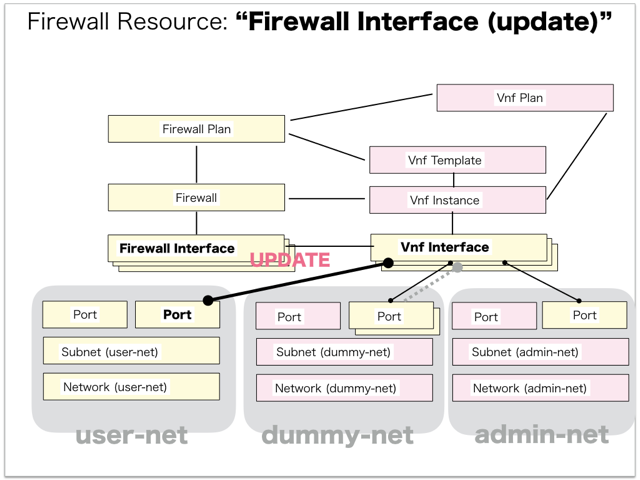
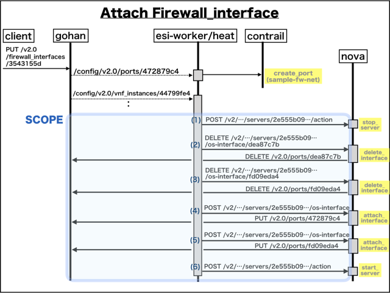

[Return to Previous Page](00_firewall.md)

# 11. Clarification of interface in Sequence Diagram "Update Firewall Interface"
You can see the relations of "Firewall Interface" as following.




## 11.1. Gohan


### Outline
First of all, Gohan has received JSON data for "Update Firewall Interface" in HTTP Methods from client.

* Checking JSON data at post method
```
PUT /v2.0/firewall_interfaces/3543155d-0d9a-43a3-ae77-3479cf8a0e4a
```
```
{
    "firewall_interface": {
        "network_id": "82712b89-c35c-4276-83cb-818860d41f9e"
    }
}
```
After processing, Gohan has stored data for "Update Firewall Interface" in etcd.

* [Checking stored data for creating "port (10.98.76.3   / device_owner:"")"](stored_in_etcd/01_Gohan/UpdateFirewallInterface_01.md)
* [Checking stored data for updating "vnf_interface (slot_number:1)"](stored_in_etcd/01_Gohan/UpdateFirewallInterface_02.md)
* [Checking stored data for updating "vnf_instance"](stored_in_etcd/01_Gohan/UpdateFirewallInterface_03.md)
* [Checking stored data for updating "firewall_interface (dp0s4 / slot_number:1 / 10.98.76.3)"](stored_in_etcd/01_Gohan/UpdateFirewallInterface_04.md)
* [Checking stored data for updating "firewall"](stored_in_etcd/01_Gohan/UpdateFirewallInterface_05.md)
* [Checking stored data for deleting "port (10.121.232.3 / device_owner:"compute:nova")"](stored_in_etcd/01_Gohan/UpdateFirewallInterface_06.md)
* [Checking stored data for updating "port (10.121.232.4 / device_owner:""             / attached:false)"](stored_in_etcd/01_Gohan/UpdateFirewallInterface_07.md)
* [Checking stored data for updating "port (10.98.76.3   / device_owner:"compute:nova" / attached:false)"](stored_in_etcd/01_Gohan/UpdateFirewallInterface_08.md)
* [Checking stored data for updating "port (10.98.76.3   / device_owner:"compute:nova" / attached:true)"](stored_in_etcd/01_Gohan/UpdateFirewallInterface_09.md)
* [Checking stored data for updating "port (10.121.232.4 / device_owner:"compute:nova" / attached:false)"](stored_in_etcd/01_Gohan/UpdateFirewallInterface_10.md)
* [Checking stored data for updating "port (10.121.232.4 / device_owner:"compute:nova" / attached:true)"](stored_in_etcd/01_Gohan/UpdateFirewallInterface_11.md)


## 11.2. ResourceReader
When ResourceReader has started, it gets all of schemas from Gohan.
After that, these schemas are converted as a template_mappings.
And then, ResourceReader keeps storing template_mappings for following processing.

### Reference
* [Checking schemas in ResourceReader](../memo/schemas.txt)
* [Checking template_mappings in ResourceReader](../memo/template_mappings.md)


### Outline
After fetching resource_data for "Update Firewall Interface" in etcd, ResourceReader has fetched heat_templates in etcd.

* [Checking stored data for "port"](../heat_template/port.md)
* [Checking stored data for "vnf_instance"](../heat_template/vnf_instance.md)
* [Checking stored data for "firewall_config"](../heat_template/firewall_config.md)
* [Checking stored data for "firewall_interface"](../heat_template/firewall_interface.md)


## 11.3. JobManager


### Outline
After converting resource_data to job_data, JobManager has stored it in etcd.

* [Checking stored data for creating "port (10.98.76.3   / device_owner:"")"](stored_in_etcd/02_JobManager/UpdateFirewallInterface_01.md)
* [Checking stored data for updating "vnf_instance"](stored_in_etcd/02_JobManager/UpdateFirewallInterface_03.md)
* [Checking stored data for updating "firewall_interface (dp0s4 / slot_number:1 / 10.98.76.3)"](stored_in_etcd/02_JobManager/UpdateFirewallInterface_04.md)
* [Checking stored data for updating "firewall"](stored_in_etcd/02_JobManager/UpdateFirewallInterface_05.md)
* [Checking stored data for deleting "port (10.121.232.3 / device_owner:"compute:nova")"](stored_in_etcd/02_JobManager/UpdateFirewallInterface_06.md)
* [Checking stored data for updating "port (10.121.232.4 / device_owner:""             / attached:false)"](stored_in_etcd/02_JobManager/UpdateFirewallInterface_07.md)
* [Checking stored data for updating "port (10.98.76.3   / device_owner:"compute:nova" / attached:false)"](stored_in_etcd/02_JobManager/UpdateFirewallInterface_08.md)
* [Checking stored data for updating "port (10.98.76.3   / device_owner:"compute:nova" / attached:true)"](stored_in_etcd/02_JobManager/UpdateFirewallInterface_09.md)
* [Checking stored data for updating "port (10.121.232.4 / device_owner:"compute:nova" / attached:false)"](stored_in_etcd/02_JobManager/UpdateFirewallInterface_10.md)
* [Checking stored data for updating "port (10.121.232.4 / device_owner:"compute:nova" / attached:true)"](stored_in_etcd/02_JobManager/UpdateFirewallInterface_11.md)


## 11.4. HeatWorker


### Outline
After fetching job_data, HeatWorker has handled job_data.
And then, HeatWorker has stored the result of handling job_data.

* [Checking stored data for creating "port (10.98.76.3   / device_owner:"")"](stored_in_etcd/03_HeatWorker/UpdateFirewallInterface_01.md)
* [Checking stored data for updating "vnf_instance"](stored_in_etcd/03_HeatWorker/UpdateFirewallInterface_03.md)
* [Checking stored data for updating "firewall_interface (dp0s4 / slot_number:1 / 10.98.76.3)"](stored_in_etcd/03_HeatWorker/UpdateFirewallInterface_04.md)
* [Checking stored data for updating "firewall"](stored_in_etcd/03_HeatWorker/UpdateFirewallInterface_05.md)
* [Checking stored data for deleting "port (10.121.232.3 / device_owner:"compute:nova")"](stored_in_etcd/03_HeatWorker/UpdateFirewallInterface_06.md)
* [Checking stored data for updating "port (10.121.232.4 / device_owner:""             / attached:false)"](stored_in_etcd/03_HeatWorker/UpdateFirewallInterface_07.md)
* [Checking stored data for updating "port (10.98.76.3   / device_owner:"compute:nova" / attached:false)"](stored_in_etcd/03_HeatWorker/UpdateFirewallInterface_08.md)
* [Checking stored data for updating "port (10.98.76.3   / device_owner:"compute:nova" / attached:true)"](stored_in_etcd/03_HeatWorker/UpdateFirewallInterface_09.md)
* [Checking stored data for updating "port (10.121.232.4 / device_owner:"compute:nova" / attached:false)"](stored_in_etcd/03_HeatWorker/UpdateFirewallInterface_10.md)
* [Checking stored data for updating "port (10.121.232.4 / device_owner:"compute:nova" / attached:true)"](stored_in_etcd/03_HeatWorker/UpdateFirewallInterface_11.md)


## 11.5. Heat


### Outline
Heat has conducted some tasks for "Update Firewall Interface".
As a result, Heat has stored heat-stacks for "Update Firewall Interface".

* [Checking heat-stack of "vnf_instance""](heat-stack/UpdateFirewallInterface_01.md)
* [Checking heat-stack of "firewall"](heat-stack/UpdateFirewallInterface_02.md)
* [Checking heat-stack of "firewall_interface (dp0s3)"](heat-stack/UpdateFirewallInterface_03.md)
* [Checking heat-stack of "firewall_interface (dp0s4)"](heat-stack/UpdateFirewallInterface_04.md)
* [Checking heat-stack of "firewall_interface (dp0s5)"](heat-stack/UpdateFirewallInterface_05.md)
* [Checking heat-stack of "port (10.98.76.3)"](heat-stack/UpdateFirewallInterface_06.md)
* [Checking heat-stack of "port (100.64.193.3)"](heat-stack/UpdateFirewallInterface_07.md)
* [Checking heat-stack of "port (10.121.232.4)"](heat-stack/UpdateFirewallInterface_08.md)


## 11.6. ESI-Interface between Gohan/heat-engine and Nova-compute




### (1) Stopping vnf-instace in nova-comoute
* from heat to nova
```
POST /v2/0f40dffa48614d9baa7eaac7e7532099/servers/2e555b09-e0d7-4cce-8854-c481a2363917/action
```
```
{
    "os-stop": null
}
```
### (2) deleting interface in nova-comoute
* from heat to nova
```
DELETE /v2/0f40dffa48614d9baa7eaac7e7532099/servers/2e555b09-e0d7-4cce-8854-c481a2363917/os-interface/dea87c7b-b43f-4936-8e32-8995b038b3f8
```
* from nova to gohan
```
DELETE /v2.0/ports/dea87c7b-b43f-4936-8e32-8995b038b3f8.json
```
### (3) deleting interface in nova-comoute
* from heat to nova
```
DELETE /v2/0f40dffa48614d9baa7eaac7e7532099/servers/2e555b09-e0d7-4cce-8854-c481a2363917/os-interface/fd09eda4-10b1-4534-984a-7124c338c69d
```
* from nova to gohan
```
DELETE /v2.0/ports/fd09eda4-10b1-4534-984a-7124c338c69d.json
```
### (4) Attaching interface in nova-comoute
* from heat to nova
```
POST /v2/0f40dffa48614d9baa7eaac7e7532099/servers/2e555b09-e0d7-4cce-8854-c481a2363917/os-interface
```
```
{
    "interfaceAttachment": {
        "port_id": "472879c4-4611-4762-a069-293e0081bcbf"
    }
}
```
* from nova to gohan
```
PUT /v2.0/ports/472879c4-4611-4762-a069-293e0081bcbf.json
```
```
{
    "port": {
        "device_owner": "compute:nova",
        "device_id": "2e555b09-e0d7-4cce-8854-c481a2363917"
    }
}
```
### (5) Attaching interface in nova-comoute
* from heat to nova
```
POST /v2/0f40dffa48614d9baa7eaac7e7532099/servers/2e555b09-e0d7-4cce-8854-c481a2363917/os-interface
```
```
{
    "interfaceAttachment": {
        "port_id": "fd09eda4-10b1-4534-984a-7124c338c69d"
    }
}
```
* from nova to gohan
```
PUT /v2.0/ports/fd09eda4-10b1-4534-984a-7124c338c69d.json
```
```
{
    "port": {
        "device_owner": "compute:nova",
        "device_id": "2e555b09-e0d7-4cce-8854-c481a2363917"
    }
}
```
### (6) Starting vnf-instace in nova-comoute
* from heat to nova
```
POST /v2/0f40dffa48614d9baa7eaac7e7532099/servers/2e555b09-e0d7-4cce-8854-c481a2363917/action
```
```
{
    "os-start": null
}
```


## 11.7. CollectorAgent


### Outline
CollectorAgent has conducted some tasks for "Update Firewall Interface" based heat-stacks via Heat.
As a result, CollectorAgent has responded the result of status information as handling tasks.

* [Checking monitoring of "vnf_instance"](collector_agents/UpdateFirewallInterface_01.md)
* [Checking monitoring of "firewall_config"](collector_agents/UpdateFirewallInterface_02.md)
* [Checking monitoring of "firewall_interface (dp0s4)"](collector_agents/UpdateFirewallInterface_03.md)
* [Checking monitoring of "port (10.98.76.3)"](collector_agents/UpdateFirewallInterface_04.md)
* [Checking monitoring of "port (10.121.232.4)"](collector_agents/UpdateFirewallInterface_05.md)

And then, CollectorAgent has stored the result of status information.

* [Checking stored data for updating "vnf_instance"](stored_in_etcd/04_CollectorAgent/UpdateFirewallInterface_03.md)
* [Checking stored data for updating "firewall_interface (dp0s4 / slot_number:1 / 10.98.76.3)"](stored_in_etcd/04_CollectorAgent/UpdateFirewallInterface_04.md)
* [Checking stored data for updating "firewall"](stored_in_etcd/04_CollectorAgent/UpdateFirewallInterface_05.md)
* [Checking stored data for updating "port (10.98.76.3   / device_owner:"compute:nova" / attached:true)"](stored_in_etcd/04_CollectorAgent/UpdateFirewallInterface_09.md)
* [Checking stored data for updating "port (10.121.232.4 / device_owner:"compute:nova" / attached:true)"](stored_in_etcd/04_CollectorAgent/UpdateFirewallInterface_11.md)


## 11.8. Stored resource in gohan
As a result, checking resources regarding of "Firewall Interface" in gohan.

* Checking the target of resources via gohan client
```
$ gohan client firewall_interface show --output-format json 3543155d-0d9a-43a3-ae77-3479cf8a0e4a
{
    "firewall_interface": {
        "description": null,
        "firewall_id": "8e4c20be-d221-43f4-8325-0162c1f06166",
        "id": "3543155d-0d9a-43a3-ae77-3479cf8a0e4a",
        "ip_address": "10.98.76.3",
        "name": "dp0s4",
        "network_id": "82712b89-c35c-4276-83cb-818860d41f9e",
        "operational_state": "UP",
        "orchestration_state": "UPDATE_COMPLETE",
        "slot_number": 1,
        "status": "ACTIVE",
        "tenant_id": "0f40dffa48614d9baa7eaac7e7532099",
        "type": "user",
        "virtual_ip_address": null,
        "virtual_ip_properties": null,
        "vnf_interface_id": "c6cf2771-be40-4d16-ba15-20a62f8b78f6"
    }
}
```
* Checking billing_resource via gohan client
```
$ gohan client billing_resource list --output-format json
{
    "billing_resources": [

        ... (snip)

        {
            "config_version": 2,
            "ended": null,
            "id": "613357ec-62d3-43d8-a1ee-146986f4ace3",
            "info": {},
            "parent_billing_id": null,
            "resource_id": "8e4c20be-d221-43f4-8325-0162c1f06166",
            "resource_type": "firewall",
            "started": 1.51842155e+09,
            "tenant_id": "0f40dffa48614d9baa7eaac7e7532099",
            "unique_resource_id": "8e4c20be-d221-43f4-8325-0162c1f06166"
        },
        {
            "config_version": 2,
            "ended": null,
            "id": "b95d379f-4019-4396-8fdf-973d826db114",
            "info": {
                "plan_name": "Brocade_5600_vRouter_3.5R6S3_2CPU-8GB-2IF"
            },
            "parent_billing_id": "613357ec-62d3-43d8-a1ee-146986f4ace3",
            "resource_id": "40520774-4f10-4e8c-90fa-550bd4cdf101",
            "resource_type": "firewall_plan",
            "started": 1.51842155e+09,
            "tenant_id": "0f40dffa48614d9baa7eaac7e7532099",
            "unique_resource_id": null
        }
    ]
}
```
* Checking another resources via nova client
```
$ nova show 2e555b09-e0d7-4cce-8854-c481a2363917
+--------------------------------------+----------------------------------------------------------+
| Property                             | Value                                                    |
+--------------------------------------+----------------------------------------------------------+
| OS-DCF:diskConfig                    | MANUAL                                                   |
| OS-EXT-AZ:availability_zone          | nova                                                     |
| OS-EXT-SRV-ATTR:host                 | nova-server                                              |
| OS-EXT-SRV-ATTR:hypervisor_hostname  | nova-server                                              |
| OS-EXT-SRV-ATTR:instance_name        | instance-00000001                                        |
| OS-EXT-STS:power_state               | 1                                                        |
| OS-EXT-STS:task_state                | -                                                        |
| OS-EXT-STS:vm_state                  | active                                                   |
| OS-SRV-USG:launched_at               | 2018-02-12T07:40:10.000000                               |
| OS-SRV-USG:terminated_at             | -                                                        |
| accessIPv4                           |                                                          |
| accessIPv6                           |                                                          |
| adminpod-net network                 | 100.64.193.3                                             |
| config_drive                         |                                                          |
| created                              | 2018-02-12T07:40:09Z                                     |
| dummy-net network                    | 10.121.232.4                                             |
| flavor                               | m1.large (4)                                             |
| hostId                               | a1ada0b7af73f0f3e44a99d3a558afdaf2caf52e3fb9910565b4d755 |
| id                                   | 2e555b09-e0d7-4cce-8854-c481a2363917                     |
| image                                | vyatta-0108-2016 (b2cb95f5-1f08-42ae-a1d2-d18b5da04f0c)  |
| key_name                             | -                                                        |
| metadata                             | {}                                                       |
| name                                 | firewall-8e4c20be-d221-43f4-8325-0162c1f06166            |
| os-extended-volumes:volumes_attached | []                                                       |
| progress                             | 0                                                        |
| sample-fw-net network                | 10.98.76.3                                               |
| security_groups                      | default                                                  |
| status                               | ACTIVE                                                   |
| tenant_id                            | 0f40dffa48614d9baa7eaac7e7532099                         |
| updated                              | 2018-02-12T07:48:53Z                                     |
| user_id                              | 0c7ba6a7a9624837929c5953b2a54c93                         |
+--------------------------------------+----------------------------------------------------------+
```
```
$ nova interface-list 2e555b09-e0d7-4cce-8854-c481a2363917
+------------------------+--------------------------------------+--------------------------------------+--------------+-------------------+
| Port State             | Port ID                              | Net ID                               | IP addresses | MAC Addr          |
+------------------------+--------------------------------------+--------------------------------------+--------------+-------------------+
| MONITORING_UNAVAILABLE | 472879c4-4611-4762-a069-293e0081bcbf | 82712b89-c35c-4276-83cb-818860d41f9e | 10.98.76.3   | fa:16:3e:f0:f2:72 |
| MONITORING_UNAVAILABLE | cdde9cfd-a898-4911-b812-b6849f611549 | 75c2c3ec-7fe7-494c-a35c-db3f94d3a554 | 100.64.193.3 | fa:16:3e:2f:e8:a6 |
| ACTIVE                 | fd09eda4-10b1-4534-984a-7124c338c69d | 73b2c401-a1f3-49fb-8612-8c755b37a28d | 10.121.232.4 | fa:16:3e:8e:dd:05 |
+------------------------+--------------------------------------+--------------------------------------+--------------+-------------------+
```
* Checking another resources via neutron client
```
$ neutron port-list | grep -v dhcp-server-port
+--------------------------------------+--------------------------+-------------------+-------------------------------------------------------------------------------------+
| id                                   | name                     | mac_address       | fixed_ips                                                                           |
+--------------------------------------+--------------------------+-------------------+-------------------------------------------------------------------------------------+
| 472879c4-4611-4762-a069-293e0081bcbf | firewall-user-port       | fa:16:3e:f0:f2:72 | {"subnet_id": "a11785e2-0c2b-4131-9144-349155f958f5", "ip_address": "10.98.76.3"}   |
| cdde9cfd-a898-4911-b812-b6849f611549 | firewall-management-port | fa:16:3e:2f:e8:a6 | {"subnet_id": "c8090497-34be-456b-9186-377e918f3d50", "ip_address": "100.64.193.3"} |
| fd09eda4-10b1-4534-984a-7124c338c69d | firewall-user-port       | fa:16:3e:8e:dd:05 | {"subnet_id": "1244d619-cc55-4bb7-b181-606776ba5e88", "ip_address": "10.121.232.4"} |
+--------------------------------------+--------------------------+-------------------+-------------------------------------------------------------------------------------+
```
```
$ neutron port-show 472879c4-4611-4762-a069-293e0081bcbf
+-----------------------+-----------------------------------------------------------------------------------+
| Field                 | Value                                                                             |
+-----------------------+-----------------------------------------------------------------------------------+
| admin_state_up        | True                                                                              |
| allowed_address_pairs |                                                                                   |
| attached              | True                                                                              |
| binding:vif_type      | vrouter                                                                           |
| description           |                                                                                   |
| device_id             | 2e555b09-e0d7-4cce-8854-c481a2363917                                              |
| device_owner          | compute:nova                                                                      |
| ese_logical_port_id   |                                                                                   |
| fake_delete           | True                                                                              |
| fixed_ips             | {"subnet_id": "a11785e2-0c2b-4131-9144-349155f958f5", "ip_address": "10.98.76.3"} |
| id                    | 472879c4-4611-4762-a069-293e0081bcbf                                              |
| mac_address           | fa:16:3e:f0:f2:72                                                                 |
| managed_by_service    | False                                                                             |
| name                  | firewall-user-port                                                                |
| network_id            | 82712b89-c35c-4276-83cb-818860d41f9e                                              |
| operational_state     | FAIL                                                                              |
| orchestration_state   | UPDATE_COMPLETE                                                                   |
| security_groups       |                                                                                   |
| segmentation_id       | 0                                                                                 |
| segmentation_type     | flat                                                                              |
| status                | MONITORING_UNAVAILABLE                                                            |
| tags                  | {}                                                                                |
| tenant_id             | 0f40dffa48614d9baa7eaac7e7532099                                                  |
+-----------------------+-----------------------------------------------------------------------------------+
```
```
$ neutron port-show cdde9cfd-a898-4911-b812-b6849f611549
+-----------------------+-------------------------------------------------------------------------------------+
| Field                 | Value                                                                               |
+-----------------------+-------------------------------------------------------------------------------------+
| admin_state_up        | True                                                                                |
| allowed_address_pairs |                                                                                     |
| attached              | True                                                                                |
| binding:vif_type      | vrouter                                                                             |
| description           |                                                                                     |
| device_id             | 2e555b09-e0d7-4cce-8854-c481a2363917                                                |
| device_owner          | compute:nova                                                                        |
| ese_logical_port_id   |                                                                                     |
| fake_delete           | True                                                                                |
| fixed_ips             | {"subnet_id": "c8090497-34be-456b-9186-377e918f3d50", "ip_address": "100.64.193.3"} |
| id                    | cdde9cfd-a898-4911-b812-b6849f611549                                                |
| mac_address           | fa:16:3e:2f:e8:a6                                                                   |
| managed_by_service    | False                                                                               |
| name                  | firewall-management-port                                                            |
| network_id            | 75c2c3ec-7fe7-494c-a35c-db3f94d3a554                                                |
| operational_state     | FAIL                                                                                |
| orchestration_state   | UPDATE_COMPLETE                                                                     |
| security_groups       |                                                                                     |
| segmentation_id       | 0                                                                                   |
| segmentation_type     | flat                                                                                |
| status                | MONITORING_UNAVAILABLE                                                              |
| tags                  | {}                                                                                  |
| tenant_id             | 0f40dffa48614d9baa7eaac7e7532099                                                    |
+-----------------------+-------------------------------------------------------------------------------------+
```
```
$ neutron port-show fd09eda4-10b1-4534-984a-7124c338c69d
+-----------------------+-------------------------------------------------------------------------------------+
| Field                 | Value                                                                               |
+-----------------------+-------------------------------------------------------------------------------------+
| admin_state_up        | False                                                                               |
| allowed_address_pairs |                                                                                     |
| attached              | True                                                                                |
| binding:vif_type      | vrouter                                                                             |
| description           |                                                                                     |
| device_id             | 2e555b09-e0d7-4cce-8854-c481a2363917                                                |
| device_owner          | compute:nova                                                                        |
| ese_logical_port_id   |                                                                                     |
| fake_delete           | True                                                                                |
| fixed_ips             | {"subnet_id": "1244d619-cc55-4bb7-b181-606776ba5e88", "ip_address": "10.121.232.4"} |
| id                    | fd09eda4-10b1-4534-984a-7124c338c69d                                                |
| mac_address           | fa:16:3e:8e:dd:05                                                                   |
| managed_by_service    | False                                                                               |
| name                  | firewall-user-port                                                                  |
| network_id            | 73b2c401-a1f3-49fb-8612-8c755b37a28d                                                |
| operational_state     | UP                                                                                  |
| orchestration_state   | UPDATE_COMPLETE                                                                     |
| security_groups       |                                                                                     |
| segmentation_id       | 0                                                                                   |
| segmentation_type     | flat                                                                                |
| status                | ACTIVE                                                                              |
| tags                  | {}                                                                                  |
| tenant_id             | 0f40dffa48614d9baa7eaac7e7532099                                                    |
+-----------------------+-------------------------------------------------------------------------------------+
```
* Checking another resources via gohan client
```
$ gohan client firewall show --output-format json 8e4c20be-d221-43f4-8325-0162c1f06166
{
    "firewall": {
        "admin_username": "user-admin",
        "availability_zone": "nova",
        "default_gateway": "192.168.1.1",
        "description": "",
        "firewall_plan_id": "40520774-4f10-4e8c-90fa-550bd4cdf101",
        "id": "8e4c20be-d221-43f4-8325-0162c1f06166",
        "interfaces": [
            {
                "id": "1c351257-d185-40b7-b04a-6272de75d434",
                "ip_address": "100.64.193.3",
                "name": "dp0s3",
                "network_id": "75c2c3ec-7fe7-494c-a35c-db3f94d3a554",
                "operational_state": "UP",
                "orchestration_state": "CREATE_COMPLETE",
                "slot_number": 0,
                "status": "ACTIVE",
                "type": "management",
                "virtual_ip_address": null,
                "virtual_ip_properties": null,
                "vnf_interface_id": "c8fef8f8-a7a1-448f-ae76-81992e598016"
            },
            {
                "id": "3543155d-0d9a-43a3-ae77-3479cf8a0e4a",
                "ip_address": "10.98.76.3",
                "name": "dp0s4",
                "network_id": "82712b89-c35c-4276-83cb-818860d41f9e",
                "operational_state": "UP",
                "orchestration_state": "UPDATE_COMPLETE",
                "slot_number": 1,
                "status": "ACTIVE",
                "type": "user",
                "virtual_ip_address": null,
                "virtual_ip_properties": null,
                "vnf_interface_id": "c6cf2771-be40-4d16-ba15-20a62f8b78f6"
            },
            {
                "id": "cdf30a48-8cf7-4935-9f8a-5b51f1177704",
                "ip_address": null,
                "name": "dp0s5",
                "network_id": null,
                "operational_state": "UP",
                "orchestration_state": "CREATE_COMPLETE",
                "slot_number": 2,
                "status": "ACTIVE",
                "type": "user",
                "virtual_ip_address": null,
                "virtual_ip_properties": null,
                "vnf_interface_id": "1e047117-2ca8-43dc-aa80-619b224bab4c"
            }
        ],
        "name": "",
        "networks": [
            {
                "cidr": "24",
                "ifname": "dp0s4",
                "ip_address": "10.98.76.3",
                "type": "static"
            },
            {
                "ifname": "dp0s5",
                "type": "disable"
            }
        ],
        "operational_state": "UP",
        "orchestration_state": "UPDATE_COMPLETE",
        "other_username": "",
        "status": "ACTIVE",
        "tenant_id": "0f40dffa48614d9baa7eaac7e7532099",
        "user_username": "user-read",
        "vnf_instance_id": "44799fe4-6fbf-4a5d-a2bc-ccd45e9f04eb"
    }
}
```
```
$ gohan client vnf_instance show --output-format json 44799fe4-6fbf-4a5d-a2bc-ccd45e9f04eb
{
    "vnf_instance": {
        "availability_zone": "nova",
        "config_drive": false,
        "description": null,
        "id": "44799fe4-6fbf-4a5d-a2bc-ccd45e9f04eb",
        "management_ip": "100.64.193.3",
        "name": "firewall-8e4c20be-d221-43f4-8325-0162c1f06166",
        "networks": [
            {
                "port": "cdde9cfd-a898-4911-b812-b6849f611549"
            },
            {
                "port": "472879c4-4611-4762-a069-293e0081bcbf"
            },
            {
                "port": "fd09eda4-10b1-4534-984a-7124c338c69d"
            }
        ],
        "operational_state": "UP",
        "orchestration_state": "UPDATE_COMPLETE",
        "owner_tenant_id": "0f40dffa48614d9baa7eaac7e7532099",
        "reboot": "",
        "status": "ACTIVE",
        "tenant_id": "0f40dffa48614d9baa7eaac7e7532099",
        "user_data": "",
        "user_data_format": "RAW",
        "user_data_parameters": {},
        "vnf_plan_id": "60791395-2267-4553-b115-a38fad3ebf69",
        "vnf_template_id": "5a84974a-9d8b-4887-898b-8e3c095e744d"
    }
}
```
```
$ gohan client port list --output-format json
{
    "ports": [

        ... (snip)

        {
            "admin_state_up": true,
            "allowed_address_pairs": [],
            "attached": true,
            "binding:vif_type": "vrouter",
            "description": "",
            "device_id": "2e555b09-e0d7-4cce-8854-c481a2363917",
            "device_owner": "compute:nova",
            "ese_logical_port_id": null,
            "fake_delete": true,
            "fixed_ips": [
                {
                    "ip_address": "10.98.76.3",
                    "subnet_id": "a11785e2-0c2b-4131-9144-349155f958f5"
                }
            ],
            "id": "472879c4-4611-4762-a069-293e0081bcbf",
            "mac_address": "fa:16:3e:f0:f2:72",
            "managed_by_service": false,
            "name": "firewall-user-port",
            "network_id": "82712b89-c35c-4276-83cb-818860d41f9e",
            "operational_state": "FAIL",
            "orchestration_state": "UPDATE_COMPLETE",
            "security_groups": [],
            "segmentation_id": 0,
            "segmentation_type": "flat",
            "status": "MONITORING_UNAVAILABLE",
            "tags": {},
            "tenant_id": "0f40dffa48614d9baa7eaac7e7532099"
        },
        {
            "admin_state_up": true,
            "allowed_address_pairs": [],
            "attached": true,
            "binding:vif_type": "vrouter",
            "description": "",
            "device_id": "2e555b09-e0d7-4cce-8854-c481a2363917",
            "device_owner": "compute:nova",
            "ese_logical_port_id": null,
            "fake_delete": true,
            "fixed_ips": [
                {
                    "ip_address": "100.64.193.3",
                    "subnet_id": "c8090497-34be-456b-9186-377e918f3d50"
                }
            ],
            "id": "cdde9cfd-a898-4911-b812-b6849f611549",
            "mac_address": "fa:16:3e:2f:e8:a6",
            "managed_by_service": false,
            "name": "firewall-management-port",
            "network_id": "75c2c3ec-7fe7-494c-a35c-db3f94d3a554",
            "operational_state": "FAIL",
            "orchestration_state": "UPDATE_COMPLETE",
            "security_groups": [],
            "segmentation_id": 0,
            "segmentation_type": "flat",
            "status": "MONITORING_UNAVAILABLE",
            "tags": {},
            "tenant_id": "0f40dffa48614d9baa7eaac7e7532099"
        },
        {
            "admin_state_up": false,
            "allowed_address_pairs": [],
            "attached": true,
            "binding:vif_type": "vrouter",
            "description": "",
            "device_id": "2e555b09-e0d7-4cce-8854-c481a2363917",
            "device_owner": "compute:nova",
            "ese_logical_port_id": null,
            "fake_delete": true,
            "fixed_ips": [
                {
                    "ip_address": "10.121.232.4",
                    "subnet_id": "1244d619-cc55-4bb7-b181-606776ba5e88"
                }
            ],
            "id": "fd09eda4-10b1-4534-984a-7124c338c69d",
            "mac_address": "fa:16:3e:8e:dd:05",
            "managed_by_service": false,
            "name": "firewall-user-port",
            "network_id": "73b2c401-a1f3-49fb-8612-8c755b37a28d",
            "operational_state": "UP",
            "orchestration_state": "UPDATE_COMPLETE",
            "security_groups": [],
            "segmentation_id": 0,
            "segmentation_type": "flat",
            "status": "ACTIVE",
            "tags": {},
            "tenant_id": "0f40dffa48614d9baa7eaac7e7532099"
        }
    ]
}
```
```
$ gohan client vnf_interface list --output-format json
{
    "vnf_interfaces": [
        {
            "description": null,
            "id": "1e047117-2ca8-43dc-aa80-619b224bab4c",
            "ip_address": null,
            "name": "interface-2",
            "network_id": null,
            "port_id": "fd09eda4-10b1-4534-984a-7124c338c69d",
            "slot_number": 2,
            "status": "ACTIVE",
            "tenant_id": "0f40dffa48614d9baa7eaac7e7532099",
            "type": "user",
            "virtual_ip_address": null,
            "virtual_ip_properties": null,
            "vnf_instance_id": "44799fe4-6fbf-4a5d-a2bc-ccd45e9f04eb"
        },
        {
            "description": null,
            "id": "c6cf2771-be40-4d16-ba15-20a62f8b78f6",
            "ip_address": "10.98.76.3",
            "name": "interface-1",
            "network_id": "82712b89-c35c-4276-83cb-818860d41f9e",
            "port_id": "472879c4-4611-4762-a069-293e0081bcbf",
            "slot_number": 1,
            "status": "MONITORING_UNAVAILABLE",
            "tenant_id": "0f40dffa48614d9baa7eaac7e7532099",
            "type": "user",
            "virtual_ip_address": null,
            "virtual_ip_properties": null,
            "vnf_instance_id": "44799fe4-6fbf-4a5d-a2bc-ccd45e9f04eb"
        },
        {
            "description": null,
            "id": "c8fef8f8-a7a1-448f-ae76-81992e598016",
            "ip_address": "100.64.193.3",
            "name": "interface-0",
            "network_id": "75c2c3ec-7fe7-494c-a35c-db3f94d3a554",
            "port_id": "cdde9cfd-a898-4911-b812-b6849f611549",
            "slot_number": 0,
            "status": "MONITORING_UNAVAILABLE",
            "tenant_id": "0f40dffa48614d9baa7eaac7e7532099",
            "type": "management",
            "virtual_ip_address": null,
            "virtual_ip_properties": null,
            "vnf_instance_id": "44799fe4-6fbf-4a5d-a2bc-ccd45e9f04eb"
        }
    ]
}
```

[Return to Previous Page](00_firewall.md)
