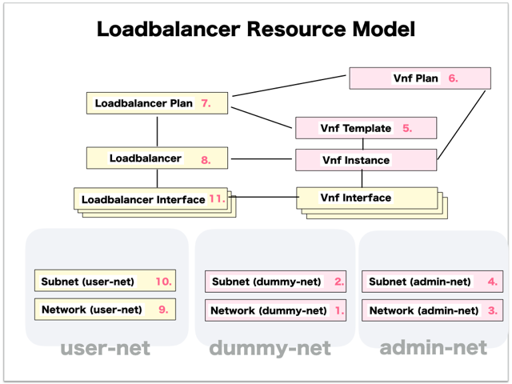

[Return to Top Page](../README.md)

# ESI interface for Loadbalancer
This section is for the purpose of documenting ESI interface.

* Initinalizing gohan ...
* Receiving HTTP Methods for Creating Resource ...

# Resource model for Loadbalancer
First of all, you can see the overview of resources model of "Loadbalancer".

* [01: Network (dummy-net)](01_network_dummy.md)
* [02: Subnet (dummy-net)](02_subnet_dummy.md)
* [03: Network (admin-net)](03_network_admin.md)
* [04: Subnet (admin-net)](04_subnet_admin.md)
* [05: Vnf Template](05_vnf_Template.md)
* [06: Vnf Plan](06_vnf_plan.md)
* [07: Loadbalancer Plan](07_loadbalancer_plan.md)
* [08: Loadbalancer](08_loadbalancer.md)
* [09: Network (user-net)](09_network_user.md)
* [10: Subnet (user-net)](10_subnet_user.md)
* [11: Loadbalancer Interface](11_loadbalancer_interface.md)

