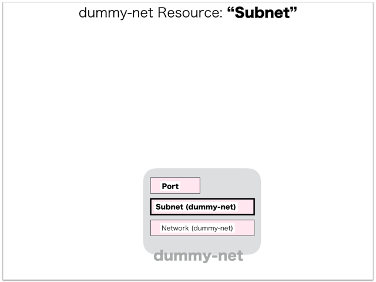

[Return to Previous Page](00_load_balancer.md)

# 2. Clarification of interface in Sequence Diagram "Create Subnet for dummy-net"
You can see the relations of "Subnet" as following.




## 2.1. Stored data in etcd after initinalizing gohan


These are stored data for "heat_templates" in etcd.

* [Checking stored data for "subnet"](../heat_template/subnet.md)
* [Checking stored data for "port"](../heat_template/port.md)


## 2.2. HTTP Methods for RESTful between Gohan and Client


This is JSON data for "Create Subnet" in HTTP Methods from client.

* Checking JSON data at post method
```
POST /v2.0/subnets
```
```
{
    "subnet": {
        "description": "dummy subnet for load_balancer",
        "name": "dummy-subnet",
        "tenant_id": "fe3a4a1a72c04479bb6c19c2c0ccba4c",
        "tags": {},
        "ip_version": 4,
        "cidr": "10.121.232.0/24",
        "network_id": "ce9a7a92-d11a-4fc6-8ae7-18061b62c98f"
    }
}
```


## 2.3. Stored data in etcd after receiving HTTP Methods for RESTful


These are stored data for "Create Subnet" in etcd.

* [Checking stored data for creating "subnet"](stored_in_etcd/CreateSubnet1_01.md)
* [Checking stored data for creating "port(dhcp)"](stored_in_etcd/CreateSubnet1_02.md)


## 2.4. Stored heat-stack via heat-api


These are stored heat-stacks for "Create Subnet" in heat-engine.

* [Checking heat-stack of "subnet"](heat-stack/CreateSubnet1_01.md)


## 2.5. Stored resource in gohan
As a result, checking resources regarding of "Subnet" in gohan.

* Checking the target of resources via gohan client
```
$ gohan client subnet show --output-format json 6f5f33d6-2cfe-47c1-a91a-3f3d44972b1a
{
    "subnet": {
        "allocation_pools": [
            {
                "end": "10.121.232.254",
                "start": "10.121.232.2"
            }
        ],
        "cidr": "10.121.232.0/24",
        "description": "dummy subnet for load_balancer",
        "dhcp_server_address": "10.121.232.2",
        "dns_nameservers": [],
        "enable_dhcp": true,
        "gateway_ip": "10.121.232.1",
        "host_routes": [],
        "id": "6f5f33d6-2cfe-47c1-a91a-3f3d44972b1a",
        "ip_version": 4,
        "ipv6_address_mode": null,
        "ipv6_ra_mode": null,
        "name": "dummy-subnet",
        "network_id": "ce9a7a92-d11a-4fc6-8ae7-18061b62c98f",
        "ntp_servers": [],
        "orchestration_state": "CREATE_COMPLETE",
        "status": "ACTIVE",
        "tags": {},
        "tenant_id": "fe3a4a1a72c04479bb6c19c2c0ccba4c"
    }
}
```
* Checking another resources via gohan client
```
$ gohan client port show --output-format json 7864794a-fe4f-4aac-91a7-61c103f11f58
{
    "port": {
        "admin_state_up": true,
        "allowed_address_pairs": [],
        "attached": false,
        "binding:vif_type": "vrouter",
        "description": "DHCP Server Port",
        "device_id": "6f5f33d6-2cfe-47c1-a91a-3f3d44972b1a",
        "device_owner": "network:dhcp",
        "ese_logical_port_id": null,
        "fake_delete": false,
        "fixed_ips": [
            {
                "ip_address": "10.121.232.2",
                "subnet_id": "6f5f33d6-2cfe-47c1-a91a-3f3d44972b1a"
            }
        ],
        "id": "7864794a-fe4f-4aac-91a7-61c103f11f58",
        "mac_address": "00:00:5e:00:01:00",
        "managed_by_service": false,
        "name": "dhcp-server-port",
        "network_id": "ce9a7a92-d11a-4fc6-8ae7-18061b62c98f",
        "operational_state": "",
        "orchestration_state": "SYNC_COMPLETE",
        "security_groups": [],
        "segmentation_id": null,
        "segmentation_type": null,
        "status": "ACTIVE",
        "tags": {},
        "tenant_id": "fe3a4a1a72c04479bb6c19c2c0ccba4c"
    }
}
```

[Return to Previous Page](00_load_balancer.md)
