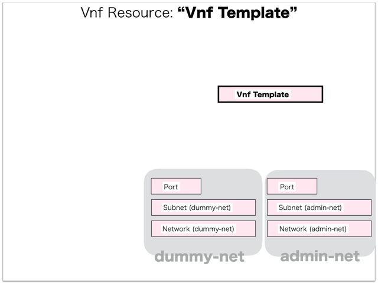

[Return to Previous Page](00_load_balancer.md)

# 5. Clarification of interface in Sequence Diagram "Create Vnf Template"
You can see the relations of "Vnf Template" as following.




## 5.1. HTTP Methods for RESTful between Gohan and Client


This is JSON data for "Create Vnf Template" in HTTP Methods from client.

* Checking JSON data at post method
```
POST /v2.0/vnf_templates
```
```
{
    "vnf_template": {
        "credentials": {
            "password": "***",
            "username": "vlbadmin"
        },
        "description": "dummy_vnf_templates",
        "dummy_networks": [
            "ce9a7a92-d11a-4fc6-8ae7-18061b62c98f"
        ],
        "function": "load_balancer",
        "image": "NSVPX-KVM-10.5-57.7_nc",
        "init_config": {},
        "management_networks": [
            "168c1535-9001-49c7-bb05-21844570a83c"
        ],
        "name": "NetScaler VPX",
        "security_group": "permit-any",
        "vendor": "citrix",
        "version": "NetScaler 10.5",
        "tenant_id": "fe3a4a1a72c04479bb6c19c2c0ccba4c"
    }
}
```


## 5.2. Stored data in etcd after receiving HTTP Methods for RESTful


These are stored data for "Create Vnf Template" in etcd.

* [Checking stored data for creating "vnf_template"](stored_in_etcd/CreateVnfTemplate_01.md)


## 5.3. Stored resource in gohan
As a result, checking resources regarding of "Vnf Template" in gohan.

* Checking the target of resources via gohan client
```
$ gohan client vnf_template show --output-format json f2123d79-e953-4b61-8aee-a217bee284af
{
    "vnf_template": {
        "credentials": {
            "password": "password",
            "username": "vlbadmin"
        },
        "description": "dummy_vnf_templates",
        "dummy_networks": [
            "ce9a7a92-d11a-4fc6-8ae7-18061b62c98f"
        ],
        "function": "load_balancer",
        "id": "f2123d79-e953-4b61-8aee-a217bee284af",
        "image": "NSVPX-KVM-10.5-57.7_nc",
        "init_config": {},
        "management_networks": [
            "168c1535-9001-49c7-bb05-21844570a83c"
        ],
        "name": "NetScaler VPX",
        "security_group": "permit-any",
        "service_network_id": null,
        "tenant_id": "fe3a4a1a72c04479bb6c19c2c0ccba4c",
        "user_data_template": "",
        "vendor": "citrix",
        "version": "NetScaler 10.5"
    }
}
```

[Return to Previous Page](00_load_balancer.md)
