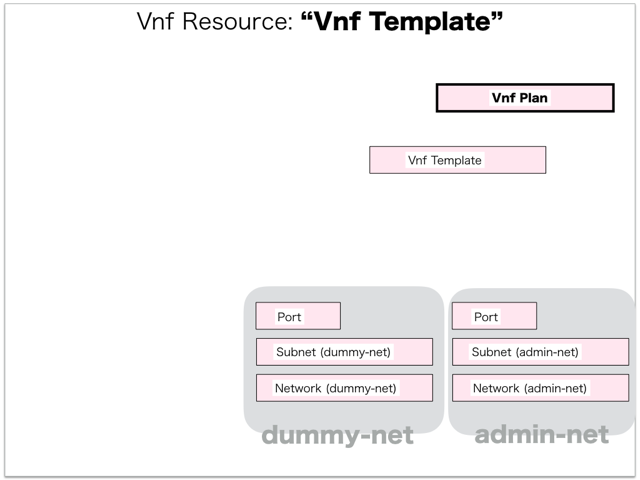
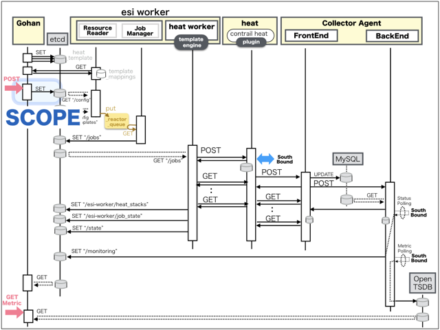
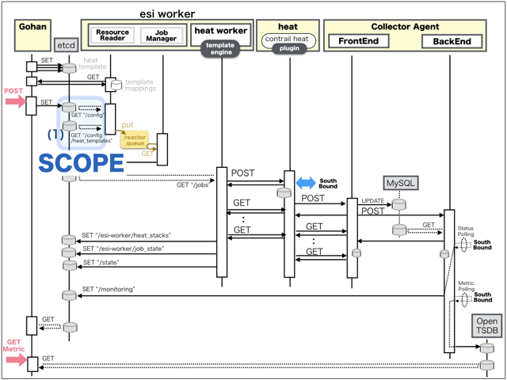

[Return to Previous Page](00_load_balancer.md)

# 6. Clarification of interface in Sequence Diagram "Create Vnf Plan"
You can see the relations of "Vnf Plan" as following.




## 6.1. Gohan



### Outline
First of all, Gohan has received JSON data for "Create Vnf Plan" in HTTP Methods from client.

* Checking JSON data at post method
```
POST /v2.0/vnf_plans
```
```
{
    "vnf_plan": {
        "default_interface_number": 3,
        "description": "dummy_vnf_plans",
        "flavor": "m1.xlarge",
        "function": "load_balancer",
        "interface_limit": 5,
        "name": "vLB_plan",
        "vendor": "citrix",
        "tenant_id": "fe3a4a1a72c04479bb6c19c2c0ccba4c"
    }
}
```
After processing, Gohan has stored data for "Create Vnf Plan" in etcd

* [Checking stored data for creating "vnf_plan"](stored_in_etcd/01_Gohan/CreateVnfPlan_01.md)


## 6.2. ResourceReader
When ResourceReader has started, it gets all of schemas from Gohan.
After that, these schemas are converted as a template_mappings.
And then, ResourceReader keeps storing template_mappings for following processing.

### Reference
* [Checking schemas in ResourceReader](../memo/schemas.txt)
* [Checking template_mappings in ResourceReader](../memo/template_mappings.md)



### Outline
After fetching resource_data for "Create Vnf Plan" in etcd, ResourceReader has not fetched heat_templates in etcd because of non_workable_resource.
And then, ResourceReader has stored data as finishing resource

* [Checking stored data for creating "vnf_plan"](stored_in_etcd/00_ResourceReader/CreateVnfPlan_01.md)


## 6.3. Stored resource in gohan
As a result, checking resources regarding of "Vnf Plan" in gohan.

* Checking the target of resources via gohan client
```
$ gohan client vnf_plan show --output-format json 043fed11-ce3d-48fb-aa8d-13aad5804d83
{
    "vnf_plan": {
        "default_interface_number": 3,
        "description": "dummy_vnf_plans",
        "flavor": "m1.xlarge",
        "function": "load_balancer",
        "id": "043fed11-ce3d-48fb-aa8d-13aad5804d83",
        "interface_limit": 5,
        "name": "vLB_plan",
        "tenant_id": "fe3a4a1a72c04479bb6c19c2c0ccba4c",
        "vendor": "citrix"
    }
}
```

[Return to Previous Page](00_load_balancer.md)
