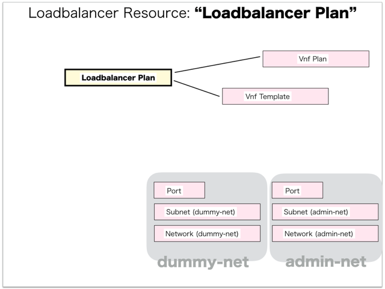

[Return to Previous Page](00_load_balancer.md)

# 7. Clarification of interface in Sequence Diagram "Create Loadbalancer Plan"
You can see the relations of "Loadbalancer Plan" as following.




## 7.1. HTTP Methods for RESTful between Gohan and Client


This is JSON data for "Create Loadbalancer Plan" in HTTP Methods from client.

* Checking JSON data at post method
```
POST /v2.0/load_balancer_plans
```
```
{
    "load_balancer_plan": {
        "is_public": true,
        "name": "Citrix_NetScaler_VPX_10.5-57.7_Standard_Edition_50Mbps_2CPU-8GB-4IF",
        "vendor": "citrix",
        "version": "10.5-57.7",
        "vnf_plan_id": "043fed11-ce3d-48fb-aa8d-13aad5804d83",
        "vnf_template_id": "f2123d79-e953-4b61-8aee-a217bee284af",
        "license_code": "LA-0001969526-49522",
        "model": {
            "edition": "Standard",
            "size": "10"
        },
        "tenant_id": "fe3a4a1a72c04479bb6c19c2c0ccba4c"
    }
}
```


## 7.2. Stored data in etcd after receiving HTTP Methods for RESTful


These are stored data for "Create Loadbalancer Plan" in etcd.

* [Checking stored data for creating "load_balancer_plan"](stored_in_etcd/CreateLoadbalancerPlan_01.md)


## 7.3. Stored resource in gohan
As a result, checking resources regarding of "Loadbalancer Plan" in gohan.

* Checking the target of resources via gohan client
```
gohan client load_balancer_plan show --output-format json f2fcb624-bac7-4601-a444-007d4a01bc6a
{
    "load_balancer_plan": {
        "description": "",
        "enabled": true,
        "id": "f2fcb624-bac7-4601-a444-007d4a01bc6a",
        "is_public": true,
        "license_code": "LA-0001969526-49522",
        "maximum_syslog_servers": 2,
        "model": {
            "edition": "Standard",
            "size": "10"
        },
        "name": "Citrix_NetScaler_VPX_10.5-57.7_Standard_Edition_50Mbps_2CPU-8GB-4IF",
        "tenant_id": "fe3a4a1a72c04479bb6c19c2c0ccba4c",
        "vendor": "citrix",
        "version": "10.5-57.7",
        "vnf_plan_id": "043fed11-ce3d-48fb-aa8d-13aad5804d83",
        "vnf_template_id": "f2123d79-e953-4b61-8aee-a217bee284af"
    }
}
```

[Return to Previous Page](00_load_balancer.md)
