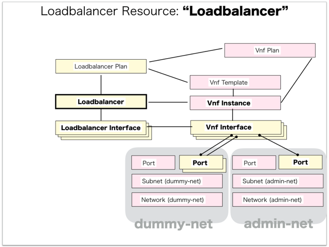
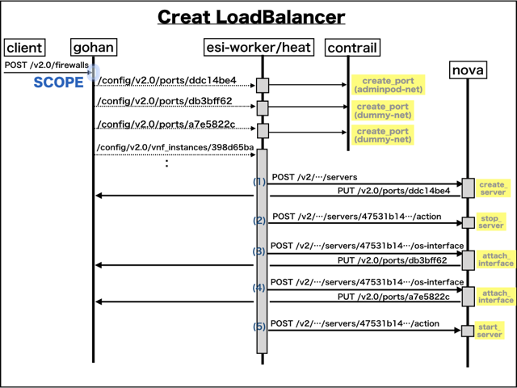
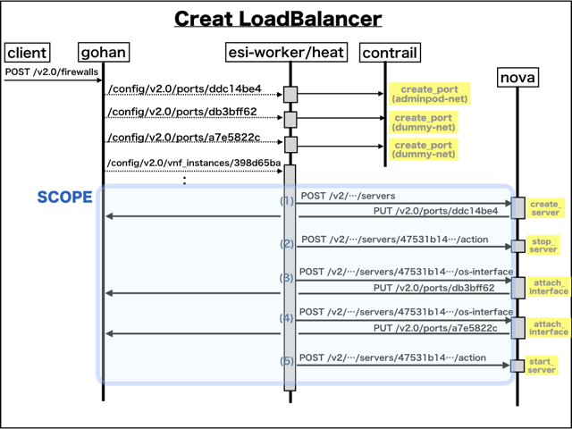

[Return to Previous Page](00_load_balancer.md)

# 8. Clarification of interface in Sequence Diagram "Create Loadbalancer"
You can see the relations of "Loadbalancer" as following.




## 8.1. Stored data in etcd after initinalizing gohan


These are stored data for "heat_templates" in etcd.

* [Checking stored data for "port"](../heat_template/port.md)
* [Checking stored data for "vnf_instance"](../heat_template/vnf_instance.md)
* [Checking stored data for "load_balancer_conf"](../heat_template/load_balancer_conf.md)
* [Checking stored data for "load_balancer"](../heat_template/load_balancer.md)
* [Checking stored data for "load_balancer_interface"](../heat_template/load_balancer_interface.md)
* [Checking stored data for "load_balancer_syslog_server"](../heat_template/load_balancer_syslog_server.md)


## 8.2. HTTP Methods for RESTful between Gohan and Client



This is JSON data for "Create Loadbalancer" in HTTP Methods from client.
```
POST /v2.0/load_balancers
```
```
{
    "load_balancer": {
        "availability_zone": "nova",
        "load_balancer_plan_id": "f2fcb624-bac7-4601-a444-007d4a01bc6a",
        "tenant_id": "fe3a4a1a72c04479bb6c19c2c0ccba4c"
    }
}
```


## 8.3. HTTP Methods for RESTful between Gohan and Nova-compute



This is JSON data for "Create Loadbalancer" in HTTP Methods.

### (1) Creating vnf-instance in nova-comoute
* from heat to nova
```
POST /v2/fe3a4a1a72c04479bb6c19c2c0ccba4c/servers
```
```
{
    "server": {
        "name": "load_balancer-b311c470-d878-4fea-8466-a4393938f2d4",
        "imageRef": "f33d2825-dc60-4376-9884-56da0c4ed704",
        "availability_zone": "nova",
        "flavorRef": "5",
        "max_count": 1,
        "min_count": 1,
        "networks": [
            {
                "port": "ddc14be4-3480-4e97-a978-817b18f9904c"
            }
        ]
    }
}
```
* from nova to gohan
```
PUT /v2.0/ports/ddc14be4-3480-4e97-a978-817b18f9904c.json
```
```
{
    "port": {
        "device_owner": "compute:nova",
        "device_id": "47531b14-72e9-439d-8949-fd941457ecde"
    }
}
```
### (2) Stopping vnf-instace in nova-comoute
* from heat to nova
```
POST /v2/fe3a4a1a72c04479bb6c19c2c0ccba4c/servers/47531b14-72e9-439d-8949-fd941457ecde/action
```
```
{
    "os-stop": null
}
```
### (3) Attaching interface in nova-comoute
* from heat to nova
```
POST /v2/fe3a4a1a72c04479bb6c19c2c0ccba4c/servers/47531b14-72e9-439d-8949-fd941457ecde/os-interface
```
```
{
    "interfaceAttachment": {
        "port_id": "db3bff62-cf93-48ce-8d6b-cfb2f7fd7dfc"
    }
}
```
* from nova to gohan
```
PUT /v2.0/ports/db3bff62-cf93-48ce-8d6b-cfb2f7fd7dfc.json
```
```
{
    "port": {
        "device_owner": "compute:nova",
        "device_id": "47531b14-72e9-439d-8949-fd941457ecde"
    }
}
```
### (4) Attaching interface in nova-comoute
* from heat to nova
```
POST /v2/fe3a4a1a72c04479bb6c19c2c0ccba4c/servers/47531b14-72e9-439d-8949-fd941457ecde/os-interface
```
```
{
    "interfaceAttachment": {
        "port_id": "a7e5822c-5c04-4c5f-a5ac-b0e0ad50159f"
    }
}
```
* from nova to gohan
```
PUT /v2.0/ports/a7e5822c-5c04-4c5f-a5ac-b0e0ad50159f.json
```
```
{
    "port": {
        "device_owner": "compute:nova",
        "device_id": "47531b14-72e9-439d-8949-fd941457ecde"
    }
}
```
### (5) Starting vnf-instace in nova-comoute
* from heat to nova
```
POST /v2/fe3a4a1a72c04479bb6c19c2c0ccba4c/servers/47531b14-72e9-439d-8949-fd941457ecde/action
```
```
{
    "os-start": null
}
```


## 8.4. Stored data in etcd after receiving HTTP Methods for RESTful


These are stored data for "Create Loadbalancer" in etcd.

* [Checking stored data for creating "port (100.64.193.3 / device_owner:"")"](stored_in_etcd/CreateLoadbalancer_01.md)
* [Checking stored data for creating "port (10.121.232.3 / device_owner:"")"](stored_in_etcd/CreateLoadbalancer_02.md)
* [Checking stored data for creating "port (10.121.232.4 / device_owner:"")"](stored_in_etcd/CreateLoadbalancer_03.md)
* [Checking stored data for creating "vnf_instance"](stored_in_etcd/CreateLoadbalancer_04.md)
* [Checking stored data for creating "vnf_interface (slot_number:0)"](stored_in_etcd/CreateLoadbalancer_05.md)
* [Checking stored data for creating "vnf_interface (slot_number:1)"](stored_in_etcd/CreateLoadbalancer_06.md)
* [Checking stored data for creating "vnf_interface (slot_number:2)"](stored_in_etcd/CreateLoadbalancer_07.md)
* [Checking stored data for creating "port (100.64.193.4 / device_owner:"")"](stored_in_etcd/CreateLoadbalancer_08.md)
* [Checking stored data for creating "load_balancer_conf"](stored_in_etcd/CreateLoadbalancer_09.md)
* [Checking stored data for creating "load_balancer"](stored_in_etcd/CreateLoadbalancer_10.md)
* [Checking stored data for creating "load_balancer_interface ("Interface 1/1" / slot_number:1)"](stored_in_etcd/CreateLoadbalancer_11.md)
* [Checking stored data for creating "load_balancer_interface ("Interface 1/2" / slot_number:2)"](stored_in_etcd/CreateLoadbalancer_12.md)
* [Checking stored data for creating "load_balancer_interface ("Interface 0/1" / slot_number:0)"](stored_in_etcd/CreateLoadbalancer_13.md)
* [Checking stored data for updating "port (100.64.193.3 / device_owner:"compute:nova" / attached:false)"](stored_in_etcd/CreateLoadbalancer_14.md)
* [Checking stored data for updating "port (100.64.193.3 / device_owner:"compute:nova" / attached:true)"](stored_in_etcd/CreateLoadbalancer_15.md)
* [Checking stored data for updating "port (10.121.232.3 / device_owner:"compute:nova" / attached:false)"](stored_in_etcd/CreateLoadbalancer_16.md)
* [Checking stored data for updating "port (10.121.232.3 / device_owner:"compute:nova" / attached:true)"](stored_in_etcd/CreateLoadbalancer_17.md)
* [Checking stored data for updating "port (10.121.232.4 / device_owner:"compute:nova" / attached:false)"](stored_in_etcd/CreateLoadbalancer_18.md)
* [Checking stored data for updating "port (10.121.232.4 / device_owner:"compute:nova" / attached:true)"](stored_in_etcd/CreateLoadbalancer_19.md)


## 8.5. Stored heat-stack via heat-api


These are stored heat-stacks for "Create Loadbalancer" in heat-engine.

* [Checking heat-stack of "vnf_instance"](heat-stack/CreateLoadbalancer_01.md)
* [Checking heat-stack of "load_balancer_conf"](heat-stack/CreateLoadbalancer_02.md)
* [Checking heat-stack of "load_balancer"](heat-stack/CreateLoadbalancer_03.md)
* [Checking heat-stack of "load_balancer_interface (Interface 0/1)"](heat-stack/CreateLoadbalancer_04.md)
* [Checking heat-stack of "load_balancer_interface (Interface 1/1)"](heat-stack/CreateLoadbalancer_05.md)
* [Checking heat-stack of "load_balancer_interface (Interface 1/2)"](heat-stack/CreateLoadbalancer_06.md)
* [Checking heat-stack of "port (10.121.232.4)"](heat-stack/CreateLoadbalancer_07.md)
* [Checking heat-stack of "port (10.121.232.3)"](heat-stack/CreateLoadbalancer_08.md)
* [Checking heat-stack of "port (100.64.193.3)"](heat-stack/CreateLoadbalancer_09.md)


## 8.6. HTTP Methods for RESTful between heat-engine and CollectorAgent


This is JSON data for "Create Loadbalancer" between heat-engine and CollectorAgent

* [Checking monitoring of "vnf_instance"](collector_agents/CreateLoadbalancer_01.md)
* [Checking monitoring of "load_balancer"](collector_agents/CreateLoadbalancer_02.md)
* [Checking monitoring of "load_balancer_interface (Interface 1/2)"](collector_agents/CreateLoadbalancer_03.md)
* [Checking monitoring of "load_balancer_interface (Interface 1/1)"](collector_agents/CreateLoadbalancer_04.md)
* [Checking monitoring of "load_balancer_interface (Interface 0/1)"](collector_agents/CreateLoadbalancer_05.md)
* [Checking monitoring of "port (100.64.193.3)"](collector_agents/CreateLoadbalancer_06.md)
* [Checking monitoring of "port (10.121.232.3)"](collector_agents/CreateLoadbalancer_07.md)
* [Checking monitoring of "port (10.121.232.4)"](collector_agents/CreateLoadbalancer_08.md)


## 8.7. Stored resource in gohan
As a result, checking resources regarding of "Loadbalancer" in gohan.

* Checking the target of resources via gohan client
```
$ gohan client load_balancer show --output-format json b311c470-d878-4fea-8466-a4393938f2d4
{
    "load_balancer": {
        "admin_username": "user-admin",
        "availability_zone": "nova",
        "default_gateway": null,
        "description": "",
        "id": "b311c470-d878-4fea-8466-a4393938f2d4",
        "interfaces": [
            {
                "id": "63121c05-53c3-4cff-9c27-5d4055541a63",
                "ip_address": "100.64.193.3",
                "name": "Interface 0/1",
                "network_id": "168c1535-9001-49c7-bb05-21844570a83c",
                "operational_state": "UP",
                "orchestration_state": "CREATE_COMPLETE",
                "slot_number": 0,
                "status": "ACTIVE",
                "type": "management",
                "virtual_ip_address": null,
                "virtual_ip_properties": null,
                "vnf_interface_id": "9cf64483-bbf1-4e82-ae07-33febf43dbbf"
            },
            {
                "id": "24580bfc-32f4-4c0f-8e8a-c7288497aa7c",
                "ip_address": null,
                "name": "Interface 1/1",
                "network_id": null,
                "operational_state": "UP",
                "orchestration_state": "CREATE_COMPLETE",
                "slot_number": 1,
                "status": "ACTIVE",
                "type": "user",
                "virtual_ip_address": null,
                "virtual_ip_properties": null,
                "vnf_interface_id": "3f1be05a-6cae-4f5e-9985-15f6f714d8dc"
            },
            {
                "id": "7f2bef0a-26f3-4ec9-89de-1aee7f04f998",
                "ip_address": null,
                "name": "Interface 1/2",
                "network_id": null,
                "operational_state": "UP",
                "orchestration_state": "CREATE_COMPLETE",
                "slot_number": 2,
                "status": "ACTIVE",
                "type": "user",
                "virtual_ip_address": null,
                "virtual_ip_properties": null,
                "vnf_interface_id": "848a926b-40ec-455a-a87c-e960c56b3dba"
            }
        ],
        "internet_port_id": "c00e43b8-ebd5-46bc-bc11-9d835b2c36ad",
        "load_balancer_conf_id": "1d2023e1-0cf4-48a1-af42-ab32466b2acb",
        "load_balancer_plan_id": "f2fcb624-bac7-4601-a444-007d4a01bc6a",
        "name": "",
        "networks": [],
        "operational_state": "UP",
        "orchestration_state": "CREATE_COMPLETE",
        "other_username": "",
        "status": "ACTIVE",
        "syslog_servers": null,
        "tenant_id": "fe3a4a1a72c04479bb6c19c2c0ccba4c",
        "user_username": "user-read",
        "vnf_instance_id": "398d65ba-0060-456e-b415-5bc954450717"
    }
}
```
* Checking billing_resource via gohan client
```
$ gohan client billing_resource list --output-format json
{
    "billing_resources": [

        ... (snip)

        {
            "config_version": 1,
            "ended": null,
            "id": "2c4293d3-aaaf-412d-a808-9ca35aef1a09",
            "info": {},
            "parent_billing_id": null,
            "resource_id": "b311c470-d878-4fea-8466-a4393938f2d4",
            "resource_type": "load_balancer",
            "started": 1.519017778e+09,
            "tenant_id": "fe3a4a1a72c04479bb6c19c2c0ccba4c",
            "unique_resource_id": "b311c470-d878-4fea-8466-a4393938f2d4"
        },
        {
            "config_version": 1,
            "ended": null,
            "id": "340f0043-462e-4363-bee5-5ad998ef58dd",
            "info": {
                "plan_name": "Citrix_NetScaler_VPX_10.5-57.7_Standard_Edition_50Mbps_2CPU-8GB-4IF"
            },
            "parent_billing_id": "2c4293d3-aaaf-412d-a808-9ca35aef1a09",
            "resource_id": "f2fcb624-bac7-4601-a444-007d4a01bc6a",
            "resource_type": "load_balancer_plan",
            "started": 1.519017778e+09,
            "tenant_id": "fe3a4a1a72c04479bb6c19c2c0ccba4c",
            "unique_resource_id": null
        }
    ]
}
```
* Checking another resources via nova client
```
$ nova show 47531b14-72e9-439d-8949-fd941457ecde
+--------------------------------------+---------------------------------------------------------------+
| Property                             | Value                                                         |
+--------------------------------------+---------------------------------------------------------------+
| OS-DCF:diskConfig                    | MANUAL                                                        |
| OS-EXT-AZ:availability_zone          | nova                                                          |
| OS-EXT-SRV-ATTR:host                 | nova-server                                                   |
| OS-EXT-SRV-ATTR:hypervisor_hostname  | nova-server                                                   |
| OS-EXT-SRV-ATTR:instance_name        | instance-00000001                                             |
| OS-EXT-STS:power_state               | 1                                                             |
| OS-EXT-STS:task_state                | -                                                             |
| OS-EXT-STS:vm_state                  | active                                                        |
| OS-SRV-USG:launched_at               | 2018-02-19T05:17:16.000000                                    |
| OS-SRV-USG:terminated_at             | -                                                             |
| accessIPv4                           |                                                               |
| accessIPv6                           |                                                               |
| adminpod-net network                 | 100.64.193.3                                                  |
| config_drive                         |                                                               |
| created                              | 2018-02-19T05:17:15Z                                          |
| dummy-net network                    | 10.121.232.3, 10.121.232.4                                    |
| flavor                               | m1.xlarge (5)                                                 |
| hostId                               | 28c16eed6256f7e9cc35b0f19a64e8f6583974b25747e68ece0629aa      |
| id                                   | 47531b14-72e9-439d-8949-fd941457ecde                          |
| image                                | NSVPX-KVM-10.5-57.7_nc (f33d2825-dc60-4376-9884-56da0c4ed704) |
| key_name                             | -                                                             |
| metadata                             | {}                                                            |
| name                                 | load_balancer-b311c470-d878-4fea-8466-a4393938f2d4            |
| os-extended-volumes:volumes_attached | []                                                            |
| progress                             | 0                                                             |
| security_groups                      | default                                                       |
| status                               | ACTIVE                                                        |
| tenant_id                            | fe3a4a1a72c04479bb6c19c2c0ccba4c                              |
| updated                              | 2018-02-19T05:21:51Z                                          |
| user_id                              | 739ac1d45a9342159ada4a00dfbfa646                              |
+--------------------------------------+---------------------------------------------------------------+
```
```
$ nova interface-list 47531b14-72e9-439d-8949-fd941457ecde
+------------------------+--------------------------------------+--------------------------------------+--------------+-------------------+
| Port State             | Port ID                              | Net ID                               | IP addresses | MAC Addr          |
+------------------------+--------------------------------------+--------------------------------------+--------------+-------------------+
| ACTIVE                 | a7e5822c-5c04-4c5f-a5ac-b0e0ad50159f | ce9a7a92-d11a-4fc6-8ae7-18061b62c98f | 10.121.232.4 | fa:16:3e:21:5b:14 |
| MONITORING_UNAVAILABLE | db3bff62-cf93-48ce-8d6b-cfb2f7fd7dfc | ce9a7a92-d11a-4fc6-8ae7-18061b62c98f | 10.121.232.3 | fa:16:3e:90:8a:94 |
| MONITORING_UNAVAILABLE | ddc14be4-3480-4e97-a978-817b18f9904c | 168c1535-9001-49c7-bb05-21844570a83c | 100.64.193.3 | fa:16:3e:cf:b0:c4 |
+------------------------+--------------------------------------+--------------------------------------+--------------+-------------------+
```
* Checking another resources via neutron client
```
$ neutron port-list | grep -v dhcp-server-port
+--------------------------------------+-------------------------------+-------------------+-------------------------------------------------------------------------------------+
| id                                   | name                          | mac_address       | fixed_ips                                                                           |
+--------------------------------------+-------------------------------+-------------------+-------------------------------------------------------------------------------------+
| a7e5822c-5c04-4c5f-a5ac-b0e0ad50159f | load_balancer-user-port       | fa:16:3e:21:5b:14 | {"subnet_id": "6f5f33d6-2cfe-47c1-a91a-3f3d44972b1a", "ip_address": "10.121.232.4"} |
| c00e43b8-ebd5-46bc-bc11-9d835b2c36ad | internet_port                 | fa:16:3e:30:58:c3 | {"subnet_id": "707847d0-89d9-4b98-93a2-8b376709c5f3", "ip_address": "100.64.193.4"} |
| db3bff62-cf93-48ce-8d6b-cfb2f7fd7dfc | load_balancer-user-port       | fa:16:3e:90:8a:94 | {"subnet_id": "6f5f33d6-2cfe-47c1-a91a-3f3d44972b1a", "ip_address": "10.121.232.3"} |
| ddc14be4-3480-4e97-a978-817b18f9904c | load_balancer-management-port | fa:16:3e:cf:b0:c4 | {"subnet_id": "707847d0-89d9-4b98-93a2-8b376709c5f3", "ip_address": "100.64.193.3"} |
+--------------------------------------+-------------------------------+-------------------+-------------------------------------------------------------------------------------+
```
```
$ neutron port-show a7e5822c-5c04-4c5f-a5ac-b0e0ad50159f
+-----------------------+-------------------------------------------------------------------------------------+
| Field                 | Value                                                                               |
+-----------------------+-------------------------------------------------------------------------------------+
| admin_state_up        | False                                                                               |
| allowed_address_pairs |                                                                                     |
| attached              | True                                                                                |
| binding:vif_type      | vrouter                                                                             |
| description           |                                                                                     |
| device_id             | 47531b14-72e9-439d-8949-fd941457ecde                                                |
| device_owner          | compute:nova                                                                        |
| ese_logical_port_id   |                                                                                     |
| fake_delete           | True                                                                                |
| fixed_ips             | {"subnet_id": "6f5f33d6-2cfe-47c1-a91a-3f3d44972b1a", "ip_address": "10.121.232.4"} |
| id                    | a7e5822c-5c04-4c5f-a5ac-b0e0ad50159f                                                |
| mac_address           | fa:16:3e:21:5b:14                                                                   |
| managed_by_service    | False                                                                               |
| name                  | load_balancer-user-port                                                             |
| network_id            | ce9a7a92-d11a-4fc6-8ae7-18061b62c98f                                                |
| operational_state     | UP                                                                                  |
| orchestration_state   | UPDATE_COMPLETE                                                                     |
| security_groups       |                                                                                     |
| segmentation_id       | 0                                                                                   |
| segmentation_type     | flat                                                                                |
| status                | ACTIVE                                                                              |
| tags                  | {}                                                                                  |
| tenant_id             | fe3a4a1a72c04479bb6c19c2c0ccba4c                                                    |
+-----------------------+-------------------------------------------------------------------------------------+
```
```
$ neutron port-show db3bff62-cf93-48ce-8d6b-cfb2f7fd7dfc
+-----------------------+-------------------------------------------------------------------------------------+
| Field                 | Value                                                                               |
+-----------------------+-------------------------------------------------------------------------------------+
| admin_state_up        | False                                                                               |
| allowed_address_pairs |                                                                                     |
| attached              | True                                                                                |
| binding:vif_type      | vrouter                                                                             |
| description           |                                                                                     |
| device_id             | 47531b14-72e9-439d-8949-fd941457ecde                                                |
| device_owner          | compute:nova                                                                        |
| ese_logical_port_id   |                                                                                     |
| fake_delete           | True                                                                                |
| fixed_ips             | {"subnet_id": "6f5f33d6-2cfe-47c1-a91a-3f3d44972b1a", "ip_address": "10.121.232.3"} |
| id                    | db3bff62-cf93-48ce-8d6b-cfb2f7fd7dfc                                                |
| mac_address           | fa:16:3e:90:8a:94                                                                   |
| managed_by_service    | False                                                                               |
| name                  | load_balancer-user-port                                                             |
| network_id            | ce9a7a92-d11a-4fc6-8ae7-18061b62c98f                                                |
| operational_state     | FAIL                                                                                |
| orchestration_state   | UPDATE_COMPLETE                                                                     |
| security_groups       |                                                                                     |
| segmentation_id       | 0                                                                                   |
| segmentation_type     | flat                                                                                |
| status                | MONITORING_UNAVAILABLE                                                              |
| tags                  | {}                                                                                  |
| tenant_id             | fe3a4a1a72c04479bb6c19c2c0ccba4c                                                    |
+-----------------------+-------------------------------------------------------------------------------------+
```
```
$ neutron port-show ddc14be4-3480-4e97-a978-817b18f9904c
+-----------------------+-------------------------------------------------------------------------------------+
| Field                 | Value                                                                               |
+-----------------------+-------------------------------------------------------------------------------------+
| admin_state_up        | True                                                                                |
| allowed_address_pairs |                                                                                     |
| attached              | True                                                                                |
| binding:vif_type      | vrouter                                                                             |
| description           |                                                                                     |
| device_id             | 47531b14-72e9-439d-8949-fd941457ecde                                                |
| device_owner          | compute:nova                                                                        |
| ese_logical_port_id   |                                                                                     |
| fake_delete           | True                                                                                |
| fixed_ips             | {"subnet_id": "707847d0-89d9-4b98-93a2-8b376709c5f3", "ip_address": "100.64.193.3"} |
| id                    | ddc14be4-3480-4e97-a978-817b18f9904c                                                |
| mac_address           | fa:16:3e:cf:b0:c4                                                                   |
| managed_by_service    | False                                                                               |
| name                  | load_balancer-management-port                                                       |
| network_id            | 168c1535-9001-49c7-bb05-21844570a83c                                                |
| operational_state     | FAIL                                                                                |
| orchestration_state   | UPDATE_COMPLETE                                                                     |
| security_groups       |                                                                                     |
| segmentation_id       | 0                                                                                   |
| segmentation_type     | flat                                                                                |
| status                | MONITORING_UNAVAILABLE                                                              |
| tags                  | {}                                                                                  |
| tenant_id             | fe3a4a1a72c04479bb6c19c2c0ccba4c                                                    |
+-----------------------+-------------------------------------------------------------------------------------+
```
* Checking another resources via gohan client
```
$ gohan client vnf_instance  show --output-format json 398d65ba-0060-456e-b415-5bc954450717
{
    "vnf_instance": {
        "availability_zone": "nova",
        "config_drive": false,
        "description": null,
        "id": "398d65ba-0060-456e-b415-5bc954450717",
        "management_ip": "100.64.193.3",
        "name": "load_balancer-b311c470-d878-4fea-8466-a4393938f2d4",
        "networks": [
            {
                "port": "ddc14be4-3480-4e97-a978-817b18f9904c"
            },
            {
                "port": "db3bff62-cf93-48ce-8d6b-cfb2f7fd7dfc"
            },
            {
                "port": "a7e5822c-5c04-4c5f-a5ac-b0e0ad50159f"
            }
        ],
        "operational_state": "UP",
        "orchestration_state": "CREATE_COMPLETE",
        "owner_tenant_id": "fe3a4a1a72c04479bb6c19c2c0ccba4c",
        "reboot": "",
        "status": "ACTIVE",
        "tenant_id": "fe3a4a1a72c04479bb6c19c2c0ccba4c",
        "user_data": "",
        "user_data_format": "RAW",
        "user_data_parameters": {
            "management_gateway": "",
            "management_ip": "",
            "management_mask": ""
        },
        "vnf_plan_id": "043fed11-ce3d-48fb-aa8d-13aad5804d83",
        "vnf_template_id": "f2123d79-e953-4b61-8aee-a217bee284af"
    }
}
```
```
$ gohan client port list --output-format json
{
    "ports": [

        ... (snip)

        {
            "admin_state_up": false,
            "allowed_address_pairs": [],
            "attached": true,
            "binding:vif_type": "vrouter",
            "description": "",
            "device_id": "47531b14-72e9-439d-8949-fd941457ecde",
            "device_owner": "compute:nova",
            "ese_logical_port_id": null,
            "fake_delete": true,
            "fixed_ips": [
                {
                    "ip_address": "10.121.232.4",
                    "subnet_id": "6f5f33d6-2cfe-47c1-a91a-3f3d44972b1a"
                }
            ],
            "id": "a7e5822c-5c04-4c5f-a5ac-b0e0ad50159f",
            "mac_address": "fa:16:3e:21:5b:14",
            "managed_by_service": false,
            "name": "load_balancer-user-port",
            "network_id": "ce9a7a92-d11a-4fc6-8ae7-18061b62c98f",
            "operational_state": "UP",
            "orchestration_state": "UPDATE_COMPLETE",
            "security_groups": [],
            "segmentation_id": 0,
            "segmentation_type": "flat",
            "status": "ACTIVE",
            "tags": {},
            "tenant_id": "fe3a4a1a72c04479bb6c19c2c0ccba4c"
        },
        {
            "admin_state_up": true,
            "allowed_address_pairs": [],
            "attached": false,
            "binding:vif_type": "vrouter",
            "description": "",
            "device_id": "",
            "device_owner": "network:empty",
            "ese_logical_port_id": null,
            "fake_delete": false,
            "fixed_ips": [
                {
                    "ip_address": "100.64.193.4",
                    "subnet_id": "707847d0-89d9-4b98-93a2-8b376709c5f3"
                }
            ],
            "id": "c00e43b8-ebd5-46bc-bc11-9d835b2c36ad",
            "mac_address": "fa:16:3e:30:58:c3",
            "managed_by_service": false,
            "name": "internet_port",
            "network_id": "168c1535-9001-49c7-bb05-21844570a83c",
            "operational_state": "NO_STATE",
            "orchestration_state": "SYNC_COMPLETE",
            "security_groups": [],
            "segmentation_id": 0,
            "segmentation_type": "flat",
            "status": "DOWN",
            "tags": {},
            "tenant_id": "fe3a4a1a72c04479bb6c19c2c0ccba4c"
        },
        {
            "admin_state_up": false,
            "allowed_address_pairs": [],
            "attached": true,
            "binding:vif_type": "vrouter",
            "description": "",
            "device_id": "47531b14-72e9-439d-8949-fd941457ecde",
            "device_owner": "compute:nova",
            "ese_logical_port_id": null,
            "fake_delete": true,
            "fixed_ips": [
                {
                    "ip_address": "10.121.232.3",
                    "subnet_id": "6f5f33d6-2cfe-47c1-a91a-3f3d44972b1a"
                }
            ],
            "id": "db3bff62-cf93-48ce-8d6b-cfb2f7fd7dfc",
            "mac_address": "fa:16:3e:90:8a:94",
            "managed_by_service": false,
            "name": "load_balancer-user-port",
            "network_id": "ce9a7a92-d11a-4fc6-8ae7-18061b62c98f",
            "operational_state": "FAIL",
            "orchestration_state": "UPDATE_COMPLETE",
            "security_groups": [],
            "segmentation_id": 0,
            "segmentation_type": "flat",
            "status": "MONITORING_UNAVAILABLE",
            "tags": {},
            "tenant_id": "fe3a4a1a72c04479bb6c19c2c0ccba4c"
        },
        {
            "admin_state_up": true,
            "allowed_address_pairs": [],
            "attached": true,
            "binding:vif_type": "vrouter",
            "description": "",
            "device_id": "47531b14-72e9-439d-8949-fd941457ecde",
            "device_owner": "compute:nova",
            "ese_logical_port_id": null,
            "fake_delete": true,
            "fixed_ips": [
                {
                    "ip_address": "100.64.193.3",
                    "subnet_id": "707847d0-89d9-4b98-93a2-8b376709c5f3"
                }
            ],
            "id": "ddc14be4-3480-4e97-a978-817b18f9904c",
            "mac_address": "fa:16:3e:cf:b0:c4",
            "managed_by_service": false,
            "name": "load_balancer-management-port",
            "network_id": "168c1535-9001-49c7-bb05-21844570a83c",
            "operational_state": "FAIL",
            "orchestration_state": "UPDATE_COMPLETE",
            "security_groups": [],
            "segmentation_id": 0,
            "segmentation_type": "flat",
            "status": "MONITORING_UNAVAILABLE",
            "tags": {},
            "tenant_id": "fe3a4a1a72c04479bb6c19c2c0ccba4c"
        }
    ]
}
```
```
$ gohan client vnf_interface list --output-format json
{
    "vnf_interfaces": [
        {
            "description": null,
            "id": "3f1be05a-6cae-4f5e-9985-15f6f714d8dc",
            "ip_address": null,
            "name": "interface-1",
            "network_id": null,
            "port_id": "db3bff62-cf93-48ce-8d6b-cfb2f7fd7dfc",
            "slot_number": 1,
            "status": "MONITORING_UNAVAILABLE",
            "tenant_id": "fe3a4a1a72c04479bb6c19c2c0ccba4c",
            "type": "user",
            "virtual_ip_address": null,
            "virtual_ip_properties": null,
            "vnf_instance_id": "398d65ba-0060-456e-b415-5bc954450717"
        },
        {
            "description": null,
            "id": "848a926b-40ec-455a-a87c-e960c56b3dba",
            "ip_address": null,
            "name": "interface-2",
            "network_id": null,
            "port_id": "a7e5822c-5c04-4c5f-a5ac-b0e0ad50159f",
            "slot_number": 2,
            "status": "ACTIVE",
            "tenant_id": "fe3a4a1a72c04479bb6c19c2c0ccba4c",
            "type": "user",
            "virtual_ip_address": null,
            "virtual_ip_properties": null,
            "vnf_instance_id": "398d65ba-0060-456e-b415-5bc954450717"
        },
        {
            "description": null,
            "id": "9cf64483-bbf1-4e82-ae07-33febf43dbbf",
            "ip_address": "100.64.193.3",
            "name": "interface-0",
            "network_id": "168c1535-9001-49c7-bb05-21844570a83c",
            "port_id": "ddc14be4-3480-4e97-a978-817b18f9904c",
            "slot_number": 0,
            "status": "MONITORING_UNAVAILABLE",
            "tenant_id": "fe3a4a1a72c04479bb6c19c2c0ccba4c",
            "type": "management",
            "virtual_ip_address": null,
            "virtual_ip_properties": null,
            "vnf_instance_id": "398d65ba-0060-456e-b415-5bc954450717"
        }
    ]
}
```
```
$ gohan client load_balancer_interface list --output-format json
{
    "load_balancer_interfaces": [
        {
            "description": null,
            "id": "24580bfc-32f4-4c0f-8e8a-c7288497aa7c",
            "ip_address": null,
            "load_balancer_id": "b311c470-d878-4fea-8466-a4393938f2d4",
            "name": "Interface 1/1",
            "network_id": null,
            "operational_state": "UP",
            "orchestration_state": "CREATE_COMPLETE",
            "slot_number": 1,
            "status": "ACTIVE",
            "tenant_id": "fe3a4a1a72c04479bb6c19c2c0ccba4c",
            "type": "user",
            "virtual_ip_address": null,
            "virtual_ip_properties": null,
            "vnf_interface_id": "3f1be05a-6cae-4f5e-9985-15f6f714d8dc"
        },
        {
            "description": null,
            "id": "63121c05-53c3-4cff-9c27-5d4055541a63",
            "ip_address": "100.64.193.3",
            "load_balancer_id": "b311c470-d878-4fea-8466-a4393938f2d4",
            "name": "Interface 0/1",
            "network_id": "168c1535-9001-49c7-bb05-21844570a83c",
            "operational_state": "UP",
            "orchestration_state": "CREATE_COMPLETE",
            "slot_number": 0,
            "status": "ACTIVE",
            "tenant_id": "fe3a4a1a72c04479bb6c19c2c0ccba4c",
            "type": "management",
            "virtual_ip_address": null,
            "virtual_ip_properties": null,
            "vnf_interface_id": "9cf64483-bbf1-4e82-ae07-33febf43dbbf"
        },
        {
            "description": null,
            "id": "7f2bef0a-26f3-4ec9-89de-1aee7f04f998",
            "ip_address": null,
            "load_balancer_id": "b311c470-d878-4fea-8466-a4393938f2d4",
            "name": "Interface 1/2",
            "network_id": null,
            "operational_state": "UP",
            "orchestration_state": "CREATE_COMPLETE",
            "slot_number": 2,
            "status": "ACTIVE",
            "tenant_id": "fe3a4a1a72c04479bb6c19c2c0ccba4c",
            "type": "user",
            "virtual_ip_address": null,
            "virtual_ip_properties": null,
            "vnf_interface_id": "848a926b-40ec-455a-a87c-e960c56b3dba"
        }
    ]
}
```

[Return to Previous Page](00_load_balancer.md)
