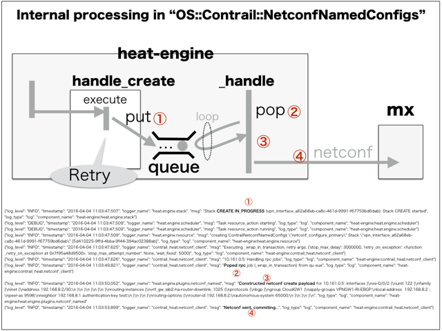

# heat_template: internet_gateway
This is heat_template of "internet_gateway" which is provided by gohan via etcd


### (1) Stored data in etcd
These are stored data for "heat_templates" in etcd.
```
/config/v2.0/heat_templates/internet_gateway
{
    "body": {
        "handler": "heat_worker", 
        "watch": [], 
        "id": "internet_gateway", 
        "template_file": "heat_template_version: 2013-05-23\n\ndescription: >\n  Internet GW Instance\n\nparameters:\n  primary_device_ip:\n    description: Ip address that will be used to establish ssh connection to the Primary Device.\n    label: Ip address of the device.\n    type: string\n  primary_device_port:\n    description: Port that will be used to establish ssh connection to the Primary Device.\n    label: Port of the ssh connection.\n    type: number\n  primary_device_username:\n    description: Name of the user which will be used to log onto the Primary Device.\n    label: User name to log on to device.\n    type: string\n  primary_device_password:\n    description: Password of the user which will be used to log onto the Primary Device.\n    label: Users password.\n    type: string\n  secondary_device_ip:\n    description: Ip address that will be used to establish ssh connection to the Secondary Device.\n    label: Ip address of the device.\n    type: string\n  secondary_device_port:\n    description: Port that will be used to establish ssh connection to the Secondary Device.\n    label: Port of the ssh connection.\n    type: number\n  secondary_device_username:\n    description: Name of the user which will be used to log onto the Secondary Device.\n    label: User name to log on to device.\n    type: string\n  secondary_device_password:\n    description: Password of the user which will be used to log onto the Secondary Device.\n    label: Users password.\n    type: string\n  primary_device_physical_interface:\n    description: Physical port on the Primary device on which the logical port will be configured\n    label: Underlying physical interface\n    type: string\n  primary_device_logical_interface:\n    description: Name of the created logical interface on the Primary device\n    label: Logical Interface name\n    type: string\n  secondary_device_physical_interface:\n    description: Physical port on the Secondary device on which the logical port will be configured\n    label: Underlying physical interface\n    type: string\n  secondary_device_logical_interface:\n    description: Name of the created logical interface on the Secondary device\n    label: Logical Interface name\n    type: string\n  vlan:\n    description: vlan tag used by logical interface\n    label: VLAN ID\n    type: string\n  vrf_name:\n    description: Name for VRF used by logical interface\n    label: VRF name\n    type: string\n  vrf_import_policy:\n    description: Import Policy for IGS\n    label: Import Policy\n    type: string\n  vrf_export_policy:\n    description: Export Policy for IGS\n    label: Export Policy\n    type: string\n  uplink_import_policy:\n    description: Uplink Import Policy for IGS\n    label: Uplink Import Policy\n    type: string\n  input_filter_name:\n    description: Policer name to use as input policer\n    label: Input policer name\n    type: string\n  output_filter_name:\n    description: Policer name to use as output policer\n    label: Output policer name\n    type: string\n  primary_vrrp_config_group:\n    description: Name for apply group to use for interface for VRRP\n    label: Apply group name\n    type: string\n  secondary_vrrp_config_group:\n    description: Name for apply group to use for interface for VRRP\n    label: Apply group name\n    type: string\n  inet_in_filter:\n    label: Internet Input Filter\n    type: string\n  inet_out_filter:\n    label: Internet Output Filter\n    type: string\n  prefix_list_name:\n    label: Prefix list name\n    type: string\n  filter_term_name:\n    label: Filter term name\n    type: string\n\nresources:\n\n  netconf_configure_{{ device }}:\n    properties:\n      on_update: merge\n      lock_timeout: 3000\n      configs:\n      - config:\n          str_replace:\n            params:\n              $APPLY_GROUP:\n                get_param: {{ device }}_vrrp_config_group\n              $VLAN:\n                get_param: vlan\n              $INPUT_FILTER:\n                get_param: input_filter_name\n              $OUTPUT_FILTER:\n                get_param: output_filter_name\n            template: |\n              apply-groups $APPLY_GROUP\n              vlan-id $VLAN;\n              description inet_gw;\n              family inet {\n                  filter {\n                      input $INPUT_FILTER;\n                      output $OUTPUT_FILTER;\n                  }\n              }\n        path:\n          - config_type: tag\n            xml_type: tag\n            tag: interfaces\n          - config_type: name\n            xml_type: named_tag\n            tag: interface\n            name: { get_param: {{ device }}_device_physical_interface }\n          - config_type: named_tag\n            xml_type: named_tag\n            tag: unit\n            name: { get_param: vlan }\n      - config:\n          str_replace:\n            params:\n              $LIF:\n                get_param: {{ device }}_device_logical_interface\n              $IMPORT_POLICY:\n                get_param: vrf_import_policy\n              $EXPORT_POLICY:\n                get_param: vrf_export_policy\n            template: |\n                instance-type virtual-router;\n                interface $LIF;\n                routing-options instance-import $IMPORT_POLICY;\n                routing-options instance-export $EXPORT_POLICY;\n                {{ jinja_vrf_config }}\n        path:\n          - config_type: tag\n            xml_type: tag\n            tag: routing-instances\n          - config_type: name\n            xml_type: named_tag\n            tag: instance\n            name: { get_param: vrf_name }\n      - config:\n          str_replace:\n            params:\n              $VRF_NAME:\n                get_param: vrf_name\n            template: |\n              from instance $VRF_NAME;\n              then accept;\n        path:\n          - config_type: tag\n            xml_type: tag\n            tag: policy-options\n          - config_type: named_tag\n            xml_type: named_tag\n            tag: policy-statement\n            name: { get_param: uplink_import_policy }\n          - config_type: named_tag\n            xml_type: named_tag\n            tag: term\n            name: { get_param: vrf_name }\n      - config: \"\"\n        path:\n          - config_type: tag\n            xml_type: tag\n            tag: policy-options\n          - config_type: named_tag\n            xml_type: named_tag\n            tag: prefix-list\n            name: { get_param: prefix_list_name }\n      - config:\n          str_replace:\n            params:\n              $PREFIX_LIST_NAME:\n                get_param: prefix_list_name\n              $VRF_NAME:\n                get_param: vrf_name\n            template: |\n               from {\n                  destination-prefix-list {\n                       $PREFIX_LIST_NAME;\n                  }\n               }\n               then {\n                    count $VRF_NAME_IN;\n                    accept;\n               }\n        path:\n          - config_type: tag\n            xml_type: tag\n            tag: firewall\n          - config_type: tag\n            xml_type: tag\n            tag: family\n          - config_type: tag\n            xml_type: tag\n            tag: inet\n          - config_type: named_tag\n            xml_type: named_tag\n            tag: filter\n            name: { get_param: inet_in_filter }\n          - config_type: named_tag\n            xml_type: named_tag\n            tag: term\n            name: { get_param: filter_term_name }\n        additional_commands:\n          str_replace:\n            params:\n              $TERM_NAME:\n                get_param: filter_term_name\n              $INET_IN:\n                get_param: inet_in_filter\n            template: |\n              insert firewall family inet filter $INET_IN term $TERM_NAME before term all-accept\n      - config:\n          str_replace:\n            params:\n              $PREFIX_LIST_NAME:\n                get_param: prefix_list_name\n              $VRF_NAME:\n                get_param: vrf_name\n            template: |\n               from {\n                  source-prefix-list {\n                       $PREFIX_LIST_NAME;\n                  }\n               }\n               then {\n                    count $VRF_NAME_OUT;\n                    accept;\n               }\n        path:\n          - config_type: tag\n            xml_type: tag\n            tag: firewall\n          - config_type: tag\n            xml_type: tag\n            tag: family\n          - config_type: tag\n            xml_type: tag\n            tag: inet\n          - config_type: named_tag\n            xml_type: named_tag\n            tag: filter\n            name: { get_param: inet_out_filter }\n          - config_type: named_tag\n            xml_type: named_tag\n            tag: term\n            name: { get_param: filter_term_name }\n        additional_commands:\n          str_replace:\n            params:\n              $TERM_NAME:\n                get_param: filter_term_name\n              $INET_OUT:\n                get_param: inet_out_filter\n            template: |\n              insert firewall family inet filter $INET_OUT term $TERM_NAME before term all-accept\n      device_ip:\n        get_param: {{ device }}_device_ip\n      password:\n        get_param: {{ device }}_device_password\n      port:\n        get_param: {{ device }}_device_port\n      username:\n        get_param: {{ device }}_device_username\n    type: OS::Contrail::NetconfNamedConfigs\n\n", 
        "parameter_mappings": {
            "vrf_export_policy": "Finternet_service+internet_service_id:vrf_export_policy", 
            "secondary_device_physical_interface": "Fha_interface+downlink_interface_id:er_physical_interface+secondary_interface_id:name", 
            "primary_device_logical_interface": "Pprimary_logical_interface_name", 
            "primary_device_password": "Fha_interface+downlink_interface_id:ha_router+ha_router_id:edge_router+primary_router_id:password", 
            "vrf_import_policy": "Finternet_service+internet_service_id:vrf_import_policy", 
            "prefix_list_name": "APvrf_name&C_prefix", 
            "jinja_vrf_config": "Finternet_service+internet_service_id:vrf_config", 
            "output_filter_name": "ACFILTER_&Fqos_option+qos_option_id:outgoing_policer_name", 
            "secondary_vrrp_config_group": "Finternet_service+internet_service_id:secondary_vrrp_config_group", 
            "primary_device_ip": "Fha_interface+downlink_interface_id:ha_router+ha_router_id:edge_router+primary_router_id:ip", 
            "inet_in_filter": "Finternet_service+internet_service_id:inet_in_filter", 
            "primary_device_username": "Fha_interface+downlink_interface_id:ha_router+ha_router_id:edge_router+primary_router_id:login", 
            "secondary_device_logical_interface": "Psecondary_logical_interface_name", 
            "inet_out_filter": "Finternet_service+internet_service_id:inet_out_filter", 
            "vlan": "Pvlan_id", 
            "primary_device_physical_interface": "Fha_interface+downlink_interface_id:er_physical_interface+primary_interface_id:name", 
            "uplink_import_policy": "Finternet_service+internet_service_id:uplink_import_policy", 
            "input_filter_name": "ACFILTER_&Fqos_option+qos_option_id:incoming_policer_name", 
            "filter_term_name": "APvrf_name&C_filter", 
            "secondary_device_port": "Fha_interface+downlink_interface_id:ha_router+ha_router_id:edge_router+secondary_router_id:ssh_port", 
            "secondary_device_password": "Fha_interface+downlink_interface_id:ha_router+ha_router_id:edge_router+secondary_router_id:password", 
            "heat_timeout": "C60", 
            "vrf_name": "Pvrf_name", 
            "primary_vrrp_config_group": "Finternet_service+internet_service_id:primary_vrrp_config_group", 
            "secondary_device_username": "Fha_interface+downlink_interface_id:ha_router+ha_router_id:edge_router+secondary_router_id:login", 
            "primary_device_port": "Fha_interface+downlink_interface_id:ha_router+ha_router_id:edge_router+primary_router_id:ssh_port", 
            "secondary_device_ip": "Fha_interface+downlink_interface_id:ha_router+ha_router_id:edge_router+secondary_router_id:ip"
        }
    }, 
    "version": 1, 
    "marked_for_deletion": false
}
```
You can see the retreiving of "template_file" as "Heat Template".

* OS::Contrail::NetconfNamedConfigs

```
heat_template_version: 2013-05-23

description: >
  Internet GW Instance

parameters:
  primary_device_ip:
    description: Ip address that will be used to establish ssh connection to the Primary Device.
    label: Ip address of the device.
    type: string
  primary_device_port:
    description: Port that will be used to establish ssh connection to the Primary Device.
    label: Port of the ssh connection.
    type: number
  primary_device_username:
    description: Name of the user which will be used to log onto the Primary Device.
    label: User name to log on to device.
    type: string
  primary_device_password:
    description: Password of the user which will be used to log onto the Primary Device.
    label: Users password.
    type: string
  secondary_device_ip:
    description: Ip address that will be used to establish ssh connection to the Secondary Device.
    label: Ip address of the device.
    type: string
  secondary_device_port:
    description: Port that will be used to establish ssh connection to the Secondary Device.
    label: Port of the ssh connection.
    type: number
  secondary_device_username:
    description: Name of the user which will be used to log onto the Secondary Device.
    label: User name to log on to device.
    type: string
  secondary_device_password:
    description: Password of the user which will be used to log onto the Secondary Device.
    label: Users password.
    type: string
  primary_device_physical_interface:
    description: Physical port on the Primary device on which the logical port will be configured
    label: Underlying physical interface
    type: string
  primary_device_logical_interface:
    description: Name of the created logical interface on the Primary device
    label: Logical Interface name
    type: string
  secondary_device_physical_interface:
    description: Physical port on the Secondary device on which the logical port will be configured
    label: Underlying physical interface
    type: string
  secondary_device_logical_interface:
    description: Name of the created logical interface on the Secondary device
    label: Logical Interface name
    type: string
  vlan:
    description: vlan tag used by logical interface
    label: VLAN ID
    type: string
  vrf_name:
    description: Name for VRF used by logical interface
    label: VRF name
    type: string
  vrf_import_policy:
    description: Import Policy for IGS
    label: Import Policy
    type: string
  vrf_export_policy:
    description: Export Policy for IGS
    label: Export Policy
    type: string
  uplink_import_policy:
    description: Uplink Import Policy for IGS
    label: Uplink Import Policy
    type: string
  input_filter_name:
    description: Policer name to use as input policer
    label: Input policer name
    type: string
  output_filter_name:
    description: Policer name to use as output policer
    label: Output policer name
    type: string
  primary_vrrp_config_group:
    description: Name for apply group to use for interface for VRRP
    label: Apply group name
    type: string
  secondary_vrrp_config_group:
    description: Name for apply group to use for interface for VRRP
    label: Apply group name
    type: string
  inet_in_filter:
    label: Internet Input Filter
    type: string
  inet_out_filter:
    label: Internet Output Filter
    type: string
  prefix_list_name:
    label: Prefix list name
    type: string
  filter_term_name:
    label: Filter term name
    type: string

resources:

  netconf_configure_{{ device }}:
    properties:
      on_update: merge
      lock_timeout: 3000
      configs:
      - config:
          str_replace:
            params:
              $APPLY_GROUP:
                get_param: {{ device }}_vrrp_config_group
              $VLAN:
                get_param: vlan
              $INPUT_FILTER:
                get_param: input_filter_name
              $OUTPUT_FILTER:
                get_param: output_filter_name
            template: |
              apply-groups $APPLY_GROUP
              vlan-id $VLAN;
              description inet_gw;
              family inet {
                  filter {
                      input $INPUT_FILTER;
                      output $OUTPUT_FILTER;
                  }
              }
        path:
          - config_type: tag
            xml_type: tag
            tag: interfaces
          - config_type: name
            xml_type: named_tag
            tag: interface
            name: { get_param: {{ device }}_device_physical_interface }
          - config_type: named_tag
            xml_type: named_tag
            tag: unit
            name: { get_param: vlan }
      - config:
          str_replace:
            params:
              $LIF:
                get_param: {{ device }}_device_logical_interface
              $IMPORT_POLICY:
                get_param: vrf_import_policy
              $EXPORT_POLICY:
                get_param: vrf_export_policy
            template: |
                instance-type virtual-router;
                interface $LIF;
                routing-options instance-import $IMPORT_POLICY;
                routing-options instance-export $EXPORT_POLICY;
                {{ jinja_vrf_config }}
        path:
          - config_type: tag
            xml_type: tag
            tag: routing-instances
          - config_type: name
            xml_type: named_tag
            tag: instance
            name: { get_param: vrf_name }
      - config:
          str_replace:
            params:
              $VRF_NAME:
                get_param: vrf_name
            template: |
              from instance $VRF_NAME;
              then accept;
        path:
          - config_type: tag
            xml_type: tag
            tag: policy-options
          - config_type: named_tag
            xml_type: named_tag
            tag: policy-statement
            name: { get_param: uplink_import_policy }
          - config_type: named_tag
            xml_type: named_tag
            tag: term
            name: { get_param: vrf_name }
      - config: ""
        path:
          - config_type: tag
            xml_type: tag
            tag: policy-options
          - config_type: named_tag
            xml_type: named_tag
            tag: prefix-list
            name: { get_param: prefix_list_name }
      - config:
          str_replace:
            params:
              $PREFIX_LIST_NAME:
                get_param: prefix_list_name
              $VRF_NAME:
                get_param: vrf_name
            template: |
               from {
                  destination-prefix-list {
                       $PREFIX_LIST_NAME;
                  }
               }
               then {
                    count $VRF_NAME_IN;
                    accept;
               }
        path:
          - config_type: tag
            xml_type: tag
            tag: firewall
          - config_type: tag
            xml_type: tag
            tag: family
          - config_type: tag
            xml_type: tag
            tag: inet
          - config_type: named_tag
            xml_type: named_tag
            tag: filter
            name: { get_param: inet_in_filter }
          - config_type: named_tag
            xml_type: named_tag
            tag: term
            name: { get_param: filter_term_name }
        additional_commands:
          str_replace:
            params:
              $TERM_NAME:
                get_param: filter_term_name
              $INET_IN:
                get_param: inet_in_filter
            template: |
              insert firewall family inet filter $INET_IN term $TERM_NAME before term all-accept
      - config:
          str_replace:
            params:
              $PREFIX_LIST_NAME:
                get_param: prefix_list_name
              $VRF_NAME:
                get_param: vrf_name
            template: |
               from {
                  source-prefix-list {
                       $PREFIX_LIST_NAME;
                  }
               }
               then {
                    count $VRF_NAME_OUT;
                    accept;
               }
        path:
          - config_type: tag
            xml_type: tag
            tag: firewall
          - config_type: tag
            xml_type: tag
            tag: family
          - config_type: tag
            xml_type: tag
            tag: inet
          - config_type: named_tag
            xml_type: named_tag
            tag: filter
            name: { get_param: inet_out_filter }
          - config_type: named_tag
            xml_type: named_tag
            tag: term
            name: { get_param: filter_term_name }
        additional_commands:
          str_replace:
            params:
              $TERM_NAME:
                get_param: filter_term_name
              $INET_OUT:
                get_param: inet_out_filter
            template: |
              insert firewall family inet filter $INET_OUT term $TERM_NAME before term all-accept
      device_ip:
        get_param: {{ device }}_device_ip
      password:
        get_param: {{ device }}_device_password
      port:
        get_param: {{ device }}_device_port
      username:
        get_param: {{ device }}_device_username
    type: OS::Contrail::NetconfNamedConfigs

```

### (2) Notes for Code of Heat Plugin in contrail-heat
* contrail-heat/contrail_heat/resources/netconf_named.py

```
class ContrailNetconfNamedConfigs(netconf.ContrailNetconf):

    ConfigEntity = collections.namedtuple('ConfigEntity',
                                          'path config')

    PROPERTIES = (
        DEVICE_IP, USERNAME, PASSWORD, PORT, CONFIGS, ON_UPDATE, LOCK_TIMEOUT
    ) = (
        'device_ip', 'username', 'password', 'port', 'configs', 'on_update',
        'lock_timeout'
    )

    CONFIG_KEYS = (PATH, CONFIG, ADDITIONAL_COMMANDS) = (
        'path', 'config', 'additional_commands')

    PATH_KEYS = (
        CONFIG_TYPE, XML_TYPE, TAG, NAME
    ) = (
        "config_type", "xml_type", "tag", "name",
    )

    path_schema = properties.Schema(
        properties.Schema.MAP,
        schema={
            CONFIG_TYPE: properties.Schema(
                properties.Schema.STRING,
                _('Type of node in juniper cli format'),
                constraints=[
                    constraints.AllowedValues(['tag', 'named_tag', 'name']),
                ],
                default='tag'
            ),
            XML_TYPE: properties.Schema(
                properties.Schema.STRING,
                _('Type of node in netconf xml'),
                constraints=[
                    constraints.AllowedValues(['tag', 'named_tag']),
                ],
                default='tag'
            ),
            TAG: properties.Schema(
                properties.Schema.STRING,
                _('Tag value for path'),
                default=''
            ),
            NAME: properties.Schema(
                properties.Schema.STRING,
                _('Name value for path'),
                default=''
            ),
        })

    properties_schema = {
        DEVICE_IP: properties.Schema(
            properties.Schema.STRING,
            _('Ip address of the device.'),
            required=True,
        ),
        USERNAME: properties.Schema(
            properties.Schema.STRING,
            _('User name to log on to device.'),
            required=True,
            update_allowed=True
        ),
        PASSWORD: properties.Schema(
            properties.Schema.STRING,
            _('Users password.'),
            required=True,
            update_allowed=True
        ),
        PORT: properties.Schema(
            properties.Schema.INTEGER,
            _('Port of the ssh connection.'),
            default=22,
            update_allowed=True
        ),
        ON_UPDATE: properties.Schema(
            properties.Schema.STRING,
            _("JUNOS action run on update. "
              "Default action is to delete old config "
              "and apply new. "
              "Rest of them are action passed to netconf as "
              "action parameter on load_configuration."),
            constraints=[
                constraints.AllowedValues(
                    ['delete-and-create', 'merge', 'override',
                     'replace', 'update']),
            ],
            default='delete-and-create',
            update_allowed=False
        ),
        CONFIGS: properties.Schema(
            properties.Schema.LIST,
            _('A list of named config entities (ex. interfaces, '
              'routing-policies, etc.)'),
            schema=properties.Schema(
                properties.Schema.MAP,
                schema={
                    PATH: properties.Schema(
                        properties.Schema.LIST,
                        _('Path of config in config tree.'),
                        required=True,
                        schema=path_schema,
                        update_allowed=False,
                    ),
                    CONFIG: properties.Schema(
                        properties.Schema.STRING,
                        _('Config in junos cli format.'),
                        required=True,
                        update_allowed=True,
                    ),
                    ADDITIONAL_COMMANDS: properties.Schema(
                        properties.Schema.STRING,
                        _("Additional JUNOS CLI commands to"
                          " run after create."),
                        required=False,
                    ),
                }
            ),
            required=True,
            update_allowed=True
        ),
        LOCK_TIMEOUT: properties.Schema(
            properties.Schema.INTEGER,
            _('Timeout on trying to get the config lock in seconds.'),
            default=120,
            update_allowed=True
        ),
    }

    XML_EDIT_CONFIG = '''
                 <edit-config>
                   <target>
                     <candidate/>
                   </target>
                   <default-operation>none</default-operation>
                   <config>
                     <configuration>
                       {config}
                     </configuration>
                   </config>
                 </edit-config>'''

    update_allowed_keys = ('Properties',)

    # templates for building xml and config strings
    _xml_open_templates = {
        "tag": "<{tag}{operation}>",
        "named_tag": """<{tag}{operation}>
        <name><![CDATA[{name}]]></name>""",
    }
    _xml_close_templates = collections.defaultdict(lambda: "</{tag}>")

    _config_templates = {
        "tag": "{tag}",
        "name": "{name}",
        "named_tag": "{tag} {name}",
    }

    class TreeNode(object):
        def __init__(self, path_element):
            self.path_element = path_element
            self.children = []
            self.value = None

    NOT_FOUND_PATTERNS = [
        re.compile("^Referenced filter '.+' is not defined$", re.I),
        re.compile("^statement not found: .+$", re.I)]

    def _is_not_found_error(self, rpc_error):
        message = rpc_error.message
        for pattern in self.NOT_FOUND_PATTERNS:
            if pattern.search(message) is not None:
                return True
        return False

    def _build_config_tree(self, configs):
        root = []
        for conf in configs:
            curr_node = root
            new_node = None
            if not conf.path:
                raise ValueError(_("Tree for config is empty"))
            for path_element in conf.path:
                found = False
                for node in curr_node:
                    if node.path_element == path_element:
                        curr_node = node.children
                        found = True
                        break
                if not found:
                    new_node = self.TreeNode(path_element)
                    curr_node.append(new_node)
                    curr_node = new_node.children
            if not new_node:
                raise ValueError(_("You are trying to overwrite other config "
                                 "from this stack."))
            new_node.value = conf.config
        return root

    def _build_config_string(self, tree):
        result = []
        for node in tree:
            path_el = node.path_element
            result.append(self._config_templates[
                path_el["config_type"]].format(tag=path_el.get("tag"),
                                               name=path_el.get("name")))
            if node.children:
                if node.value:
                    # we don't allow this as it will make deletion harder
                    # and it may be even easier to just
                    # insert child's config in parent's config
                    raise ValueError(_(
                        "You can't add a child to the parent created "
                        "in this stack. If you need this "
                        "insert child config as "
                        "string in parent config."))
                result.append(' {{\n{} }}\n'.format(
                              self._build_config_string(node.children)))
            elif node.value:
                result.append(' {{\n{} }}\n'.format(node.value))
            else:
                # no children or value - we don't need to open scope,
                # just add statement
                result.append(";\n")
        return ''.join(result)

    def _build_xml_string(self, tree, operation=""):
        result = []
        for node in tree:
            path_el = node.path_element
            template_args = collections.defaultdict(
                str, tag=path_el.get("tag"), name=path_el.get("name"))
            if not node.children:
                template_args["operation"] = operation
            result.append(string.Formatter().vformat(
                self._xml_open_templates[path_el["xml_type"]], (),
                template_args))
            if node.children:
                result.append(self._build_xml_string(node.children, operation))
            result.append(string.Formatter().vformat(
                self._xml_close_templates[path_el["xml_type"]], (),
                template_args))
            LOG.info(result)
        return ''.join(result)

    def _create_config(self):
        configs = self._get_configs()
        tree = self._build_config_tree(configs)
        return self._build_config_string(tree)

    def _create_delete_rpcs(self):
        configs = self._get_configs()
        xmls = []
        for config in configs:
            tree = self._build_config_tree([config])
            xmls.append(self._build_xml_string(tree, " operation=\"delete\""))
        rpcs = []
        for xml in xmls:
            rpcs.append(self.XML_EDIT_CONFIG.format(config=xml))
        return rpcs

    def _get_configs(self):
        return [self.ConfigEntity(p[self.PATH],
                                  p[self.CONFIG])
                for p in self.properties[self.CONFIGS]]

    def _execute_additional_commands(self, manager):
        cmds = '\n'.join(p[self.ADDITIONAL_COMMANDS]
                         for p in self.properties[self.CONFIGS]
                         if bool(p[self.ADDITIONAL_COMMANDS]))
        if cmds:
            manager.load_configuration(target="candidate",
                                    config=cmds,
                                    format='text',
                                    action="set")

    def _create(self, manager, config, action='merge'):
        # merge is default action for load_configuration

        LOG.info('Constructed netconf create payload for %s: %s',
                 self.properties[self.DEVICE_IP], config)
        manager.load_configuration(target="candidate",
                                   action=action,
                                   config=config,
                                   format='text')
        self._execute_additional_commands(manager)

    def _delete(self, manager, configs):
        LOG.info('Constructed netconf delete rpcs %s: %s',
                 self.properties[self.DEVICE_IP], '\n'.join(configs))
        for config in configs:
            try:
                manager.rpc(config)
            except RPCError as e:
                if not self._is_not_found_error(e):
                    raise
                else:
                    LOG.warn("Resource not found for config: \n %s \n."
                             "  Skipping...", config)

    def _update(self, manager, delete_configs, new_config):
        if self.properties[self.ON_UPDATE] == 'delete-and-create':
            LOG.debug("Running delete-and-create.")
            self._delete(manager, delete_configs)
            self._create(manager, new_config)
        else:
            LOG.debug("Running update with action %s",
                      self.properties[self.ON_UPDATE])
            self._create(manager, new_config,
                         action=self.properties[self.ON_UPDATE])

    def handle_create(self):
        self.resource_id_set(str(uuid.uuid4()))
        config = self._create_config()
        self._client.execute_in_transaction(self._create, config)

    def handle_update(self, json_snippet=None, tmpl_diff=None, prop_diff=None):
        if not prop_diff:
            LOG.info("No update required.")
            return

        # create cmd to remove old config
        delete_configs = self._create_delete_rpcs()

        self.properties = json_snippet.properties(self.properties_schema,
                                                  self.context)

        # create updated config
        new_config = self._create_config()
        # execute delete and create with single commit
        self._client.execute_in_transaction(
                self._update, delete_configs, new_config)

    def handle_delete(self):
        configs = self._create_delete_rpcs()
        self._client.execute_in_transaction(self._delete, configs)


def resource_mapping():
    return {
        'OS::Contrail::NetconfNamedConfigs': ContrailNetconfNamedConfigs,
    }
```

### (3) Memo for myself ...
* It looks that master branch is not used in repository of "contrail-heat".
* The codes of processing via netconf is included in repository of "esi-python-modules".


