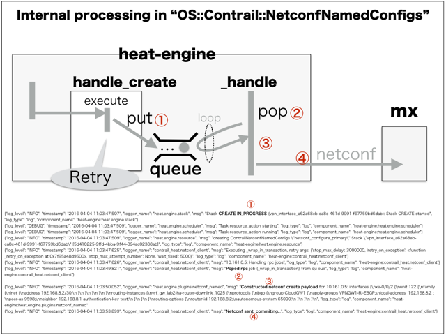

# heat_template: vpn_interface
This is heat_template of "vpn_interface" which is provided by gohan via etcd


### (1) Stored data in etcd
These are stored data for "heat_templates" in etcd.
```
/config/v2.0/heat_templates/vpn_interface
{
    "body": {
        "handler": "heat_worker", 
        "watch": [], 
        "id": "vpn_interface", 
        "template_file": "heat_template_version: 2013-05-23\n\ndescription: >\n  Inet Address\n\nparameters:\n  primary_device_ip:\n    description: Ip address that will be used to establish ssh connection to the Primary Device.\n    label: Ip address of the device.\n    type: string\n  primary_device_port:\n    description: Port that will be used to establish ssh connection to the Primary Device.\n    label: Port of the ssh connection.\n    type: number\n  primary_device_username:\n    description: Name of the user which will be used to log onto the Primary Device.\n    label: User name to log on to device.\n    type: string\n  primary_device_password:\n    description: Password of the user which will be used to log onto the Primary Device.\n    label: Users password.\n    type: string\n  secondary_device_ip:\n    description: Ip address that will be used to establish ssh connection to the Secondary Device.\n    label: Ip address of the device.\n    type: string\n  secondary_device_port:\n    description: Port that will be used to establish ssh connection to the Secondary Device.\n    label: Port of the ssh connection.\n    type: number\n  secondary_device_username:\n    description: Name of the user which will be used to log onto the Secondary Device.\n    label: User name to log on to device.\n    type: string\n  secondary_device_password:\n    description: Password of the user which will be used to log onto the Secondary Device.\n    label: Users password.\n    type: string\n  primary_device_physical_interface:\n    description: MX physical port on which logical interface will be created\n    label: Underlying physical interface\n    type: string\n  secondary_device_physical_interface:\n    description: MX physical port on which logical interface will be created\n    label: Underlying physical interface\n    type: string\n  vrf_name:\n    description: Name of VRF (routing-instance) in MX config\n    label: VRF Name\n    type: string\n  local_as:\n    type: number\n    label: Local AS Number\n  primary_ebgp_config_group:\n    description: Name of MX config group for eBGP config\n    label: eBGP config group\n    type: string\n  secondary_ebgp_config_group:\n    description: Name of MX config group for eBGP config\n    label: eBGP config group\n    type: string\n  uplink_vlan:\n    description: VLAN ID used on uplink interfaces (same for both primary and secondary device)\n    label: Uplink VLAN ID\n    type: string\n  primary_peer_ip:\n    description: IP address of primary router eBGP neighbour\n    label: Primary device BGP peer\n    type: string\n  secondary_peer_ip:\n    description: IP address of secondary router eBGP neighbour\n    label: Secondary device BGP peer\n    type: string\n  primary_router_id:\n    description: Primary router VRF router id\n    label: Primary router id\n    type: string\n  secondary_router_id:\n    description: Secondary router VRF router id\n    label: Secondary router id\n    type: string\n  remote_as:\n    description: eBGP remote autonomous system\n    label: Remote AS\n    type: string\n  md5:\n    description: eBGP authentication key\n    label: eBGP authentication key\n    type: string\n  bgp_group_name:\n    description: Name of eBGP group\n    label: eBGP group name\n    type: string\n\nresources:\n\n\n\n  netconf_configure_{{ device }}:\n    properties:\n      lock_timeout: 3000\n      configs:\n      - config: \"\"\n        path:\n          - config_type: tag\n            xml_type: tag\n            tag: interfaces\n          - config_type: name\n            xml_type: named_tag\n            tag: interface\n            name: { get_param: {{ device }}_device_physical_interface }\n          - config_type: named_tag\n            xml_type: named_tag\n            tag: unit\n            name: { get_param: uplink_vlan }\n          - config_type: tag\n            xml_type: tag\n            tag: family\n          - config_type: tag\n            xml_type: tag\n            tag: inet\n          - config_type: named_tag\n            xml_type: named_tag\n            tag: address\n            name:  {{ jinja_primary_uplink_ip }}  {{ jinja_secondary_uplink_ip }} \n      - config:\n          str_replace:\n            params:\n              $NEIGHBOR_IP:\n                    get_param: {{ device }}_peer_ip\n              $REMOTE_AS:\n                    get_param: remote_as\n              $APPLY_GROUP:\n                    get_param: {{ device }}_ebgp_config_group\n              $KEY:\n                    get_param: md5\n            template: |\n              apply-groups $APPLY_GROUP;\n              local-address  {{ primary_ip_uplink_split[0] }}  {{ secondary_ip_uplink_split[0] }} ;\n              peer-as $REMOTE_AS;\n              neighbor $NEIGHBOR_IP authentication-key $KEY;\n        path:\n          - config_type: tag\n            xml_type: tag\n            tag: routing-instances\n          - config_type: name\n            xml_type: named_tag\n            tag: instance\n            name: { get_param: vrf_name }\n          - config_type: tag\n            xml_type: tag\n            tag: protocols\n          - config_type: tag\n            xml_type: tag\n            tag: bgp\n          - config_type: named_tag\n            xml_type: named_tag\n            tag: group\n            name: { get_param: bgp_group_name }\n      - config:\n          str_replace:\n            params:\n              $ROUTER_ID:\n                    get_param: {{device}}_router_id\n              $LOCAL_AS:\n                    get_param: local_as\n            template: |\n              router-id $ROUTER_ID;\n              autonomous-system $LOCAL_AS;\n        path:\n          - config_type: tag\n            xml_type: tag\n            tag: routing-instances\n          - config_type: name\n            xml_type: named_tag\n            tag: instance\n            name: { get_param: vrf_name }\n          - config_type: tag\n            xml_type: tag\n            tag: routing-options\n      device_ip:\n        get_param: {{ device }}_device_ip\n      password:\n        get_param: {{ device }}_device_password\n      port:\n        get_param: {{ device }}_device_port\n      username:\n        get_param: {{ device }}_device_username\n    type: OS::Contrail::NetconfNamedConfigs\n\n", 
        "parameter_mappings": {
            "secondary_router_id": "Osecondary:bgp_router_id", 
            "secondary_device_physical_interface": "Fvpn_gateway+vpn_gw_id:vpn_service+vpn_service_id:ha_interface+uplink_interface_id:er_physical_interface+secondary_interface_id:name", 
            "primary_peer_ip": "Oprimary:bgp_peer_ip", 
            "primary_device_password": "Fvpn_gateway+vpn_gw_id:ha_interface+downlink_interface_id:ha_router+ha_router_id:edge_router+primary_router_id:password", 
            "bgp_group_name": "CCloudGW1", 
            "remote_as": "Pbgp_remote_as", 
            "jinja_primary_uplink_ip": "Oprimary:ip_address", 
            "primary_device_ip": "Fvpn_gateway+vpn_gw_id:ha_interface+downlink_interface_id:ha_router+ha_router_id:edge_router+primary_router_id:ip", 
            "secondary_ebgp_config_group": "Fvpn_gateway+vpn_gw_id:vpn_service+vpn_service_id:secondary_ebgp_config_group", 
            "secondary_device_username": "Fvpn_gateway+vpn_gw_id:ha_interface+downlink_interface_id:ha_router+ha_router_id:edge_router+secondary_router_id:login", 
            "local_as": "Fvpn_gateway+vpn_gw_id:local_as_number", 
            "primary_device_physical_interface": "Fvpn_gateway+vpn_gw_id:vpn_service+vpn_service_id:ha_interface+uplink_interface_id:er_physical_interface+primary_interface_id:name", 
            "uplink_vlan": "Fvpn_gateway+vpn_gw_id:uplink_vlan_id", 
            "md5": "Pbgp_md5", 
            "secondary_peer_ip": "Osecondary:bgp_peer_ip", 
            "primary_router_id": "Oprimary:bgp_router_id", 
            "primary_ebgp_config_group": "Fvpn_gateway+vpn_gw_id:vpn_service+vpn_service_id:primary_ebgp_config_group", 
            "jinja_secondary_uplink_ip": "Osecondary:ip_address", 
            "secondary_device_port": "Fvpn_gateway+vpn_gw_id:ha_interface+downlink_interface_id:ha_router+ha_router_id:edge_router+secondary_router_id:ssh_port", 
            "secondary_device_password": "Fvpn_gateway+vpn_gw_id:ha_interface+downlink_interface_id:ha_router+ha_router_id:edge_router+secondary_router_id:password", 
            "heat_timeout": "C60", 
            "vrf_name": "Fvpn_gateway+vpn_gw_id:vrf_name", 
            "primary_device_username": "Fvpn_gateway+vpn_gw_id:ha_interface+downlink_interface_id:ha_router+ha_router_id:edge_router+primary_router_id:login", 
            "primary_device_port": "Fvpn_gateway+vpn_gw_id:ha_interface+downlink_interface_id:ha_router+ha_router_id:edge_router+primary_router_id:ssh_port", 
            "secondary_device_ip": "Fvpn_gateway+vpn_gw_id:ha_interface+downlink_interface_id:ha_router+ha_router_id:edge_router+secondary_router_id:ip"
        }
    }, 
    "version": 1, 
    "marked_for_deletion": false
}
```
You can see the retreiving of "template_file" as "Heat Template".

* OS::Contrail::NetconfNamedConfigs

```
heat_template_version: 2013-05-23

description: >
  Inet Address

parameters:
  primary_device_ip:
    description: Ip address that will be used to establish ssh connection to the Primary Device.
    label: Ip address of the device.
    type: string
  primary_device_port:
    description: Port that will be used to establish ssh connection to the Primary Device.
    label: Port of the ssh connection.
    type: number
  primary_device_username:
    description: Name of the user which will be used to log onto the Primary Device.
    label: User name to log on to device.
    type: string
  primary_device_password:
    description: Password of the user which will be used to log onto the Primary Device.
    label: Users password.
    type: string
  secondary_device_ip:
    description: Ip address that will be used to establish ssh connection to the Secondary Device.
    label: Ip address of the device.
    type: string
  secondary_device_port:
    description: Port that will be used to establish ssh connection to the Secondary Device.
    label: Port of the ssh connection.
    type: number
  secondary_device_username:
    description: Name of the user which will be used to log onto the Secondary Device.
    label: User name to log on to device.
    type: string
  secondary_device_password:
    description: Password of the user which will be used to log onto the Secondary Device.
    label: Users password.
    type: string
  primary_device_physical_interface:
    description: MX physical port on which logical interface will be created
    label: Underlying physical interface
    type: string
  secondary_device_physical_interface:
    description: MX physical port on which logical interface will be created
    label: Underlying physical interface
    type: string
  vrf_name:
    description: Name of VRF (routing-instance) in MX config
    label: VRF Name
    type: string
  local_as:
    type: number
    label: Local AS Number
  primary_ebgp_config_group:
    description: Name of MX config group for eBGP config
    label: eBGP config group
    type: string
  secondary_ebgp_config_group:
    description: Name of MX config group for eBGP config
    label: eBGP config group
    type: string
  uplink_vlan:
    description: VLAN ID used on uplink interfaces (same for both primary and secondary device)
    label: Uplink VLAN ID
    type: string
  primary_peer_ip:
    description: IP address of primary router eBGP neighbour
    label: Primary device BGP peer
    type: string
  secondary_peer_ip:
    description: IP address of secondary router eBGP neighbour
    label: Secondary device BGP peer
    type: string
  primary_router_id:
    description: Primary router VRF router id
    label: Primary router id
    type: string
  secondary_router_id:
    description: Secondary router VRF router id
    label: Secondary router id
    type: string
  remote_as:
    description: eBGP remote autonomous system
    label: Remote AS
    type: string
  md5:
    description: eBGP authentication key
    label: eBGP authentication key
    type: string
  bgp_group_name:
    description: Name of eBGP group
    label: eBGP group name
    type: string

resources:



  netconf_configure_{{ device }}:
    properties:
      lock_timeout: 3000
      configs:
      - config: ""
        path:
          - config_type: tag
            xml_type: tag
            tag: interfaces
          - config_type: name
            xml_type: named_tag
            tag: interface
            name: { get_param: {{ device }}_device_physical_interface }
          - config_type: named_tag
            xml_type: named_tag
            tag: unit
            name: { get_param: uplink_vlan }
          - config_type: tag
            xml_type: tag
            tag: family
          - config_type: tag
            xml_type: tag
            tag: inet
          - config_type: named_tag
            xml_type: named_tag
            tag: address
            name:  {{ jinja_primary_uplink_ip }}  {{ jinja_secondary_uplink_ip }} 
      - config:
          str_replace:
            params:
              $NEIGHBOR_IP:
                    get_param: {{ device }}_peer_ip
              $REMOTE_AS:
                    get_param: remote_as
              $APPLY_GROUP:
                    get_param: {{ device }}_ebgp_config_group
              $KEY:
                    get_param: md5
            template: |
              apply-groups $APPLY_GROUP;
              local-address  {{ primary_ip_uplink_split[0] }}  {{ secondary_ip_uplink_split[0] }} ;
              peer-as $REMOTE_AS;
              neighbor $NEIGHBOR_IP authentication-key $KEY;
        path:
          - config_type: tag
            xml_type: tag
            tag: routing-instances
          - config_type: name
            xml_type: named_tag
            tag: instance
            name: { get_param: vrf_name }
          - config_type: tag
            xml_type: tag
            tag: protocols
          - config_type: tag
            xml_type: tag
            tag: bgp
          - config_type: named_tag
            xml_type: named_tag
            tag: group
            name: { get_param: bgp_group_name }
      - config:
          str_replace:
            params:
              $ROUTER_ID:
                    get_param: {{device}}_router_id
              $LOCAL_AS:
                    get_param: local_as
            template: |
              router-id $ROUTER_ID;
              autonomous-system $LOCAL_AS;
        path:
          - config_type: tag
            xml_type: tag
            tag: routing-instances
          - config_type: name
            xml_type: named_tag
            tag: instance
            name: { get_param: vrf_name }
          - config_type: tag
            xml_type: tag
            tag: routing-options
      device_ip:
        get_param: {{ device }}_device_ip
      password:
        get_param: {{ device }}_device_password
      port:
        get_param: {{ device }}_device_port
      username:
        get_param: {{ device }}_device_username
    type: OS::Contrail::NetconfNamedConfigs

```

### (2) Notes for Code of Heat Plugin in contrail-heat
* contrail-heat/contrail_heat/resources/netconf_named.py

```
class ContrailNetconfNamedConfigs(netconf.ContrailNetconf):

    ConfigEntity = collections.namedtuple('ConfigEntity',
                                          'path config')

    PROPERTIES = (
        DEVICE_IP, USERNAME, PASSWORD, PORT, CONFIGS, ON_UPDATE, LOCK_TIMEOUT
    ) = (
        'device_ip', 'username', 'password', 'port', 'configs', 'on_update',
        'lock_timeout'
    )

    CONFIG_KEYS = (PATH, CONFIG, ADDITIONAL_COMMANDS) = (
        'path', 'config', 'additional_commands')

    PATH_KEYS = (
        CONFIG_TYPE, XML_TYPE, TAG, NAME
    ) = (
        "config_type", "xml_type", "tag", "name",
    )

    path_schema = properties.Schema(
        properties.Schema.MAP,
        schema={
            CONFIG_TYPE: properties.Schema(
                properties.Schema.STRING,
                _('Type of node in juniper cli format'),
                constraints=[
                    constraints.AllowedValues(['tag', 'named_tag', 'name']),
                ],
                default='tag'
            ),
            XML_TYPE: properties.Schema(
                properties.Schema.STRING,
                _('Type of node in netconf xml'),
                constraints=[
                    constraints.AllowedValues(['tag', 'named_tag']),
                ],
                default='tag'
            ),
            TAG: properties.Schema(
                properties.Schema.STRING,
                _('Tag value for path'),
                default=''
            ),
            NAME: properties.Schema(
                properties.Schema.STRING,
                _('Name value for path'),
                default=''
            ),
        })

    properties_schema = {
        DEVICE_IP: properties.Schema(
            properties.Schema.STRING,
            _('Ip address of the device.'),
            required=True,
        ),
        USERNAME: properties.Schema(
            properties.Schema.STRING,
            _('User name to log on to device.'),
            required=True,
            update_allowed=True
        ),
        PASSWORD: properties.Schema(
            properties.Schema.STRING,
            _('Users password.'),
            required=True,
            update_allowed=True
        ),
        PORT: properties.Schema(
            properties.Schema.INTEGER,
            _('Port of the ssh connection.'),
            default=22,
            update_allowed=True
        ),
        ON_UPDATE: properties.Schema(
            properties.Schema.STRING,
            _("JUNOS action run on update. "
              "Default action is to delete old config "
              "and apply new. "
              "Rest of them are action passed to netconf as "
              "action parameter on load_configuration."),
            constraints=[
                constraints.AllowedValues(
                    ['delete-and-create', 'merge', 'override',
                     'replace', 'update']),
            ],
            default='delete-and-create',
            update_allowed=False
        ),
        CONFIGS: properties.Schema(
            properties.Schema.LIST,
            _('A list of named config entities (ex. interfaces, '
              'routing-policies, etc.)'),
            schema=properties.Schema(
                properties.Schema.MAP,
                schema={
                    PATH: properties.Schema(
                        properties.Schema.LIST,
                        _('Path of config in config tree.'),
                        required=True,
                        schema=path_schema,
                        update_allowed=False,
                    ),
                    CONFIG: properties.Schema(
                        properties.Schema.STRING,
                        _('Config in junos cli format.'),
                        required=True,
                        update_allowed=True,
                    ),
                    ADDITIONAL_COMMANDS: properties.Schema(
                        properties.Schema.STRING,
                        _("Additional JUNOS CLI commands to"
                          " run after create."),
                        required=False,
                    ),
                }
            ),
            required=True,
            update_allowed=True
        ),
        LOCK_TIMEOUT: properties.Schema(
            properties.Schema.INTEGER,
            _('Timeout on trying to get the config lock in seconds.'),
            default=120,
            update_allowed=True
        ),
    }

    XML_EDIT_CONFIG = '''
                 <edit-config>
                   <target>
                     <candidate/>
                   </target>
                   <default-operation>none</default-operation>
                   <config>
                     <configuration>
                       {config}
                     </configuration>
                   </config>
                 </edit-config>'''

    update_allowed_keys = ('Properties',)

    # templates for building xml and config strings
    _xml_open_templates = {
        "tag": "<{tag}{operation}>",
        "named_tag": """<{tag}{operation}>
        <name><![CDATA[{name}]]></name>""",
    }
    _xml_close_templates = collections.defaultdict(lambda: "</{tag}>")

    _config_templates = {
        "tag": "{tag}",
        "name": "{name}",
        "named_tag": "{tag} {name}",
    }

    class TreeNode(object):
        def __init__(self, path_element):
            self.path_element = path_element
            self.children = []
            self.value = None

    NOT_FOUND_PATTERNS = [
        re.compile("^Referenced filter '.+' is not defined$", re.I),
        re.compile("^statement not found: .+$", re.I)]

    def _is_not_found_error(self, rpc_error):
        message = rpc_error.message
        for pattern in self.NOT_FOUND_PATTERNS:
            if pattern.search(message) is not None:
                return True
        return False

    def _build_config_tree(self, configs):
        root = []
        for conf in configs:
            curr_node = root
            new_node = None
            if not conf.path:
                raise ValueError(_("Tree for config is empty"))
            for path_element in conf.path:
                found = False
                for node in curr_node:
                    if node.path_element == path_element:
                        curr_node = node.children
                        found = True
                        break
                if not found:
                    new_node = self.TreeNode(path_element)
                    curr_node.append(new_node)
                    curr_node = new_node.children
            if not new_node:
                raise ValueError(_("You are trying to overwrite other config "
                                 "from this stack."))
            new_node.value = conf.config
        return root

    def _build_config_string(self, tree):
        result = []
        for node in tree:
            path_el = node.path_element
            result.append(self._config_templates[
                path_el["config_type"]].format(tag=path_el.get("tag"),
                                               name=path_el.get("name")))
            if node.children:
                if node.value:
                    # we don't allow this as it will make deletion harder
                    # and it may be even easier to just
                    # insert child's config in parent's config
                    raise ValueError(_(
                        "You can't add a child to the parent created "
                        "in this stack. If you need this "
                        "insert child config as "
                        "string in parent config."))
                result.append(' {{\n{} }}\n'.format(
                              self._build_config_string(node.children)))
            elif node.value:
                result.append(' {{\n{} }}\n'.format(node.value))
            else:
                # no children or value - we don't need to open scope,
                # just add statement
                result.append(";\n")
        return ''.join(result)

    def _build_xml_string(self, tree, operation=""):
        result = []
        for node in tree:
            path_el = node.path_element
            template_args = collections.defaultdict(
                str, tag=path_el.get("tag"), name=path_el.get("name"))
            if not node.children:
                template_args["operation"] = operation
            result.append(string.Formatter().vformat(
                self._xml_open_templates[path_el["xml_type"]], (),
                template_args))
            if node.children:
                result.append(self._build_xml_string(node.children, operation))
            result.append(string.Formatter().vformat(
                self._xml_close_templates[path_el["xml_type"]], (),
                template_args))
            LOG.info(result)
        return ''.join(result)

    def _create_config(self):
        configs = self._get_configs()
        tree = self._build_config_tree(configs)
        return self._build_config_string(tree)

    def _create_delete_rpcs(self):
        configs = self._get_configs()
        xmls = []
        for config in configs:
            tree = self._build_config_tree([config])
            xmls.append(self._build_xml_string(tree, " operation=\"delete\""))
        rpcs = []
        for xml in xmls:
            rpcs.append(self.XML_EDIT_CONFIG.format(config=xml))
        return rpcs

    def _get_configs(self):
        return [self.ConfigEntity(p[self.PATH],
                                  p[self.CONFIG])
                for p in self.properties[self.CONFIGS]]

    def _execute_additional_commands(self, manager):
        cmds = '\n'.join(p[self.ADDITIONAL_COMMANDS]
                         for p in self.properties[self.CONFIGS]
                         if bool(p[self.ADDITIONAL_COMMANDS]))
        if cmds:
            manager.load_configuration(target="candidate",
                                    config=cmds,
                                    format='text',
                                    action="set")

    def _create(self, manager, config, action='merge'):
        # merge is default action for load_configuration

        LOG.info('Constructed netconf create payload for %s: %s',
                 self.properties[self.DEVICE_IP], config)
        manager.load_configuration(target="candidate",
                                   action=action,
                                   config=config,
                                   format='text')
        self._execute_additional_commands(manager)

    def _delete(self, manager, configs):
        LOG.info('Constructed netconf delete rpcs %s: %s',
                 self.properties[self.DEVICE_IP], '\n'.join(configs))
        for config in configs:
            try:
                manager.rpc(config)
            except RPCError as e:
                if not self._is_not_found_error(e):
                    raise
                else:
                    LOG.warn("Resource not found for config: \n %s \n."
                             "  Skipping...", config)

    def _update(self, manager, delete_configs, new_config):
        if self.properties[self.ON_UPDATE] == 'delete-and-create':
            LOG.debug("Running delete-and-create.")
            self._delete(manager, delete_configs)
            self._create(manager, new_config)
        else:
            LOG.debug("Running update with action %s",
                      self.properties[self.ON_UPDATE])
            self._create(manager, new_config,
                         action=self.properties[self.ON_UPDATE])

    def handle_create(self):
        self.resource_id_set(str(uuid.uuid4()))
        config = self._create_config()
        self._client.execute_in_transaction(self._create, config)

    def handle_update(self, json_snippet=None, tmpl_diff=None, prop_diff=None):
        if not prop_diff:
            LOG.info("No update required.")
            return

        # create cmd to remove old config
        delete_configs = self._create_delete_rpcs()

        self.properties = json_snippet.properties(self.properties_schema,
                                                  self.context)

        # create updated config
        new_config = self._create_config()
        # execute delete and create with single commit
        self._client.execute_in_transaction(
                self._update, delete_configs, new_config)

    def handle_delete(self):
        configs = self._create_delete_rpcs()
        self._client.execute_in_transaction(self._delete, configs)


def resource_mapping():
    return {
        'OS::Contrail::NetconfNamedConfigs': ContrailNetconfNamedConfigs,
    }
```

### (3) Memo for myself ...
* It looks that master branch is not used in repository of "contrail-heat".
* The codes of processing via netconf is included in repository of "esi-python-modules".


